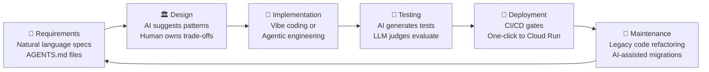
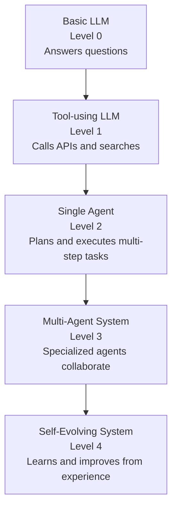
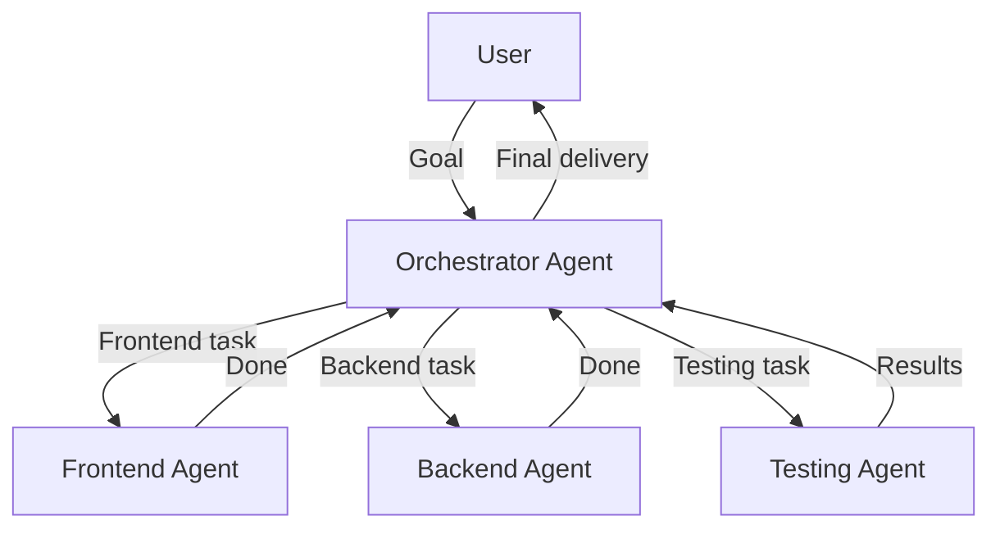
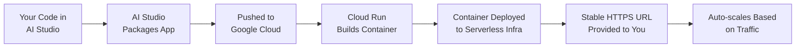

# 🚀 Day 1 Study Notes: Google/Kaggle 5-Day AI Agents Intensive — Vibe Coding Course

> **Course:** 5-Day AI Agents: Intensive Vibe Coding Course With Google (June 15–19, 2026)
> **Day 1 Theme:** Introduction to Agents & Vibe Coding — Moving from Chatbots to Autonomous Systems
> **Prepared from:** Podcast companion video, "The New SDLC with Vibe Coding" whitepaper, Google Antigravity Codelab, and AI Studio → Cloud Run Codelab

---

## 📋 Table of Contents

1. [Course Overview](#-course-overview)
2. [What is Vibe Coding?](#-what-is-vibe-coding)
3. [The New SDLC — How AI Rewrites Software Development](#-the-new-sdlc--how-ai-rewrites-software-development)
4. [Introduction to AI Agents](#-introduction-to-ai-agents)
5. [Agent Anatomy: The Three Core Components](#-agent-anatomy-the-three-core-components)
6. [Agent Capability Taxonomy (Levels 0–4)](#-agent-capability-taxonomy-levels-04)
7. [The Agent Harness — The 90% You Don't See](#️-the-agent-harness--the-90-you-dont-see)
8. [Context Engineering — The Core Skill of the AI Era](#-context-engineering--the-core-skill-of-the-ai-era)
9. [AgentOps — Reliability, Governance & Security](#-agentops--reliability-governance--security)
10. [Agent Interoperability — MCP and A2A](#-agent-interoperability--mcp-and-a2a)
11. [Google Antigravity 2.0 — The Agentic Development Platform](#-google-antigravity-20--the-agentic-development-platform)
12. [Getting Started with Google Antigravity (Codelab 1)](#-getting-started-with-google-antigravity-codelab-1)
13. [Google AI Studio — Vibe Code and Deploy](#-google-ai-studio--vibe-code-and-deploy)
14. [Deploying from AI Studio to Cloud Run (Codelab 2)](#-deploying-from-ai-studio-to-cloud-run-codelab-2)
15. [Cloud Run MCP Server](#-cloud-run-mcp-server)
16. [The Developer Role Transformation](#-the-developer-role-transformation)
17. [Economics of Vibe Coding vs. Agentic Engineering](#-economics-of-vibe-coding-vs-agentic-engineering)
18. [Key Takeaways for Day 1](#-key-takeaways-for-day-1)
19. [Glossary of Key Terms](#-glossary-of-key-terms)
20. [Resources & Links](#-resources--links)

---

## 🌐 Course Overview

### What is This Course?

The **5-Day AI Agents: Intensive Vibe Coding Course** is a **free** online program co-hosted by **Google** and **Kaggle**. It ran June 15–19, 2026, and is the second iteration of Google's AI Intensive series (the first attracted over **1.5 million learners**).

The course teaches you how to build **production-ready AI agents** using **natural language (vibe coding)** — meaning you describe what you want in plain English, and AI systems handle the syntax, scaffolding, and integration.

### Daily Structure

Each day includes:
- 📄 **Whitepaper** — deep conceptual reading
- 🎙️ **Companion Podcast** — accessible audio summary of the whitepaper
- 🧪 **Codelabs** — hands-on guided tutorials
- 📺 **Livestream** — live Q&A with Google engineers and course authors

### 5-Day Syllabus at a Glance

| Day | Topic |
|-----|-------|
| **Day 1** | Intro to Agents & Vibe Coding — moving from chatbots to autonomous agents |
| **Day 2** | Agent Tools & Interoperability — APIs, MCP, agent-to-agent communication |
| **Day 3** | Context Engineering — sessions, skills & memory |
| **Day 4** | Agent Quality & Security — observability, tracing, evaluation |
| **Day 5** | Prototype to Production — deploying and scaling multi-agent systems |

> **Time commitment:** ~1–2 hours per day

---

## 💡 What is Vibe Coding?

### The Plain-English Definition

> **Vibe coding** is when you explain what you want software to do in simple, natural language — and an AI agent creates it for you. You tell the machine your *goals*, and it handles the technical work.

Instead of writing:
```python
def add_snowflakes():
    for i in range(50):
        flake = document.createElement('div')
        flake.classList.add('snowflake')
        # ... 40 more lines of DOM manipulation
```

You just say:

> *"Make snowflakes fall from the top of the screen for 5 seconds when the user clicks the Snowflakes button."*

### Why This Matters

| Traditional Coding | Vibe Coding |
|---|---|
| You write every line of syntax | You describe your intent |
| Bottleneck = coding speed | Bottleneck = specification quality |
| Requires programming knowledge | Requires clear communication skills |
| Hours or days per feature | Minutes per feature |
| One developer, one task | One developer, many parallel agents |

### Industry Adoption (2026 Data)

According to the Google/Kaggle whitepaper:

- **85%** of professional developers now regularly use AI coding agents
- **51%** use AI coding agents **every single day**
- Approximately **41%** of all new code written today is **AI-generated**

### The Critical Warning: "Vibe Coding is NOT Vibe in Production"

This is the most important beginner lesson from the whitepaper:

> While AI generates code rapidly, it can produce bugs at scale. **Success requires writing detailed specifications before deploying AI agents.** Clear requirements — a communication skill, not a technical one — determine output quality.

```
PROTOTYPE PHASE:  Vibe freely → quick results, exploratory, throwaway code OK
PRODUCTION PHASE: Spec-driven → detailed requirements, testing, guardrails, oversight
```

### The 5 Core Principles of Vibe Coding (From Google's Guide)

#### Principle 1: New Software Development Lifecycle
Development is shifting from *writing code* to *evaluating it*. The most valuable skill becomes **judgment** — recognizing quality outcomes.

#### Principle 2: Spec-Driven Development
Write detailed specifications before deploying AI agents. Clear requirements are a *communication skill*, not a technical one.

#### Principle 3: Agent Skills
Skills are reusable playbooks stored as markdown files. They teach agents your organization's processes, brand voice, compliance steps, and reporting formats — creating "procedural memory" that works across different AI tools without vendor lock-in.

#### Principle 4: Agent Tools & Interoperability
Real power emerges when agents access data, execute code, and integrate with other software. Choose open, interoperable protocols (like MCP) over closed, one-off integrations.

#### Principle 5: Security & Evaluation
Autonomous agents accessing sensitive systems need guardrails. Critical practices: human review checkpoints, continuous testing, and treating evaluation as an ongoing process rather than a one-time event.

### Beginner Workflow for Vibe Coding

```
Step 1: Start with ONE simple automation task
   ↓
Step 2: Provide clear, detailed instructions (the "spec")
   ↓
Step 3: Carefully examine the AI's results
   ↓
Step 4: Build incrementally from successful iterations
```

---

## 🔄 The New SDLC — How AI Rewrites Software Development

### What is SDLC?

**SDLC** stands for **Software Development Life Cycle** — the structured process that teams follow to build software. Traditionally it has 6 phases:

```
Requirements → Design → Implementation → Testing → Deployment → Maintenance
```

Each phase historically took weeks or months, with humans handling every step manually.

### The AI-Transformed SDLC



### Phase-by-Phase Transformation

#### 📋 Phase 1: Requirements & Planning (Before → After)

**Before AI:**
- Long requirement documents
- Weeks of meetings
- Hand-off from business to developers

**After AI:**
- Specifications become `AGENTS.md` files that **directly instruct AI systems**
- Agents draft user stories and surface edge cases automatically
- Simultaneous specification AND prototyping
- Specification quality becomes the bottleneck, not coding speed

**What is AGENTS.md?**
A plain-text file at the root of your project that tells AI agents:
- What the project does
- What constraints to follow
- What success looks like
- What tools they can use

#### 🏛️ Phase 2: Design & Architecture (Most Human-Centric Phase)

AI can *suggest* architectures, but it **cannot own the trade-offs**:
- Consistency vs. availability? That depends on business priorities AI can't fully grasp
- Build vs. buy? Requires knowing company budget, team skills, vendor reliability

> **Key insight:** Design remains stubbornly human-dependent. Developers document structural decisions; AI implements them.

#### 💻 Phase 3: Implementation (The Big Change)

Two distinct approaches emerge:

```
VIBE CODING (For prototypes)          AGENTIC ENGINEERING (For production)
────────────────────────────          ────────────────────────────────────
• Natural language descriptions        • Formal specifications
• Accept rapid AI output              • Guardrails and constraints
• Fix errors with more prompts        • Automated test suites
• Fast but risky at scale             • CI/CD pipeline gates
• Throwaway/exploratory code          • Human oversight loops
                                      • LLM judges for quality
```

**Productivity data:**
- Surveys show **25–39% productivity gains** in implementation
- BUT: Experienced developers sometimes 19% *slower* on familiar tasks when accounting for verification time
- Takeaway: Implementation transforms from *writing* to *reviewing*

#### 🧪 Phase 4: Testing & QA (The Flip)

Tests become the **primary specification mechanism** — they communicate intent to agents:

```
Old testing: Write code → write tests → deploy
New testing: Write tests → tests drive agents → evaluate trajectories → deploy
```

**Two evaluation types:**
1. **Output evaluation** — did the final result work correctly?
2. **Trajectory evaluation** — did the agent take the right path to get there? (examining tool calls and reasoning steps)

```
benchmark execution
    ↓
failure clustering
    ↓
prompt/tool refinement
    ↓
regression checking
    ↓
production monitoring
```

#### 🚀 Phase 5: Code Review & Deployment

- AI provides **first-pass security and style review**
- Deterministic checks run pre-commit (sandboxes isolate AI-generated code)
- Observability tracks agent actions, timing, and costs
- Human judgment remains essential for design and maintainability review
- **One-click deployment** to Cloud Run from AI Studio

#### 🔧 Phase 6: Maintenance (The Underrated Win)

> "The most underrated win" — previously untouchable legacy code becomes navigable and refactorable with AI assistance.

Previously "too risky to touch" code can now be:
- Systematically migrated to new APIs
- Refactored safely with AI-generated test coverage
- Modernized without breaking existing functionality

### The Spectrum: Vibe Coding ↔ Agentic Engineering

Rather than a binary divide, development exists on a **spectrum** defined by verification rigor:

```
VIBE CODING ←──────────────────────────→ AGENTIC ENGINEERING
────────────────────────────────────────────────────────────
Casual prompts                          Formal specs
"Does it seem to work?"                 Automated evaluations
Minimal codebase understanding          Architecture docs + memory files
Prototypes/throwaway code              CI/CD gates + LLM judges
                                        Production systems at team scale
```

**The differentiator is verification:**
- Deterministic tests validate outputs
- Evaluations assess agent trajectory and decision quality

---

## 🤖 Introduction to AI Agents

### What is an AI Agent?

An **AI agent** is a system that can:
1. **Perceive** its environment (read files, call APIs, browse the web)
2. **Reason** about what to do (using an LLM as its "brain")
3. **Act** autonomously to achieve goals (write code, send messages, deploy apps)
4. **Reflect** and **improve** based on feedback

### Chatbots vs. Agents: The Critical Difference

```
CHATBOT                          AI AGENT
────────────────────────────     ────────────────────────────────────────
Passive — waits for questions    Active — pursues goals without being asked
One-turn interactions            Multi-step, long-horizon tasks
No memory between sessions       Persistent memory and context
No tool access                   Can call APIs, read files, browse web
You do the work it suggests      It does the work itself
```

**Analogy:** A chatbot is like a **reference book** — you look things up and apply them yourself. An agent is like a **capable intern** — you assign a goal, they figure out the steps and execute them.

### From Passive AI to Autonomous AI

The podcast companion for Day 1 (titled "Introduction to Agents and Vibe Coding") covers the shift from passive AI models to **autonomous, goal-oriented AI agents**. Key progression:



### Real-World Examples Referenced

- **Google's CoScientist** — an AI agent that autonomously designs and runs scientific experiments
- **AlphaVolv** — demonstrates self-evolving AI systems that improve through experience

---

## 🧬 Agent Anatomy: The Three Core Components

Every AI agent is built from three fundamental building blocks:

```
┌─────────────────────────────────────────────────────────┐
│                      AI AGENT                           │
│  ┌─────────────┐  ┌──────────────┐  ┌───────────────┐  │
│  │    MODEL    │  │    TOOLS     │  │ORCHESTRATION  │  │
│  │  (The LLM) │  │ (The Hands)  │  │  (The Brain)  │  │
│  │            │  │              │  │               │  │
│  │ Gemini 3.5 │  │ - Search API │  │ - Plan steps  │  │
│  │ Flash,     │  │ - Code exec  │  │ - Call tools  │  │
│  │ Claude,    │  │ - File I/O   │  │ - Loop & retry│  │
│  │ GPT-4o     │  │ - Web browse │  │ - Manage state│  │
│  └─────────────┘  └──────────────┘  └───────────────┘  │
└─────────────────────────────────────────────────────────┘
```

### Component 1: The Model (LLM)

The **Large Language Model** is the agent's reasoning engine. It:
- Reads the current context
- Decides what action to take
- Generates text, code, or tool calls
- Interprets results and plans next steps

**Common models used:**
- **Gemini 3.5 Flash** (Google's default in Antigravity — optimized for speed, 289 tokens/second)
- **Gemini 3 Pro** (higher reasoning capability)
- **Claude Sonnet 4.5** (Anthropic — also supported in Antigravity)
- **GPT-OSS** (OpenAI — also supported)

> **Key insight from the whitepaper:** The model is only about **10%** of what makes an agent work well. The other 90% is the *harness* (see below).

### Component 2: Tools (The Agent's Hands)

Tools let the agent interact with the world beyond just generating text. Examples:

| Tool Type | What It Does | Example |
|-----------|-------------|---------|
| **Web Search** | Finds current information online | Google Search API |
| **Code Execution** | Runs Python, Bash, etc. | Sandboxed execution environment |
| **File I/O** | Reads and writes files | Read `main.py`, write `output.json` |
| **Web Browsing** | Navigates websites like a human | Fill out forms, click buttons |
| **External APIs** | Calls any REST/GraphQL API | Send an email, query a database |
| **MCP Tools** | Standardized tool protocol (see MCP section) | Cloud Run deploy, Slack messages |

### Component 3: Orchestration (The Operational Loop)

The orchestration layer manages the **agent's operational loop** — the cycle of planning, acting, observing, and adjusting:

```
┌─── ORCHESTRATION LOOP ───────────────────────────────┐
│                                                       │
│  1. RECEIVE task/goal from user                      │
│       ↓                                               │
│  2. PLAN — break task into steps                     │
│       ↓                                               │
│  3. ACT — call tools, write code, etc.               │
│       ↓                                               │
│  4. OBSERVE — read results from tool calls           │
│       ↓                                               │
│  5. REFLECT — did this work? what's next?            │
│       ↓                                               │
│  6. LOOP back to step 2 (or STOP if goal achieved)   │
│                                                       │
└───────────────────────────────────────────────────────┘
```

---

## 📊 Agent Capability Taxonomy (Levels 0–4)

The whitepaper presents a progression framework from basic language models to self-evolving systems:

### Level 0: Basic Language Model
```
Input → LLM → Output
No memory, no tools, no autonomy
Example: Simple Q&A chatbot
```

### Level 1: Tool-Using LLM
```
Input → LLM → Tool Call → Result → LLM → Output
Can search the web, run code, call APIs
Example: Gemini with Google Search enabled
```

### Level 2: Single Autonomous Agent
```
Goal → Plan → [Loop: Act → Observe → Reflect] → Completion
Multi-step, long-horizon task execution
Example: "Build me a simple web app" — agent writes code, runs tests, fixes bugs
```

### Level 3: Multi-Agent System
```
Orchestrator Agent
├── Specialist Agent A (e.g., Frontend Dev)
├── Specialist Agent B (e.g., Backend Dev)
└── Specialist Agent C (e.g., QA Tester)
Parallel work, coordination, communication
```

### Level 4: Self-Evolving System
```
Agent + Feedback Loop + Learning Mechanism
Agent improves its own behavior based on outcomes
Example: AlphaVolv — continuously learns from experimental results
```

---

## ⚙️ The Agent Harness — The 90% You Don't See

### The Formula

> **Agent = Model + Harness**

The **harness** is everything that surrounds the model and makes it effective. It comprises approximately **90%** of what makes an agent succeed or fail.

```
┌─────────────────────────────────────────────────────────────┐
│                     THE AGENT HARNESS                       │
│                                                             │
│  📋 Instruction Files    (AGENTS.md, CLAUDE.md, GEMINI.md) │
│  🔧 MCP Servers          (tool connections to the world)    │
│  📦 Sandboxes            (isolated execution environments)  │
│  🔀 Orchestration Logic  (sub-agent spawning & routing)     │
│  🔒 Guardrails           (safety constraints)               │
│  👁️ Observability        (logging, drift detection)         │
│  🧠 Memory Systems       (short-term and long-term)         │
│                                                             │
│  In the center, taking up just ~10%:                        │
│  ┌──────────────────────┐                                   │
│  │    THE MODEL (LLM)   │                                   │
│  └──────────────────────┘                                   │
└─────────────────────────────────────────────────────────────┘
```

### Evidence That Harness Matters More Than Model

**Terminal Bench 2.0 case study:**
> A team improved their agent's ranking from **outside Top 30** to **Top 5** by changing **only the harness** — no model upgrade, no new tools, just better instructions, better context, better structure.

**LangChain case study:**
> Achieved a **13.7-point benchmark gain** through **system prompt and tool adjustments alone**.

**What this means for beginners:** When your agent fails, it's usually NOT because the model is bad. It's because the *instructions, context, or tools* aren't set up well. Fix the harness first.

---

## 🧠 Context Engineering — The Core Skill of the AI Era

### What is Context Engineering?

**Context engineering** is the practice of deliberately managing the information you give to an AI agent — so it has exactly what it needs to do the job well, no more and no less.

> *"What would a new team member need to know to contribute well?"* — This is your template for designing agent context.

### The 6 Types of Agent Context

```
┌────────────────────────────────────────────────────────────┐
│                 WHAT AGENTS RECEIVE                        │
├────────────────┬───────────────────────────────────────────┤
│ 1. Instructions│ Role definition, task boundaries, rules   │
│ 2. Knowledge   │ Docs, diagrams, domain expertise          │
│ 3. Memory      │ Session logs, project history, state      │
│ 4. Examples    │ Reference patterns, "do it like this"     │
│ 5. Tools       │ Callable APIs, scripts, databases         │
│ 6. Guardrails  │ Constraints, safety rules, off-limits     │
└────────────────┴───────────────────────────────────────────┘
```

### Static vs. Dynamic Context

The most important architectural decision in context engineering:

```
STATIC CONTEXT                      DYNAMIC CONTEXT
(Loaded every turn = token-costly)  (Loaded on-demand = efficient)
──────────────────────────────────  ──────────────────────────────
• System instructions               • Agent Skills (triggered by task match)
• Core rule files                   • Tool results during execution
• Global memory                     • Retrieved documents (RAG)
• Core guardrails                   • Just-in-time knowledge
```

**Why this matters:** Loading everything every turn = massive token costs. Dynamic context (via Skills) lets one agent carry dozens of capabilities while only paying for what's actually used.

### Agent Skills — Dynamic Context in Practice

**Skills** are specialized knowledge packages that sit dormant until needed — they're the most powerful form of dynamic context.

```
SKILL ARCHITECTURE
──────────────────
User sends: "Please review my code for bugs"
    ↓
Agent detects: task matches "code-review" skill description
    ↓
Skill loads: full code review instructions, checklist, style guide
    ↓
Agent executes: systematic review with all the right context
    ↓
Skill unloads: freed from context window after task complete
```

**Key benefit:** "Progressive disclosure" — one agent can carry dozens of skills while paying only for utilized components per turn.

---

## 🛡️ AgentOps — Reliability, Governance & Security

### What is AgentOps?

**AgentOps** is the discipline of reliably operating AI agents in production. Just like DevOps brought rigor to software deployment, AgentOps brings rigor to agent deployment.

It covers three pillars:

```
┌─────────────────────────────────────────────────────┐
│                    AGENTOPS                         │
│                                                     │
│  ⚙️ RELIABILITY          🏛️ GOVERNANCE              │
│  • Uptime and stability  • Audit trails             │
│  • Error recovery        • Policy enforcement       │
│  • Retry logic           • Compliance               │
│  • Fallback strategies   • Access controls          │
│                                                     │
│  🔒 SECURITY                                        │
│  • Identity verification                            │
│  • Constrained permissions (principle of least      │
│    privilege)                                       │
│  • Sandboxed execution                              │
│  • Human review checkpoints                         │
│  • Prompt injection defenses                        │
└─────────────────────────────────────────────────────┘
```

### Why AgentOps Matters

When agents can **autonomously access sensitive systems, write code, and deploy applications**, the stakes are much higher than with traditional software:

| Risk | Traditional Software | AI Agent |
|------|---------------------|----------|
| Bad code | Developer catches it in review | Agent might deploy it automatically |
| Data access | Manual authorization | Agent may have broad API access |
| Unintended actions | Requires human trigger | Agent acts on its own interpretation |
| Cost overruns | Fixed compute costs | Agent can burn API tokens in loops |

### Security Through Identity & Constrained Policies

Two key security mechanisms from the whitepaper:

1. **Identity verification** — agents must authenticate before accessing systems, just like humans
2. **Constrained permissions** — agents only get access to exactly what they need for their task (principle of least privilege)

### Human Review as a Security Gate

The best agent systems include **mandatory human review checkpoints** before consequential actions:

```
Agent plans action → Shows artifact/plan → Human approves → Agent executes
                          ↑
                  "Review-Driven Development"
                  (Antigravity's default mode)
```

---

## 🔌 Agent Interoperability — MCP and A2A

### Why Interoperability Matters

Agents are most powerful when they can:
- Use tools built by other teams
- Hand off work to specialized agents
- Access data from any system
- Work across different AI platforms

### Model Context Protocol (MCP)

**MCP** is the **open standard** for connecting AI agents to external tools and data sources. Think of it like USB — any MCP-compatible agent can plug into any MCP-compatible tool.

```
WITHOUT MCP:                    WITH MCP:
───────────                     ──────────
Custom integration              Standard protocol
for every tool                  works everywhere
Agent A ─── Tool X (custom)     Agent A ─┐
Agent A ─── Tool Y (custom)              ├── MCP ─── Tool X
Agent B ─── Tool X (custom)     Agent B ─┘       └── Tool Y
= N agents × M tools = chaos    = Write once, use anywhere
```

**MCP enables:**
- AI coding assistants (like Claude Desktop, VS Code Copilot) to deploy code to Cloud Run
- Agent SDKs (like Google's ADK) to access databases, send messages, call services
- One agent to orchestrate multiple external systems through a single protocol

**Cloud Run MCP Server Installation:**

```json
{
  "cloud-run": {
    "command": "npx",
    "args": ["-y", "https://github.com/GoogleCloudPlatform/cloud-run-mcp"]
  }
}
```

Add this to your MCP client configuration (e.g., Claude Desktop's `config.json`, VS Code settings, or Antigravity's MCP config at `$HOME/.gemini/config/mcp_config.json`).

### Agent-to-Agent Protocol (A2A)

**A2A** is the protocol for **agents talking to other agents** — for complex, long-running operations requiring specialized sub-systems.



**MCP vs. A2A summary:**

| Protocol | Purpose |
|----------|---------|
| **MCP** | Agent ↔ Tool (external system integration) |
| **A2A** | Agent ↔ Agent (inter-agent work handoff) |

---

## 🚀 Google Antigravity 2.0 — The Agentic Development Platform

### What is Google Antigravity?

**Google Antigravity 2.0** is Google's **agentic development platform** — released May 19, 2026 at Google I/O. It's designed as a "central command center" for the **agent-first era** of software development.

> Think of it as: instead of you writing code line by line, you *direct multiple AI agents* to write code for you — and Antigravity is the control room where you oversee them all.

```
TRADITIONAL IDE                    GOOGLE ANTIGRAVITY 2.0
───────────────────────────────    ─────────────────────────────────────
You write code in editor           You direct agents with natural language
One task at a time                 Multiple parallel agents simultaneously
Manual testing                     Agents generate & run tests
Manual deployment                  One-click deploy to Cloud Run
You debug errors                   Agents reproduce & fix bugs for you
```

### The Four Product Surfaces

```
┌─────────────────────────────────────────────────────────────┐
│               GOOGLE ANTIGRAVITY 2.0 ECOSYSTEM              │
├─────────────────────┬───────────────────────────────────────┤
│ 🖥️ DESKTOP APP      │ Central command center                 │
│                     │ Multi-agent orchestration             │
│                     │ Agent Manager hub                     │
│                     │ Visual review of artifacts            │
├─────────────────────┼───────────────────────────────────────┤
│ 💻 ANTIGRAVITY IDE  │ Full VS Code-style code editor        │
│                     │ Integrated agent panel               │
│                     │ Tab completions & inline commands     │
│                     │ Code review, explain, generate, fix   │
├─────────────────────┼───────────────────────────────────────┤
│ ⌨️ ANTIGRAVITY CLI  │ Terminal-based interface               │
│                     │ Built from scratch in Go             │
│                     │ Replaces deprecated Gemini CLI       │
│                     │ Full feature parity with Desktop     │
├─────────────────────┼───────────────────────────────────────┤
│ 🔧 ANTIGRAVITY SDK  │ Programmatic agent access             │
│                     │ Custom agent behaviors               │
│                     │ Self-hosted deployments              │
│                     │ Python/Go API integration            │
└─────────────────────┴───────────────────────────────────────┘
```

### Antigravity 1.0 vs. 2.0: What Changed

| Dimension | 1.0 | 2.0 |
|-----------|-----|-----|
| Form | VS Code fork IDE | Standalone desktop app + CLI + SDK |
| Agent model | Single agent at a time | Multiple parallel agents |
| CLI | Separate Gemini CLI | Built-in CLI (Go-based) |
| Task automation | Manual prompting required | Scheduled background execution |
| Voice control | Absent | Native support |
| API integration | None | Managed Agents in Gemini API |
| Enterprise path | Unavailable | Gemini Enterprise Agent Platform |
| Default model | Gemini 3 Pro | Gemini 3.5 Flash |
| Pricing | Free / AI Pro ($20/mo) | Free / AI Pro / AI Ultra ($100/mo) / AI Ultra Premium ($200/mo) |

### The Default Model: Gemini 3.5 Flash

- Outputs at **289 tokens per second** — one of the fastest coding agents available
- Co-developed *using Antigravity itself* (Google's team dogfooded the platform)
- Claimed to outperform Gemini 3.1 Pro on benchmarks
- "Roughly four times quicker than other frontier models"
- Critical for multi-agent work: when 10 agents fire simultaneously, even 200ms latency compounds

### Other Supported Models

Antigravity 2.0 supports multiple models:
- **Gemini 3.5 Flash** (default, fast)
- **Gemini 3 Pro** (higher reasoning)
- **Claude Sonnet 4.5** (Anthropic)
- **GPT-OSS** (OpenAI)

### A Real Showcase: What Antigravity Can Do

At Google I/O 2026, the keynote showcased parallel agents constructing:
> "A working operating system core from scratch for under $1,000 in compute" — with a Doom clone running on top.

This demonstrates the platform's capacity for complex, coordinated development at scale.

---

## 🛠️ Getting Started with Google Antigravity (Codelab 1)

### Prerequisites

Before starting:
- [ ] Antigravity downloaded and installed (macOS, Windows, or Linux)
- [ ] Chrome web browser installed
- [ ] Personal Gmail account (not a work/school account)

### Step 1: Download and Install

```
1. Visit: antigravity.google/download
2. Download the version for your OS (Windows/macOS/Linux)
3. Run the installer
4. Authenticate with your Google account
5. Accept the Security and Data Use policy
6. Choose your theme (light or dark)
7. Optionally install plugins for Google Developer Tools
8. Setup complete → you're in the main interface!
```

**Optional: Install the Antigravity IDE**
- Available from the same download page
- When both are installed, you'll see two dock icons:
  - ⬜ **Antigravity** (white icon) — the Desktop App / Manager
  - ⬛ **Antigravity IDE** (black grid icon) — the code editor

**Linux note:** The `.tar.gz` bundle automatically configures a full IDE environment with a single integrated icon that handles both workspace and background agent management.

### Step 2: Create Your First Project

A **Project** in Antigravity combines folders that define the environment and scope for your agent. Think of it as a "workspace boundary" — the agent can see and work within the project's folders but nothing outside.

```
1. Click "Select Project → New Project"
2. Click "Add Folder" and choose your project folder(s)
   (You can add multiple folders, e.g., frontend/ and backend/)
3. Choose a security preset:
   → Default: Balances automation with safety
   → Custom: You control exactly what's allowed
4. Name your project
5. Click "Create"
```

**Project Folder Example:**
```
$HOME/agy2-projects/my-first-project/
├── src/
├── tests/
├── package.json
└── .agents/
    └── skills/          ← project-scoped skills go here
```

**Project Settings (accessible via ⚙️ gear icon):**

| Setting | What It Controls |
|---------|-----------------|
| Security Preset | Whether terminal commands and file access need human approval |
| Agent Behaviour | Whether agent executes with or without review |
| Local Permissions | Which file paths and URLs the agent can access |
| MCP Tool Config | Which MCP tools/servers the agent can use |

### Step 3: Have Your First Conversation

Conversations are **message threads** between you and the agent within a project.

```
Navigation:
+ button → "New Conversation in Project"

Three vertical dots → Rename conversation (keep things organized!)

"Conversation History" (top left) → see all past conversations
```

### Step 4: Use Slash Commands

Type `/` in the chat interface to access special commands:

| Command | What It Does |
|---------|-------------|
| `/browser` | Launches a browser sub-agent; requires Chrome as default browser; useful for UI testing and web scraping |
| `/schedule` | Sets up recurring or one-off tasks at fixed intervals |

### Step 5: Set Up Scheduled Tasks

Run agents on autopilot with scheduled tasks:

```
1. Click "New" to create a scheduled task
2. Describe the task in natural language
3. Set the frequency and timing
4. Click "Add Scheduled Task"
5. Task appears in the scheduled tasks list (can be disabled or deleted)
```

**Example scheduled tasks:**
- "Every weekday at 6 PM, remind me of tomorrow's meetings by checking my calendar"
- "Every 20 minutes, remind me to take a break"
- "Every morning at 8 AM, summarize overnight GitHub notifications"

### Step 6: Add MCP Servers

MCP is described as "the standard to help connect agents to external systems," keeping agents grounded in data and integrations.

```
Settings → Customizations → "Add MCP+" button
```

**Pre-configured integrations include:**
- Google Cloud services (Cloud Run, Firebase, etc.)
- One-click installs with configuration data already filled in

**Custom remote servers:** Add entries to:
```
$HOME/.gemini/config/mcp_config.json
```

**With Cloud Run MCP enabled**, you can simply ask:
> "Build and deploy a Cloud Run service"

And the agent handles the rest!

### Understanding Artifacts

**Artifacts** are the outputs agents create as they plan and execute work. They bridge the trust gap between agent and developer by making the agent's intentions visible and reviewable.

```
┌─────────────────────────────────────────────────────────┐
│                    ARTIFACT TYPES                       │
├──────────────────┬──────────────────────────────────────┤
│ 📋 Task Lists    │ Structured plan before code writing  │
│                  │ You can comment and request changes   │
├──────────────────┼──────────────────────────────────────┤
│ 🏛️ Implementation│ Architectural changes needed          │
│ Plan             │ Technical details for review          │
│                  │ Must click "Proceed" to authorize     │
├──────────────────┼──────────────────────────────────────┤
│ 🚶 Walkthrough   │ Summary after task completion         │
│                  │ Includes changes + testing steps      │
├──────────────────┼──────────────────────────────────────┤
│ 🔀 Code Diffs    │ Shows exactly what changed and why    │
├──────────────────┼──────────────────────────────────────┤
│ 📸 Screenshots   │ UI state before and after changes     │
└──────────────────┴──────────────────────────────────────┘
```

**Review Workflow (Review-Driven Development):**

```
Agent generates Implementation Plan
          ↓
You review it in the Auxiliary Pane (top-right toggle button)
          ↓
Click "Proceed" to authorize execution
          ↓
Agent creates more artifacts while working
          ↓
Final "Walkthrough" artifact generated on completion
          ↓
You review, test, and give feedback
```

### Understanding Skills in Antigravity

Skills are **specialized knowledge packages** that load only when needed — solving "tool bloat" through progressive disclosure.

**Definition:** "A specialized package of knowledge that sits dormant until needed"

#### Skill Scope Levels

```
GLOBAL SCOPE:          ~/.gemini/config/skills/
                       Available across ALL Antigravity products and projects

PROJECT SCOPE:         <project-root>/.agents/skills/
                       Available only within this specific project
```

#### Skill Directory Structure

```
my-skill/
├── SKILL.md          ← REQUIRED: metadata + instructions
├── scripts/          ← Optional: Python or Bash helper scripts
├── references/       ← Optional: text files, docs, examples
└── assets/           ← Optional: images, logos, brand assets
```

#### SKILL.md Format

```yaml
---
name: code-review
description: Reviews code for bugs, style issues, and performance problems
---

# Code Review Skill

When asked to review code, systematically check:

## Checklist
- [ ] Correctness: Does the logic do what it claims?
- [ ] Edge cases: What happens with empty input? Large input? Null values?
- [ ] Error handling: Are exceptions caught and handled gracefully?
- [ ] Performance: Are there inefficient loops or unnecessary operations?
- [ ] Style: Does it follow the project's coding conventions?

## How to Deliver Feedback
- Lead with the most critical issues
- Explain WHY something is a problem, not just WHAT
- Suggest specific fixes, not just complaints
- Acknowledge what's done well
```

#### Practical Exercise: Creating a Code Review Skill

**Step 1:** Create the skill directory
```bash
mkdir -p .agents/skills/code-review
```

**Step 2:** Create `SKILL.md` with review instructions (see format above)

**Step 3:** Create a test file with intentional bugs
```python
# demo_bad_code.py — intentional issues for practicing code review

def calculate_average(numbers):
    # BUG 1: No null check — crashes with None input
    total = sum(numbers)
    
    # BUG 2: Inefficient loop with unnecessary sleep
    result = 0
    for n in numbers:
        result += n
        import time
        time.sleep(0.001)  # Why is this here?!
    
    # BUG 3: Inconsistent error handling (sometimes raises, sometimes returns)
    if len(numbers) == 0:
        return None  # Should raise ValueError instead
    
    return total / len(numbers)  # Division by zero risk!

# BUG 4: Style inconsistency
def Calculate_Sum( nums ):  # Wrong naming convention, extra spaces
    return sum(nums)
```

**Step 4:** Trigger the skill in a conversation
```
You: "@demo_bad_code.py please review this file for issues"
Agent: [Skill loads automatically, performs systematic review]
```

**How skill triggering works:**
- Skill metadata loads when agent starts up
- Full instructions only load when the request matches the skill's description
- This is the "progressive disclosure" pattern in action

### Using the Antigravity IDE

The IDE is a full code editor integrated with agent capabilities:

**Access:** Toggle the Auxiliary Panel → click "Open IDE"

**Features:**
- Familiar VS Code-style interface
- Shows all generated folders and files
- Integrated editor with syntax highlighting
- **Agent Panel** for code-focused interactions:
  - Explain this code
  - Generate tests
  - Fix this bug

**Note:** When launching the IDE, a system security warning appears — click "Yes" to proceed. This is normal.

---

## 🎨 Google AI Studio — Vibe Code and Deploy

### What is Google AI Studio?

**Google AI Studio** (aistudio.google.com) is Google's free, browser-based platform for building AI-powered applications using vibe coding — **no installation required, no credit card needed to get started**.

It's the fastest way to go from idea to deployed web application:

```
Natural Language Description → AI Studio Generates App → One Click → Live HTTPS URL
(< 5 minutes for a simple app)
```

### Key Features

- **Free tier:** 2 free deployments per Google Account via the Starter Tier
- **Model:** Gemini 3.5 Flash as default
- **Framework selection:** Choose your preferred web framework
- **System instructions:** Give your app a personality or behavior
- **One-click deployment:** Push to Cloud Run with zero DevOps knowledge
- **API key security:** Gemini API key managed server-side, never exposed to clients
- **Auto-scaling:** Scales down to zero when not in use (pay only for what you use)

### The Google Cloud Starter Tier

A key enabler for beginners:
- **No payment method required** to get started
- **No billing account needed**
- Your Google Account is enough to go from prompt to live URL
- Includes database (Cloud Firestore) and auth (Firebase Authentication)
- Free monthly usage of 20+ products including AI APIs
- New customers also get **$300 free credit** if they want to go further

**Starter Tier limits:**
- Up to **2 active web applications** per Google Account simultaneously

---

## 📦 Deploying from AI Studio to Cloud Run (Codelab 2)

### Prerequisites

- [ ] Modern web browser (Chrome or Firefox recommended)
- [ ] Personal Google Account (NOT a work or school account — these may have API restrictions)
- [ ] No programming experience needed!

### What You'll Learn

1. Build a simple web application in AI Studio using vibe coding
2. Test your application before deploying
3. Deploy to Cloud Run (serverless hosting)

### What is Cloud Run?

**Cloud Run** is Google's **serverless** application hosting platform. "Serverless" means:

```
Traditional Hosting:             Cloud Run (Serverless):
─────────────────────────────    ──────────────────────────────────────
You rent a server 24/7           You pay only when your app handles requests
Configure OS, security, etc.     Google manages ALL infrastructure for you
Pay even when idle               Scales to zero when not in use
Manual scaling for traffic       Automatic scaling for any traffic level
DevOps expertise needed          Zero DevOps — just push your code
```

**Cloud Run pricing:**
- Request-based billing at **100ms granularity** (very precise)
- **Free tier: 2 million requests per month**
- Auto-scales up to handle traffic spikes
- Auto-scales down to **zero** when nobody's using your app

### Step-by-Step: Building and Deploying Your First App

#### Phase 1: Access AI Studio

```
1. Navigate to: aistudio.google.com
2. Sign in with your personal Google Account
3. Review and accept the service terms
```

#### Phase 2: Build Your Application with Vibe Coding

```
1. Click "Build" or navigate to the Apps section
2. Open the Settings panel (top-right corner)
3. Select your preferred model (Gemini 3.5 Flash recommended)
4. Select your framework preference
5. Add system instructions if needed (e.g., "You are a helpful assistant...")
6. Type your app description in the prompt box
```

**Example prompt from the codelab:**

> *"Create a formal looking frontend application that has two buttons: 'Snowflakes' and 'Balloons'. When the user clicks Snowflakes, snowflakes fall from the top of the screen for 5 seconds. When the user clicks Balloons, balloons float upward from the bottom for 5 seconds."*

**Wait 2–3 minutes** for the AI to generate your application. It may ask you design decision questions during generation.

#### Phase 3: Refine Your App

After generation, you can refine with follow-up prompts:

```
"Increase the size of the snowflakes to twice their current size."
"Add a counter showing how many snowflakes have fallen."
"Change the background to dark blue."
```

This is the **iterative vibe coding loop** — describe, review, refine, repeat.

#### Phase 4: Deploy to Cloud Run

```
1. Click the "Publish" button (top-right corner)
2. In the "Deploy app on Google Cloud" dialog:
   → Click "Select a Cloud Project" dropdown
   → Select your project or continue with "Default Gemini Project"
   → Choose organization type: "Individual"
   → Enter street address if prompted
3. Click "Publish your app"
4. Wait a few minutes for deployment to complete
5. Receive your stable HTTPS URL!
```

**What happens during deployment:**



#### Phase 5: Update Your App

You can re-deploy from AI Studio anytime:
```
1. Make changes in AI Studio (add features with more prompts)
2. Click Publish again
3. AI Studio re-deploys to the same Cloud Run URL
```

Or continue development in the **Cloud Run source editor** if you want more direct control.

#### Phase 6: Cleanup (Important!)

To avoid unexpected charges on your Google Cloud account:
```
1. Go back to AI Studio
2. Click "Unpublish app"
3. This removes the Cloud Run service and stops billing
```

> **Always unpublish apps you're done with!** Even with the free tier, it's good practice.

### Architecture Diagram: AI Studio → Cloud Run

```
┌─────────────────────────────────────────────────────────────────┐
│                    COMPLETE DEPLOYMENT FLOW                     │
│                                                                 │
│  👤 You (Browser)                                               │
│      │                                                          │
│      │ Natural language prompt                                  │
│      ▼                                                          │
│  ┌────────────────────────┐                                     │
│  │    GOOGLE AI STUDIO    │  ← Free, browser-based             │
│  │  • Gemini 3.5 Flash    │                                     │
│  │  • Generates HTML/CSS/ │                                     │
│  │    JavaScript/Python   │                                     │
│  │  • Live preview        │                                     │
│  └────────────┬───────────┘                                     │
│               │ One-click Publish                               │
│               ▼                                                 │
│  ┌────────────────────────┐                                     │
│  │    GOOGLE CLOUD RUN    │  ← Serverless, auto-scaling        │
│  │  • Containerized app   │                                     │
│  │  • HTTPS URL           │                                     │
│  │  • Scales to zero      │                                     │
│  │  • 2M req/mo free      │                                     │
│  └────────────┬───────────┘                                     │
│               │                                                 │
│               ▼                                                 │
│  🌐 Public HTTPS URL — Share with anyone!                       │
└─────────────────────────────────────────────────────────────────┘
```

---

## 🔌 Cloud Run MCP Server

### What It Is

The **Cloud Run MCP Server** is an open-source tool that lets any MCP-compatible AI agent deploy applications to Cloud Run. It's the bridge between your AI assistant and Google's cloud infrastructure.

**GitHub:** https://github.com/GoogleCloudPlatform/cloud-run-mcp

### How to Install

**Add to your MCP client configuration:**

```json
{
  "cloud-run": {
    "command": "npx",
    "args": ["-y", "https://github.com/GoogleCloudPlatform/cloud-run-mcp"]
  }
}
```

**Where to put this config:**
- Claude Desktop: `~/claude_desktop_config.json`
- VS Code with Copilot: workspace/user MCP settings
- Antigravity: `$HOME/.gemini/config/mcp_config.json`

### What It Enables

Once installed, you can simply tell your AI assistant:

> "Build a FastAPI Python app that returns a JSON greeting, and deploy it to Cloud Run."

And the agent will:
1. Write the application code
2. Create a `Dockerfile`
3. Build the container image
4. Deploy to Cloud Run
5. Return the HTTPS URL

### Supported MCP Clients

| Client | Capability |
|--------|-----------|
| **Claude Desktop** | Generate code and deploy to Cloud Run conversationally |
| **VS Code + Copilot** | Develop and deploy FastAPI Python apps in agent mode |
| **Google ADK** | Function calling + tool integration with Cloud Run |
| **Google Gen AI SDK** | Full MCP tool support for agent pipelines |

### Using Cloud Run MCP with Google ADK

```python
from google import genai
from google.genai.types import HttpOptions

# Connect to your deployed Cloud Run endpoint
client = genai.Client(
    api_key="YOUR_API_KEY_FROM_DEPLOYMENT",
    http_options=HttpOptions(base_url="YOUR_CLOUD_RUN_URL")
)

# Generate content via your deployed model
response = client.models.generate_content_stream(
    model="gemma-3-4b-it",
    contents=["Write a story about a magic backpack."]
)

for chunk in response:
    print(chunk.text, end="")
```

---

## 👨‍💼 The Developer Role Transformation

### From Coder to Conductor/Orchestrator

The New SDLC creates two new primary developer roles that replace traditional "write every line" coding:

```
┌──────────────────────────────────────────────────────────────┐
│              THE TWO NEW DEVELOPER MODES                     │
├─────────────────────────┬────────────────────────────────────┤
│    🎼 CONDUCTOR MODE    │    🎭 ORCHESTRATOR MODE            │
├─────────────────────────┼────────────────────────────────────┤
│ Real-time, keystroke    │ Asynchronous, goal-based           │
│ level control           │                                    │
│                         │                                    │
│ Works in the IDE        │ Delegates to multiple agents       │
│ alongside the agent     │ Reviews outcomes later             │
│                         │                                    │
│ Best for:               │ Best for:                          │
│ • Complex logic         │ • Well-specified work              │
│ • Unfamiliar code       │ • Migrations                       │
│ • Exploration           │ • Test generation                  │
│                         │ • Background automation            │
│ Risk: becomes the       │ Risk: needs detailed specs or      │
│ bottleneck              │ agents go off-track                │
└─────────────────────────┴────────────────────────────────────┘
```

### The Shift: From Syntax to Intent

```
OLD DEVELOPER JOB:              NEW DEVELOPER JOB:
──────────────────────────      ──────────────────────────────────
Write correct syntax            Express clear intent
Debug line-by-line              Review agent reasoning (trajectories)
Implement features manually     Direct agents to implement
Test manually                   Design evaluation frameworks
Fix your own bugs               Guide agents to fix their bugs
Memorize APIs                   Write specs that agents use
                                Verify agent outputs
                                Design systems that produce code
```

### The 80% Problem

One of the most important practical realities of working with agents:

> "Agents get the first 80% of a feature fast. The last 20% — the edge cases and the seams between systems — still needs context the models usually don't have."

```
0% ──────────────────────────── 100%
         ↑                    ↑
    Agent zooms here        You take over here
    (fast, autonomous)      (context-rich, judgment)
```

**Implication:** Plan for human involvement in the final 20% of every significant task. Don't assume agents will always cross the finish line alone.

### What Skills Become More Valuable

```
DECREASING VALUE:              INCREASING VALUE:
──────────────────────         ──────────────────────────────────
Memorizing syntax              Writing clear specifications
Manual code typing             Evaluating output quality
Individual debugging           Designing verification systems
Narrow specialization          Cross-domain system thinking
Executing known patterns       Architectural judgment
                               Context engineering
                               Prompt design
                               Agent orchestration
```

---

## 💰 Economics of Vibe Coding vs. Agentic Engineering

### The Hidden Cost of "Free and Fast"

Vibe coding looks cheap upfront, but carries hidden costs:

```
VIBE CODING COST STRUCTURE:
─────────────────────────────
Low initial investment
BUT hidden ongoing costs:
  + Token burn from unstructured prompts (agents retry when confused)
  + Maintenance tax from ad-hoc, messy code
  + Security cleanup when vulnerabilities found
  + Rework when poorly-specified features miss requirements

AGENTIC ENGINEERING COST STRUCTURE:
─────────────────────────────────────
Higher upfront investment:
  + Schema design
  + Test suite creation
  + Structured context (AGENTS.md, skills, etc.)
BUT lower ongoing costs:
  + Agents work efficiently with good context
  + Tests catch regressions automatically
  + Each feature costs less as the harness matures
```

### The Crossover Point

```
Cost
 │
 │  Vibe Coding Total Cost     ╱╱╱╱╱╱╱╱╱╱ (grows with maintenance)
 │                          ╱
 │                       ╱
 │  ─ ─ ─ ─ ─ ─ ─ ─ ─╳─ ─ ─ ─ (crossover point)
 │              ╱        ╲
 │           ╱             ╲ Agentic Engineering (flattens out)
 │        ╱                 ──────────────────────
 │    ╱ ╱  (higher upfront)
 │ ╱ ╱
 └─────────────────────────────────────────────→ Number of features
```

> **Key finding:** Vibe coding costs "3 to 10x more per feature" past the break-even point for production systems.

### Smart Model Routing

A financial lever that reduces costs while maintaining quality:

```python
# Route expensive tasks to powerful models
# Route cheap/routine tasks to small, fast models

TASK_ROUTING = {
    "architecture_design": "gemini-3-pro",      # Complex reasoning
    "code_implementation": "gemini-3.5-flash",   # Fast generation
    "test_generation": "gemini-flash-lite",       # Routine work
    "code_review": "gemini-flash-lite",           # Pattern matching
    "ci_checks": "gemini-flash-lite",             # Deterministic
}
```

---

## 🎯 Key Takeaways for Day 1

### The Big Ideas

1. **Vibe coding is real and mainstream** — 85% of developers use AI coding agents; 41% of new code is AI-generated. This isn't hype, it's the current reality.

2. **Agents = Model + Harness** — The model is 10% of the story. The harness (instructions, tools, sandboxes, orchestration) is 90%. When your agent fails, fix the harness.

3. **Context engineering is the new core skill** — How well you specify what the agent needs to know determines how well it performs. "What would a new team member need to know?" is your guide.

4. **Vibe coding ≠ vibe in production** — Use casual vibe coding for prototypes and exploration. Use agentic engineering (with specs, tests, and guardrails) for anything that matters.

5. **The 80% problem is real** — Agents speed up the first 80% of any task. Plan for human judgment in the final 20%.

6. **MCP is the USB port for agents** — It's the open standard that lets any agent connect to any tool. Learn it once, use it everywhere.

7. **Google Antigravity is your command center** — It's not an IDE replacement; it's an *agent management platform* where you direct multiple AI agents as a team.

8. **AI Studio → Cloud Run is the vibe coding full cycle** — From natural language prompt to live public URL in under 5 minutes, for free.

9. **The developer role is evolving, not disappearing** — Judgment, specification, architecture, and verification are the new craft. "Generation is largely solved."

10. **Structure scales, vibes don't** — The more structured your context and specs, the more scalable and reliable your agent-powered development becomes.

### The Mental Model Shift

```
OLD MENTAL MODEL:              NEW MENTAL MODEL:
─────────────────              ───────────────────────────────────
"I need to write this code"    "I need to specify this clearly"
"I need to debug this bug"     "I need to evaluate this trajectory"
"I need to learn this API"     "I need to design this harness"
"I code, then I test"          "My tests ARE my specifications"
"I'm the bottleneck"           "I'm the architect; agents implement"
```

---

## 📖 Glossary of Key Terms

| Term | Definition |
|------|-----------|
| **AI Agent** | A system that perceives its environment, reasons about goals, and acts autonomously to achieve them |
| **A2A (Agent-to-Agent)** | Protocol for agents to hand off work to other agents in multi-agent systems |
| **AGENTS.md** | A plain-text configuration file at the root of a project that gives AI agents their instructions, constraints, and success criteria |
| **AgentOps** | The discipline of reliably operating AI agents in production (reliability, governance, security) |
| **Agentic Engineering** | Production-grade AI-assisted development with formal specs, automated tests, CI/CD gates, and human oversight |
| **Antigravity** | Google's agentic development platform — a central command center for directing multiple AI agents |
| **Artifact** | A tangible output created by an AI agent during task execution (task list, implementation plan, code diff, screenshot) |
| **Cloud Run** | Google's serverless application hosting platform — auto-scales to zero, pay only for actual usage |
| **Conductor Mode** | Developer operating mode: real-time, keystroke-level direction of an AI agent in the IDE |
| **Context Engineering** | The practice of deliberately managing what information an AI agent receives to maximize its effectiveness |
| **Dynamic Context** | Information loaded on-demand when an agent needs it (Skills, tool results, RAG documents) |
| **Gemini** | Google's family of large language models powering Antigravity, AI Studio, and other Google AI products |
| **Harness** | Everything surrounding a model that makes it an effective agent: instructions, tools, sandboxes, orchestration, guardrails, observability |
| **LLM** | Large Language Model — the AI "brain" that reads context and generates text or actions |
| **MCP (Model Context Protocol)** | Open standard for connecting AI agents to external tools and data sources |
| **Multi-Agent System** | Multiple specialized AI agents working together, orchestrated by a coordinator agent |
| **Orchestrator Mode** | Developer operating mode: asynchronous delegation of tasks to multiple agents, reviewing outcomes |
| **RAG** | Retrieval-Augmented Generation — dynamically pulling relevant documents into an agent's context |
| **Review-Driven Development** | Development approach where agents move autonomously but request human approval before major changes |
| **SDLC** | Software Development Life Cycle — the structured process for building software (Requirements → Design → Implementation → Testing → Deployment → Maintenance) |
| **Serverless** | Hosting model where infrastructure is fully managed — you pay only for compute used, no servers to manage |
| **Skill** | A specialized knowledge package (markdown file + optional scripts) that loads into an agent only when needed for a relevant task |
| **Spec-Driven Development** | Writing detailed specifications before using AI agents, so the agents know exactly what to build |
| **Static Context** | Information always loaded for an agent (system instructions, core rules) — costly in tokens |
| **Trajectory Evaluation** | Evaluating the path an agent took (tool calls, reasoning steps) rather than just its final output |
| **Vibe Coding** | Describing what you want software to do in natural language, letting AI handle the syntax and implementation |

---

## 🔗 Resources & Links

### Official Course Resources
- [5-Day AI Agents Intensive Course — Kaggle](https://www.kaggle.com/competitions/5-day-ai-agents-intensive-vibecoding-course-with-google)
- [Course Learn Guide](https://www.kaggle.com/learn-guide/5-day-agents)
- [Google Blog Announcement](https://blog.google/innovation-and-ai/technology/developers-tools/kaggle-genai-intensive-course-vibe-coding-june-2026/)

### Day 1 Materials
- [Podcast: "Introduction to Agents and Vibe Coding" (YouTube)](https://www.youtube.com/watch?v=cbzmr7vt4XA)
- [Whitepaper: The New SDLC with Vibe Coding (Kaggle)](https://www.kaggle.com/whitepaper-the-new-SDLC-with-vibe-coding)
- [Codelab 1: Getting Started with Google Antigravity](https://codelabs.developers.google.com/getting-started-google-antigravity#0)
- [Codelab 2: Deploy from AI Studio to Cloud Run](https://codelabs.developers.google.com/deploy-from-aistudio-to-run?hl=en#0)

### Google Tools
- [Google Antigravity Download](https://antigravity.google/download)
- [Antigravity Documentation](https://antigravity.google/docs/home)
- [Antigravity Use Cases](https://antigravity.google/use-cases)
- [Google Antigravity YouTube Channel](https://www.youtube.com/@googleantigravity)
- [Google AI Studio](https://aistudio.google.com)
- [Cloud Run Console](https://console.cloud.google.com/run)

### Cloud Run MCP Server
- [Cloud Run MCP GitHub](https://github.com/GoogleCloudPlatform/cloud-run-mcp)
- [AI Studio Blog: AI Studio to Cloud Run](https://cloud.google.com/blog/products/ai-machine-learning/ai-studio-to-cloud-run-and-cloud-run-mcp-server)

### Further Reading
- [Google Developers Blog: Build with Antigravity](https://developers.googleblog.com/build-with-google-antigravity-our-new-agentic-development-platform/)
- [Addy Osmani: The New Software Lifecycle](https://addyosmani.com/blog/new-sdlc-vibe-coding/)
- [Google Gen AI SDK Docs](https://cloud.google.com/vertex-ai/generative-ai/docs/sdks/overview)
- [ADK MCP Tools Documentation](https://google.github.io/adk-docs/tools/mcp-tools/)
- [Function Calling with MCP (Gemini API)](https://ai.google.dev/gemini-api/docs/function-calling?example=meeting#use_model_context_protocol_mcp)

---

## 🏅 Completion Badge

Participants who complete the codelabs as part of Kaggle's "5-Day AI Agents: Intensive Vibe Coding Course" can claim the **5-Day AI Agents badge** on Kaggle.

---

*Notes compiled from: Day 1 Podcast Companion Video, "The New SDLC with Vibe Coding" whitepaper, Google Antigravity Getting Started Codelab, and Deploy from AI Studio to Cloud Run Codelab — June 2026 cohort.*

---

Sources:
- [5-Day AI Agents: Intensive Vibe Coding Course With Google | Kaggle](https://www.kaggle.com/competitions/5-day-ai-agents-intensive-vibecoding-course-with-google)
- [Join the new AI Agents Vibe Coding Course from Google and Kaggle](https://blog.google/innovation-and-ai/technology/developers-tools/kaggle-genai-intensive-course-vibe-coding-june-2026/)
- [Build with Google Antigravity, our new agentic development platform - Google Developers Blog](https://developers.googleblog.com/build-with-google-antigravity-our-new-agentic-development-platform/)
- [AI Studio to Cloud Run and Cloud Run MCP server | Google Cloud Blog](https://cloud.google.com/blog/products/ai-machine-learning/ai-studio-to-cloud-run-and-cloud-run-mcp-server)
- [The New Software Development Lifecycle (SDLC): From Vibe Coding to Agentic Engineering](https://www.workingsoftware.dev/the-new-software-development-lifecycle-sdlc-from-vibe-coding-to-agentic-engineering/)
- [Addy Osmani: The New Software Lifecycle](https://addyosmani.com/blog/new-sdlc-vibe-coding/)
- [A Practical Guide to Vibe Coding from Google (for Beginners)](https://aitoolsclub.com/a-practical-guide-to-vibe-coding-from-google-for-beginners/)
- [Google Antigravity 2.0: The Full Developer Guide (I/O 2026)](https://www.analyticsvidhya.com/blog/2026/05/google-antigravity-2-0/)
