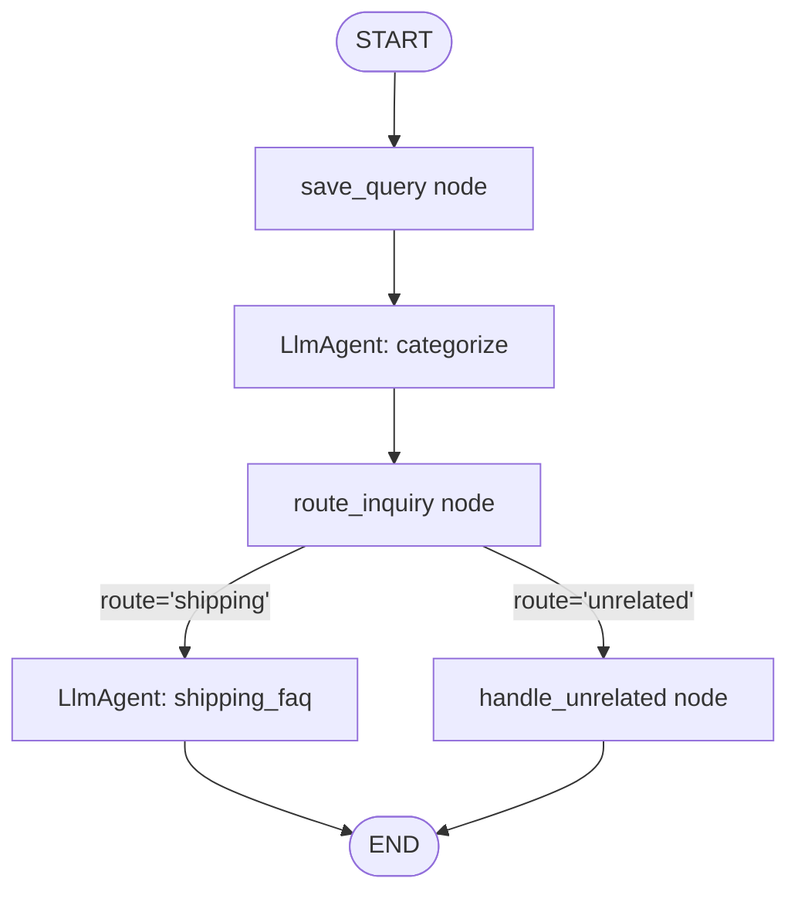
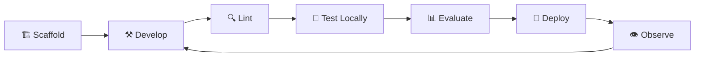
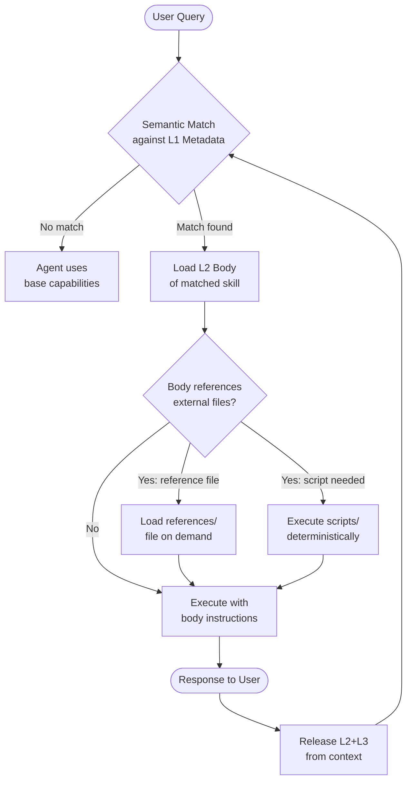
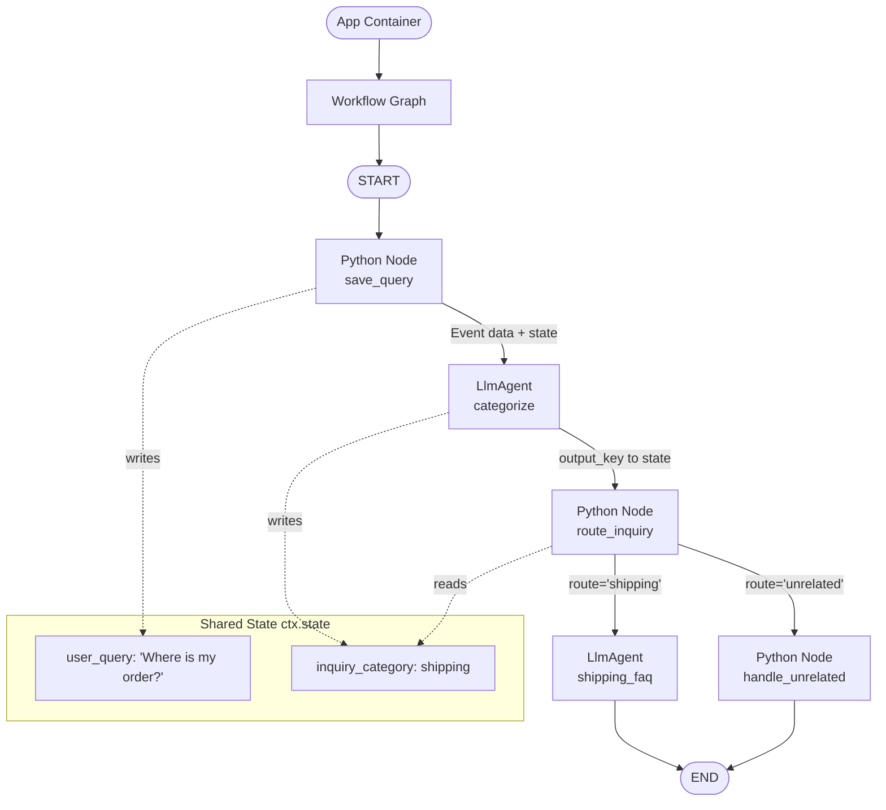
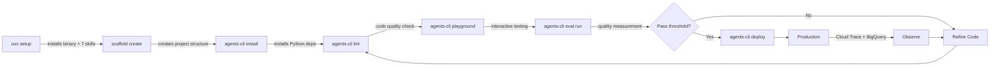

# 🤖 Day 3 Study Notes — Google/Kaggle AI Agents & Vibe Coding Intensive
## Agent Skills, Antigravity, and the ADK Lifecycle

> **Course:** 5-Day AI Agents Intensive Vibe Coding Course with Google × Kaggle
> **Day 3 Focus:** Agent Skills · Antigravity Skill Patterns · ADK 2.0 · Agent Lifecycle Management
> **Sources synthesized:** YouTube Podcast (uYURYHhpmKc) · Kaggle Agent Skills Whitepaper · Antigravity Skills Codelab · Agents CLI / ADK Lifecycle Codelab

---

## 📋 Table of Contents

1. [🎙️ Day 3 Podcast Overview — What Was Covered](#️-day-3-podcast-overview--what-was-covered)
2. [🧠 The Big Problem: Context Rot & Agent Overload](#-the-big-problem-context-rot--agent-overload)
3. [⚡ What Are Agent Skills?](#-what-are-agent-skills)
4. [🔬 Skills vs Tools vs MCP — Key Distinctions](#-skills-vs-tools-vs-mcp--key-distinctions)
5. [🏗️ Anatomy of a Skill — SKILL.md Deep Dive](#️-anatomy-of-a-skill--skillmd-deep-dive)
6. [🌀 Progressive Disclosure — The Core Pattern](#-progressive-disclosure--the-core-pattern)
7. [📦 Skill Directory Structure](#-skill-directory-structure)
8. [🎯 Scope: Where Skills Live](#-scope-where-skills-live)
9. [🔄 Four Levels of Skill Patterns](#-four-levels-of-skill-patterns)
10. [🛠️ Hands-On: Antigravity Skills Codelab](#️-hands-on-antigravity-skills-codelab)
11. [⚙️ ADK 2.0 — The Agent Development Kit](#️-adk-20--the-agent-development-kit)
12. [🏗️ ADK Core Architecture Concepts](#️-adk-core-architecture-concepts)
13. [🔄 Building a Real Agent — Customer Support Example](#-building-a-real-agent--customer-support-example)
14. [🌀 Agents CLI — The Lifecycle Command Center](#-agents-cli--the-lifecycle-command-center)
15. [📊 Agent Evaluation — Quality Assurance](#-agent-evaluation--quality-assurance)
16. [🎯 Skills vs Multi-Agent Architecture](#-skills-vs-multi-agent-architecture)
17. [🧬 Memory Types in AI Agents](#-memory-types-in-ai-agents)
18. [📏 Token Economics — The Numbers](#-token-economics--the-numbers)
19. [🔐 Trust, Security, and Governance](#-trust-security-and-governance)
20. [🚀 Meta-Skills and Self-Improvement](#-meta-skills-and-self-improvement)
21. [🏪 The Skills Ecosystem & Marketplace](#-the-skills-ecosystem--marketplace)
22. [🎓 The Five Golden Rules of Agent Skills](#-the-five-golden-rules-of-agent-skills)
23. [✅ Quick-Start Implementation Guide](#-quick-start-implementation-guide)
24. [🗺️ Architecture Diagrams](#️-architecture-diagrams)
25. [📚 Key Terms Glossary](#-key-terms-glossary)

---

## 🎙️ Day 3 Podcast Overview — What Was Covered

The Day 3 companion podcast (YouTube: `https://www.youtube.com/watch?v=uYURYHhpmKc`) accompanies the **Agent Skills whitepaper** authored by:

- **Tanvi Singhal** (Google)
- **Gabriela Hernandez Larios** (Google)
- **Debanshu Das** (Google)
- **Lavi Nigam** (Google)
- **Smitha Kolam** (Google)

The Day 3 **livestream** brought together hosts **Kanchana Patlolla** and **Anant Nawalgaria**, codelab author **Kristopher Overholt**, Google guests **Steven Johnson**, **Kimberly Milam**, and **Julia Wiesinger**, plus external guest **Jay Alammar** from Cohere.

### 🎯 Day 3 Top-Level Theme

> Day 3 is all about **context engineering** — sessions, skills, memory, and strategies for optimal token use. How do you give an agent the right knowledge at the right moment without overloading it?

The podcast walks through the 62-page whitepaper, discussing:
- Why dumping all instructions into one prompt is a bad idea (Context Rot)
- The procedural memory gap in current AI agents
- How Agent Skills solve this elegantly
- How to build, evaluate, and deploy skills in production

---

## 🧠 The Big Problem: Context Rot & Agent Overload

Before we understand skills, we need to understand what problem they solve. There are **four major friction points** that Agent Skills address:

### 🔴 Problem 1: Context Rot

**What is it?** When you stuff too many instructions into a single system prompt, the LLM's performance degrades — even if you're still within the technical context window limit.

**Research backing:**
- *"Lost in the Middle"* (Liu et al., TACL 2024) — shows models lose information from the middle of long contexts
- *"Context Rot"* (Chroma, 2025) — demonstrates accuracy falls as input grows

**Analogy:** Imagine trying to follow a recipe while someone reads you 50 other recipes at the same time. Even if you *can* remember them all, your attention degrades.

```
Without Skills:
System Prompt = [50 workflows × ~300 tokens each] = 15,000 tokens EVERY turn
                     ↓
            LLM gets confused, slower, more expensive
```

### 🔴 Problem 2: Procedural Memory Gap

AI agents have different types of memory (more on this in the Memory section), but **procedural memory** — the "how to do things step by step" knowledge — is what's missing. Skills fill this gap.

### 🔴 Problem 3: Multi-Agent Overload

Early 2025 became the era of "just make a router agent plus 15 specialist sub-agents." This works but creates:
- Complex CI/CD pipelines (15 agents to deploy and version)
- Maintenance nightmares
- Unnecessary orchestration overhead

**Skills alternative:** One general agent + a library of on-demand specialist runbooks.

### 🔴 Problem 4: Portability Constraints

If your agent instructions are locked inside one platform's proprietary format, you can't move them. Markdown-based skills work across:
- Claude Code (Anthropic)
- Codex (OpenAI)
- Cursor
- Antigravity (Google)
- ADK (Google)

---

## ⚡ What Are Agent Skills?

> **Definition:** Agent Skills are **directory-based packages** containing a `SKILL.md` definition file and optional supporting assets (scripts, references, templates). They function as **on-demand capability extensions** that load only when relevant to the user's request.

Think of a Skill as **the runbook that an experienced colleague hands you on day one** — it's the step-by-step procedural knowledge for getting specific tasks done.

### The Metaphor

```
Traditional Agent:
┌─────────────────────────────────────────┐
│ SYSTEM PROMPT (always loaded)           │
│ • Instructions for Task A (500 tokens)  │
│ • Instructions for Task B (500 tokens)  │
│ • Instructions for Task C (500 tokens)  │
│ • ... 47 more tasks ...                 │
│ • Total: 15,000 tokens EVERY request    │
└─────────────────────────────────────────┘

Agent with Skills:
┌──────────────────────────────────────────┐
│ SYSTEM PROMPT (always loaded)            │
│ • Skill A metadata: 50 tokens            │
│ • Skill B metadata: 50 tokens            │
│ • ... 48 more skill names ...            │
│ • Total: ~4,000 metadata tokens          │
│                                          │
│ WHEN user asks about Task B:             │
│   → Load Skill B's full body (500 tokens)│
│   → Total this turn: ~4,500 tokens       │
└──────────────────────────────────────────┘
```

### Core Properties of Skills

| Property | Description |
|----------|-------------|
| **File-system native** | Just a folder with files — no special runtime needed |
| **Portable** | Works across Claude Code, Cursor, Codex, Antigravity, ADK |
| **Progressive** | Only loads detail when needed |
| **Composable** | Skills can reference other skills and tools |
| **Versioned** | Treated like code — git, semver, PR review |
| **Human-editable** | Plain Markdown — no coding required to write one |

---

## 🔬 Skills vs Tools vs MCP — Key Distinctions

This is crucial to understand because these terms get confused constantly.

### The Layers of an AI Agent

```
┌─────────────────────────────────────────────────────┐
│                    AI AGENT                         │
│                                                     │
│  🧠 SKILLS          → "the runbook"                │
│     Procedural memory: HOW to execute workflows     │
│                                                     │
│  🤲 TOOLS / MCP     → "the hands"                 │
│     Connections to external systems: APIs, DBs      │
│                                                     │
│  📖 AGENTS.MD       → "project README"             │
│     Always-on conventions + skill catalog router    │
│                                                     │
│  💾 RAG             → "the library"                │
│     Static reference knowledge retrieval            │
│                                                     │
│  💡 SYSTEM PROMPT   → "instinct"                  │
│     Core persona, always-on identity               │
└─────────────────────────────────────────────────────┘
```

### Detailed Comparison Table

| Primitive | Role | When to Use | Example |
|-----------|------|-------------|---------|
| **MCP (Model Context Protocol)** | Connect to external systems | API calls, database queries, file I/O | Call a GitHub API |
| **Skill** | Teach HOW to use tools for a workflow | Procedural tasks, reusable processes | "How to make a proper git commit" |
| **AGENTS.md** | Always-on conventions + routing catalog | Project-level configuration | Project coding standards |
| **RAG** | Retrieve static reference content | Knowledge bases, docs | Find relevant documentation |
| **System Prompt** | Core identity and instincts | Persona, language, safety rules | "Be a helpful assistant" |

### The Whitepaper's Key Distinction (memorize this!)

> **MCP = the agent's hands** (heavy-duty connections to external systems)
> **Skills = the agent's brains** (directing how and when to use those hands)

### Skills vs MCP: Complementary, Not Competing

The open-standard move for Skills mirrors Anthropic's earlier playbook with MCP (donated to Linux Foundation on December 9, 2025):

```
MCP:    Standardizes HOW an agent connects to tools
Skills: Standardizes HOW an agent learns a procedure

These are TWO DIFFERENT LAYERS that compose together.
```

---

## 🏗️ Anatomy of a Skill — SKILL.md Deep Dive

Every skill is built around a **SKILL.md** file. This is the most important file to understand.

### SKILL.md Structure

A SKILL.md file has exactly **two parts**:

#### Part 1: YAML Frontmatter (the metadata)

```yaml
---
name: git-commit-formatter
description: |
  Formats git commit messages using the Conventional Commits specification.
  Use when creating, reviewing, or fixing commit messages.
  Do NOT use for branch naming, code review, or PR descriptions.
---
```

**Fields:**
- `name`: Unique identifier (lowercase, kebab-case; optional — defaults to directory name)
- `description`: **THE MOST IMPORTANT FIELD** — this is the routing algorithm that determines WHEN this skill fires

#### Part 2: Markdown Body (the instructions)

```markdown
# Git Commit Formatter

## Goal
Format git commit messages to follow the Conventional Commits specification.

## Specification
Commit messages must follow this format:
`<type>(<scope>): <description>`

## Valid Types
- `feat`: New feature
- `fix`: Bug fix
- `docs`: Documentation changes
- `style`: Formatting changes
- `refactor`: Code restructure
- `test`: Adding tests
- `chore`: Maintenance tasks

## Examples
✅ GOOD:
- `feat(auth): implement login with google`
- `fix(api): resolve null pointer on user lookup`
- `docs(readme): add installation instructions`

❌ BAD:
- `update code`
- `fixed stuff`
- `WIP`

## Rules
1. Keep the description under 72 characters
2. Use the imperative mood ("add" not "added")
3. Don't end with a period
4. Reference issue numbers when applicable: `feat(auth): add OAuth (#123)`
```

### The Golden Rule of Descriptions

> **Descriptions are routing algorithms, not documentation.**

Bad description: `"Database tools"` ← Too vague, will never trigger correctly
Good description: `"Executes read-only SQL queries against PostgreSQL for data debugging"` ← Precise trigger

**Rules for writing great descriptions:**
1. Front-load trigger keywords (what the user will likely say)
2. Include explicit "Do NOT use for..." anti-triggers
3. Name the output format if relevant
4. Be specific about the domain

---

## 🌀 Progressive Disclosure — The Core Pattern

This is the architectural philosophy that makes skills efficient.

### The Three Levels

| Level | Name | Contents | When Loaded | Token Cost |
|-------|------|----------|-------------|------------|
| **L1** | Metadata | `name` + `description` only | Every turn | ~50 tokens/skill |
| **L2** | Body | Full `SKILL.md` content | When skill triggers | Variable (hundreds) |
| **L3** | Bundled assets | `references/`, `scripts/`, `assets/` | When body references them or script executes | On-demand only |

### How It Works in Practice

```
USER: "Help me write a git commit message for this bug fix"
        ↓
AGENT checks L1 metadata for all loaded skills:
  • git-commit-formatter: "Formats git commits..." ← MATCH!
  • license-header-adder: "Adds copyright headers..." ← no match
  • json-to-pydantic: "Converts JSON to Pydantic..." ← no match
        ↓
AGENT loads L2 body of git-commit-formatter (~200 tokens)
        ↓
AGENT follows instructions → produces correct commit message
        ↓
Next turn: Body released from context (if no longer needed)
```

### Token Math

```
50 skills × 50 tokens metadata = 2,500 tokens (always loaded)
+ 1 active skill body         = ~300 tokens (only when needed)
─────────────────────────────────────────────────────────────
Total cost per turn:           ≈ 2,800 tokens

vs.

Monolithic system prompt with all 50 workflows embedded:
50 × 300 tokens = 15,000 tokens EVERY SINGLE TURN
```

**Real-world validation from Anthropic:** Converting workflows to skills reduced active context from ~150,000 tokens to ~2,000 tokens.

---

## 📦 Skill Directory Structure

### Minimal Skill (Level 1)

```
git-commit-formatter/
└── SKILL.md
```

### Full-Featured Skill (Level 4)

```
database-schema-validator/
├── SKILL.md                    ← Required: routing + instructions
├── scripts/
│   └── validate_schema.py      ← Deterministic Python validation
├── references/
│   └── schema_standards.md     ← Loaded on demand (not always)
└── assets/
    └── schema_template.sql     ← Example templates
```

### Example: License Header Adder (Reference Pattern)

```
license-header-adder/
├── SKILL.md
└── resources/
    └── HEADER_TEMPLATE.txt     ← Legal text stored here, NOT in SKILL.md
```

**Why store it separately?** Because legal boilerplate text is:
- Long (wastes tokens if always in body)
- Exact (models hallucinate legal text if not given verbatim)
- Stable (doesn't change often)

---

## 🎯 Scope: Where Skills Live

Skills can be installed at **two levels of scope**:

### 🌍 Global Scope

**Location:** `~/.gemini/config/skills/` (or `~/.agents/skills/`)

**Use for:**
- Utilities you want everywhere: JSON formatting, UUID generation, code style review
- Personal productivity workflows
- Universal standards (commit formatting, etc.)

### 📁 Project/Workspace Scope

**Location:** `<project-root>/.agents/skills/`

**Use for:**
- Project-specific deployment scripts
- Database management for this app
- Proprietary framework patterns
- Domain-specific knowledge (company's internal APIs)

### Scope Priority

```
Project Scope (.agents/skills/) overrides Global Scope (~/.agents/skills/)
```

---

## 🔄 Four Levels of Skill Patterns

The codelab introduces four progressively complex patterns. Think of these as a **skill design framework**:

### 🟢 Level 1: The Basic Router Pattern
**"Hello World" of Skills**

**Example skill:** `git-commit-formatter`

**What it uses:** Instructions only — no scripts, no external files
**When to use:** When the task is well-defined, small, and the model can do it from clear instructions alone

```yaml
---
name: git-commit-formatter
description: |
  Formats git commit messages using Conventional Commits.
  Use when creating or reviewing commit messages.
---

# Instructions
Format commit messages as: `<type>(<scope>): <description>`

Valid types: feat, fix, docs, style, refactor, test, chore

## Examples
- feat(auth): implement login with google
- fix(api): resolve null pointer on user lookup
```

**How to use it:**
```bash
# 1. Initialize a test repo
git init git_test
cd git_test
echo "initial" > README.md
git add .
git commit -m "initial commit"

# 2. Make a change
echo "def login(): pass" > auth.py
git add auth.py

# 3. Ask the agent
# "Help me write a commit message for adding Google login"
# Agent uses the skill → produces: feat(auth): implement login with google

# 4. Verify
git log --oneline
```

---

### 🔵 Level 2: The Reference Pattern
**"Asset Utilization"**

**Example skill:** `license-header-adder`

**What it uses:** External reference files (text, docs, templates)
**When to use:** When the task requires exact text/boilerplate that models would otherwise hallucinate, or content that's too long to embed in the body

```
license-header-adder/
├── SKILL.md
└── resources/
    └── HEADER_TEMPLATE.txt
```

**SKILL.md:**
```yaml
---
name: license-header-adder
description: |
  Adds Apache 2.0 copyright license headers to source files.
  Use when creating new files or auditing existing files for license compliance.
---

## Goal
Add the correct Apache 2.0 license header to source code files.

## Instructions
1. Read the template from `resources/HEADER_TEMPLATE.txt`
2. Convert comment syntax for the target language:
   - Python: `#` prefix each line
   - JavaScript/C/Java: Wrap in `/* ... */`
   - HTML: Wrap in `<!-- ... -->`
3. Prepend the converted header to the file

## Important
- Always read the template file first — never write the license from memory
- Do not modify existing headers
```

**HEADER_TEMPLATE.txt:**
```
Copyright [YEAR] Google LLC

Licensed under the Apache License, Version 2.0 (the "License");
you may not use this file except in compliance with the License.
You may obtain a copy of the License at

    http://www.apache.org/licenses/LICENSE-2.0
...
```

---

### 🟡 Level 3: The Few-Shot Pattern
**"Learning by Example"**

**Example skill:** `json-to-pydantic`

**What it uses:** Example input/output pairs in an `examples/` folder
**When to use:** When showing is better than telling — complex transformations, style conventions, formatting rules

```
json-to-pydantic/
├── SKILL.md
└── examples/
    ├── input_data.json
    └── output_model.py
```

**SKILL.md:**
```yaml
---
name: json-to-pydantic
description: |
  Converts JSON data structures into Pydantic Python model classes.
  Use when you have JSON and need type-safe Python data models.
---

## Goal
Convert JSON data into well-structured Pydantic v2 models.

## Instructions
1. Read the example in `examples/` to understand the expected output style
2. Analyze the JSON structure
3. Generate Pydantic models following these conventions:
   - Class names: PascalCase (`ProductDetail`, not `product_detail`)
   - Optional fields: `Optional[Type] = None`
   - Lists: `List[Type]` or `list[Type]`
   - Nested objects: Create separate model classes

## Style Reference
Always check `examples/output_model.py` before generating — match the exact style.
```

**examples/input_data.json:**
```json
{
  "product_id": "P001",
  "name": "Widget",
  "price": 9.99,
  "tags": ["sale", "featured"],
  "supplier": {
    "id": "S01",
    "name": "Acme Corp"
  }
}
```

**examples/output_model.py:**
```python
from pydantic import BaseModel
from typing import Optional, List

class Supplier(BaseModel):
    id: str
    name: str

class Product(BaseModel):
    product_id: str
    name: str
    price: float
    tags: List[str]
    supplier: Optional[Supplier] = None
```

---

### 🔴 Level 4: The Tool Use Pattern
**"Procedural Logic with Deterministic Code"**

**Example skill:** `database-schema-validator`

**What it uses:** Python/Bash scripts that execute deterministically
**When to use:** When validation/logic must be 100% reliable, not probabilistic; when you need exit codes for success/failure

```
database-schema-validator/
├── SKILL.md
└── scripts/
    └── validate_schema.py
```

**SKILL.md:**
```yaml
---
name: database-schema-validator
description: |
  Validates SQL schema files against project standards before migration.
  Use when reviewing, creating, or approving database schema changes.
---

## Goal
Validate SQL schema files enforce three mandatory policies.

## Validation Rules
1. No `DROP TABLE` statements (irreversible, requires DBA approval)
2. Table names must use `snake_case` (not camelCase or PascalCase)
3. Every table must have an `id` primary key column

## How to Validate
Run the validation script:
```
python scripts/validate_schema.py <path_to_schema.sql>
```

- Exit code `0` = Schema is valid, proceed
- Exit code `1` = Schema has violations (errors printed to stdout)

## After Validation Fails
Report each violation found. Suggest specific fixes.
Do not proceed with migration until all violations are resolved.
```

**scripts/validate_schema.py:**
```python
#!/usr/bin/env python3
import sys
import re

def validate_schema(filepath: str) -> list[str]:
    errors = []
    with open(filepath, 'r') as f:
        content = f.read()

    # Rule 1: No DROP TABLE
    if re.search(r'\bDROP\s+TABLE\b', content, re.IGNORECASE):
        errors.append("VIOLATION: DROP TABLE found — requires DBA approval")

    # Rule 2: snake_case table names
    create_matches = re.findall(r'CREATE\s+TABLE\s+(\w+)', content, re.IGNORECASE)
    for table_name in create_matches:
        if table_name != table_name.lower() or '-' in table_name:
            errors.append(f"VIOLATION: Table '{table_name}' must use snake_case")

    # Rule 3: Every table must have an id primary key
    table_blocks = re.split(r'CREATE\s+TABLE', content, flags=re.IGNORECASE)[1:]
    for block in table_blocks:
        if not re.search(r'\bid\b.*PRIMARY\s+KEY', block, re.IGNORECASE):
            table_name = re.match(r'\s+(\w+)', block)
            name = table_name.group(1) if table_name else "unknown"
            errors.append(f"VIOLATION: Table '{name}' missing 'id' primary key")

    return errors

if __name__ == "__main__":
    if len(sys.argv) != 2:
        print("Usage: validate_schema.py <schema.sql>")
        sys.exit(1)

    errors = validate_schema(sys.argv[1])
    if errors:
        for error in errors:
            print(error)
        sys.exit(1)
    else:
        print("Schema validation passed ✓")
        sys.exit(0)
```

**Testing the validator:**
```sql
-- bad_schema.sql (intentionally bad for testing)
DROP TABLE IF EXISTS OldUsers;

CREATE TABLE UserProfile (  -- camelCase violation!
  username VARCHAR(255),    -- missing id primary key!
  email VARCHAR(255)
);
```

```bash
# Agent runs:
python scripts/validate_schema.py bad_schema.sql
# Output:
# VIOLATION: DROP TABLE found — requires DBA approval
# VIOLATION: Table 'UserProfile' must use snake_case
# VIOLATION: Table 'UserProfile' missing 'id' primary key
# Exit code: 1
```

---

## 🛠️ Hands-On: Antigravity Skills Codelab

### What is Antigravity?

Antigravity is Google's AI-powered coding assistant (similar to GitHub Copilot but from Google). It supports skills natively, making it the perfect sandbox for learning the skill system.

### Installation Steps

**Step 1: Clone the example repository**
```bash
git clone https://github.com/rominirani/antigravity-skills
cd antigravity-skills/skills_tutorial
```

**Step 2: Choose your scope and install the four example skills**

For **project scope** (this project only):
```bash
# Create the skills directory in your project
mkdir -p .agents/skills/

# Copy all four example skills
cp -r git-commit-formatter .agents/skills/
cp -r license-header-adder .agents/skills/
cp -r database-schema-validator .agents/skills/
cp -r json-to-pydantic .agents/skills/
```

For **global scope** (available in all projects):
```bash
mkdir -p ~/.gemini/config/skills/

cp -r git-commit-formatter ~/.gemini/config/skills/
cp -r license-header-adder ~/.gemini/config/skills/
cp -r database-schema-validator ~/.gemini/config/skills/
cp -r json-to-pydantic ~/.gemini/config/skills/
```

**Step 3: Verify the skills are loaded**

In the Antigravity UI:
```
Ask: "What skills are available?"
→ Agent lists all registered skills with descriptions
```

In the Antigravity CLI:
```bash
/skills
# Shows list of all available skills
```

### Running the Examples

**git-commit-formatter walkthrough:**
```bash
# Create test repo
git init git_test && cd git_test
echo "print('hello')" > app.py
git add . && git commit -m "initial"

# Make a meaningful change
echo "def login_with_google(): pass" >> app.py
git add app.py

# Ask agent (in Antigravity):
# "Write a commit message for the changes I just staged"
# → Skill triggers → Agent produces:
# feat(auth): implement google login function

git commit -m "feat(auth): implement google login function"
git log --oneline
```

**json-to-pydantic walkthrough:**
```bash
cat > product.json << 'EOF'
{
  "id": "P001",
  "name": "Coffee Mug",
  "price": 12.99,
  "in_stock": true,
  "categories": ["kitchen", "gifts"],
  "dimensions": {"height": 10, "width": 8, "unit": "cm"}
}
EOF

# Ask agent: "Convert product.json to a Pydantic model"
# Skill triggers, reads examples/, produces:
```

```python
# product_model.py (agent-generated output)
from pydantic import BaseModel
from typing import List, Optional

class Dimensions(BaseModel):
    height: float
    width: float
    unit: str

class Product(BaseModel):
    id: str
    name: str
    price: float
    in_stock: bool
    categories: List[str]
    dimensions: Optional[Dimensions] = None
```

---

## ⚙️ ADK 2.0 — The Agent Development Kit

### What is ADK?

The **Agent Development Kit (ADK)** is Google's open-source, code-first framework for building production-grade AI agents. Think of it as the "batteries included" toolkit for agent development.

**Key facts:**
- Open source (Apache 2.0)
- Multi-language: Python, TypeScript, Go, Java, Kotlin
- Python 2.0 (current) features **graph workflows** and collaborative agents
- Pairs with **Agents CLI** for end-to-end lifecycle management

### ADK vs Raw API

```
Raw Gemini API:
   You write: prompt → call API → parse response → loop
   You manage: state, routing, errors, retries, context

ADK:
   You write: agent instructions and workflow graph
   ADK manages: execution loop, state, routing, context, output schemas
```

### Prerequisites

```bash
# Python 3.11+
python --version  # Must be 3.11+

# uv package manager (fast Python package manager)
pip install uv

# Node.js 18+ (for skill tooling)
node --version    # Must be 18+
```

### Authentication

**Option A: Gemini API Key (recommended for getting started)**
```bash
export GEMINI_API_KEY="your_api_key_here"
export GOOGLE_GENAI_USE_ENTERPRISE=FALSE
```

**Option B: Google Cloud Application Default Credentials**
```bash
gcloud auth application-default login
gcloud config set project <YOUR_PROJECT_ID>
export GOOGLE_GENAI_USE_ENTERPRISE=TRUE
export GOOGLE_CLOUD_PROJECT=YOUR_PROJECT_ID
export GOOGLE_CLOUD_LOCATION=us-central1
```

---

## 🏗️ ADK Core Architecture Concepts

### The Building Blocks

ADK 2.0 introduces a **graph-based architecture**. Here's every concept you need to know:

#### 1. LlmAgent — The Brain Node

An `LlmAgent` is a **declarative specification** of an LLM-powered task. It's not a function you call — it's a configuration that ADK executes.

```python
from google.adk import LlmAgent
from pydantic import BaseModel
from typing import Literal
from pydantic import Field

class SentimentOutput(BaseModel):
    sentiment: Literal['positive', 'negative', 'neutral'] = Field(
        description='The sentiment of the input text'
    )
    confidence: float = Field(description='Confidence score 0-1')

sentiment_agent = LlmAgent(
    name='sentiment_analyzer',           # Unique name in the graph
    model='gemini-3.1-flash-lite',       # Which LLM to use
    instruction='''
        You are an expert sentiment analyzer.
        Analyze the input text and classify its sentiment.
        Be precise and consistent.
    ''',
    output_key='sentiment_result',       # Where to store result in state
    output_schema=SentimentOutput,       # Type-safe structured output
)
```

**LlmAgent properties:**

| Property | Required | Description |
|----------|----------|-------------|
| `name` | Yes | Unique identifier in the workflow graph |
| `model` | Yes | Which LLM model to use |
| `instruction` | Yes | The system prompt / task description |
| `output_key` | No | Key name for storing result in shared state |
| `output_schema` | No | Pydantic model for structured output |

#### 2. Nodes — Custom Logic Functions

Nodes are plain Python functions (or decorated with `@node`) that perform deterministic logic. They access shared state via `Context` and emit `Event` objects.

```python
from google.adk import node, Context, Event

# Simple node: save input to state
def save_query(node_input: str):
    """Saves the user's query to shared state for downstream nodes."""
    yield Event(
        data=node_input,              # Pass data to next node
        state={'user_query': node_input}  # Save to shared state
    )

# Decorated node with Context access: routing logic
@node
def route_inquiry(ctx: Context, node_input: Any):
    """Reads categorization result and routes to correct handler."""
    # Access data stored by a previous node
    category_data = ctx.state.get('inquiry_category', {})
    category = category_data.get('category', 'unrelated')

    # Retrieve the original query from state
    query = ctx.state.get('user_query', node_input)

    # Emit event with routing signal
    yield Event(
        data=query,
        route=category    # This string determines the next node
    )
```

#### 3. Event — The Message Carrier

Events are how nodes communicate downstream:

```python
# Event with just data (goes to next node in chain)
yield Event(data="some result")

# Event with data + state update
yield Event(
    data="some result",
    state={'my_key': 'my_value'}  # Persists to ctx.state for all downstream
)

# Event with routing signal (conditional branching)
yield Event(
    data="some result",
    route='shipping'  # Jump to the node registered for 'shipping'
)
```

#### 4. Context — The Shared Whiteboard

The `Context` object gives nodes access to everything that's happened so far in the workflow:

```python
@node
def my_node(ctx: Context, node_input: Any):
    # Read from state
    previous_result = ctx.state.get('some_key', default_value)

    # Read conversation history
    history = ctx.session.get_history()

    # Process and yield
    result = process(previous_result)
    yield Event(data=result, state={'my_output': result})
```

#### 5. Workflow — The Graph Orchestrator

`Workflow` assembles nodes and agents into an execution graph using **edges**:

```python
from google.adk import Workflow
from google.adk.agents import Edge, START

root_agent = Workflow(
    name='my_workflow',
    edges=[
        # Chain: START → A → B → C (sequential)
        *Edge.chain('START', node_a, agent_b, node_c),

        # Conditional branches from node_c:
        (node_c, handler_x, 'route_value_x'),  # if route='route_value_x'
        (node_c, handler_y, 'route_value_y'),  # if route='route_value_y'
    ]
)
```

**Edge.chain()** is syntactic sugar that expands:
```python
Edge.chain('START', A, B, C)
# Becomes:
# ('START', A)
# (A, B)
# (B, C)
```

#### 6. App — The Outermost Container

`App` wraps the root workflow to expose it to external tools (CLI, playground, eval harnesses, Agent Runtime):

```python
from google.adk import App

app = App(
    name='my_agent_app',
    root_agent=root_agent   # The Workflow defined above
)
```

---

## 🔄 Building a Real Agent — Customer Support Example

The ADK codelab walks through building a **customer support routing agent**. Here's the complete implementation:

### Architecture



### Step 1: Define the Output Schema

```python
from pydantic import BaseModel, Field
from typing import Literal

class InquiryCategory(BaseModel):
    """Structured output from the categorization step."""
    category: Literal['shipping', 'unrelated'] = Field(
        description='Classify whether the query relates to shipping/delivery. '
                    'Use "unrelated" for anything else.'
    )
```

### Step 2: Save Query Node

```python
from google.adk import Event

def save_query(node_input: str):
    """Captures and persists the user's raw query for later nodes."""
    yield Event(
        data=node_input,
        state={'user_query': node_input}
    )
```

### Step 3: Categorization Agent

```python
from google.adk import LlmAgent

categorize_agent = LlmAgent(
    name='categorize',
    model='gemini-3.1-flash-lite',
    instruction='''
        You are an expert query classifier for a shipping company.
        Classify the user's query as either:
        - "shipping": questions about delivery, tracking, shipping times, costs
        - "unrelated": anything that's not about shipping
        Be strict — when in doubt, classify as "unrelated".
    ''',
    output_key='inquiry_category',      # Saved to ctx.state['inquiry_category']
    output_schema=InquiryCategory,      # Returns InquiryCategory-shaped JSON
)
```

### Step 4: Routing Node

```python
from google.adk import node, Context, Event
from typing import Any

@node
def route_inquiry(ctx: Context, node_input: Any):
    """Reads the categorization result and routes to the appropriate handler."""
    # Read the structured output from the categorize_agent
    category_data = ctx.state.get('inquiry_category', {})
    category = category_data.get('category', 'unrelated')

    # Retrieve the original query
    query = ctx.state.get('user_query', str(node_input))

    # Route based on category
    yield Event(
        data=query,
        route=category    # 'shipping' or 'unrelated'
    )
```

### Step 5: Specialized Handlers

```python
# Handler for shipping questions
shipping_faq_agent = LlmAgent(
    name='shipping_faq',
    model='gemini-3.1-flash-lite',
    instruction='''
        You are a helpful shipping support representative.
        Answer questions about:
        - Standard delivery: 5-7 business days
        - Express delivery: 2-3 business days
        - Overnight delivery: next business day
        - International shipping: 10-14 business days
        Always be friendly and precise.
    ''',
)

# Handler for unrelated questions
@node
def handle_unrelated(ctx: Context, node_input: Any):
    """Politely declines non-shipping questions."""
    yield Event(
        data='I\'m sorry, I specialize in shipping support only. '
             'For other questions, please contact our general support team.'
    )
```

### Step 6: Assemble the Workflow

```python
from google.adk import Workflow, App
from google.adk.agents import Edge

root_agent = Workflow(
    name='customer_support_workflow',
    edges=[
        # Main chain: START → save → categorize → route
        *Edge.chain('START', save_query, categorize_agent, route_inquiry),

        # Branches from route_inquiry based on category
        (route_inquiry, shipping_faq_agent, 'shipping'),
        (route_inquiry, handle_unrelated, 'unrelated'),
    ],
)

# Wrap in App for external interface
app = App(
    name='customer_support_agent',
    root_agent=root_agent
)
```

### Complete File Layout

```
customer-support-agent/
├── agent.py          ← All the code above
├── pyproject.toml    ← Dependencies (managed by agents-cli)
├── evals/
│   └── shipping_evals.json   ← Test cases
└── .agents/
    └── skills/       ← Any skills for this project
```

---

## 🌀 Agents CLI — The Lifecycle Command Center

The **Agents CLI** is the command-line tool that manages the **complete development lifecycle** of ADK agents. Think of it as `npm` or `cargo` but for AI agents.

### Installation

```bash
uvx google-agents-cli setup
```

This single command:
1. Installs the `agents-cli` binary globally
2. Installs **7 domain-specific coding assistant skills** to `~/.agents/skills/`

**Installed Skills:**
| Skill Name | Purpose |
|------------|---------|
| `google-agents-cli-adk-code` | Writing ADK Python code |
| `google-agents-cli-deploy` | Deployment configuration |
| `google-agents-cli-eval` | Evaluation harness setup |
| `google-agents-cli-observability` | Monitoring and tracing |
| `google-agents-cli-publish` | Publishing to registries |
| `google-agents-cli-scaffold` | Project scaffolding |
| `google-agents-cli-workflow` | Workflow pattern guidance |

> Notice: **the CLI itself uses skills** to teach the AI how to help you with the CLI. Very meta!

### The Complete Development Lifecycle



### Phase 1: Scaffold — Create Your Project

```bash
# Create a new agent project with prototype templates
agents-cli scaffold create customer-support-agent --prototype --yes

# What this generates:
customer-support-agent/
├── agent.py              ← Main agent code
├── pyproject.toml        ← Python dependencies
├── README.md             ← Project documentation
└── evals/
    └── default.json      ← Starter eval cases
```

### Phase 2: Develop — Install Dependencies

```bash
cd customer-support-agent

# Install Python dependencies using uv
agents-cli install
```

### Phase 3: Lint — Code Quality Check

```bash
agents-cli lint
```

What it checks:
- Import statements (unused, missing)
- Python syntax errors
- Formatting consistency
- ADK-specific best practices
- Type annotation coverage

### Phase 4: Local Testing — The Playground

```bash
# Launch the interactive web playground
agents-cli playground
```

Opens `http://127.0.0.1:8080/dev-ui/?app=app` in your browser.

**Key features:**
- Interactive chat interface with your agent
- **Auto-reload** on code changes (save file → playground updates instantly)
- Full conversation history
- State inspector (see what's in `ctx.state` at any point)

```bash
# Alternative: Single-turn CLI testing (good for scripts/CI)
agents-cli run "How long does standard delivery take?"
# Output: "Standard delivery takes 5-7 business days."
```

### Phase 5: Evaluate — Measure Quality

```bash
agents-cli eval run
```

Scores your agent against an evalset — JSON files with expected inputs/outputs.

**Evalset format:**
```json
[
  {
    "id": "shipping_standard_001",
    "input": "How long does standard shipping take?",
    "expected_output": "Standard delivery takes 5-7 business days.",
    "expected_route": "shipping"
  },
  {
    "id": "unrelated_001",
    "input": "What's the weather like today?",
    "expected_route": "unrelated"
  }
]
```

### Phase 6: Deploy — Production

```bash
agents-cli deploy
```

Options:
- **Agent Runtime**: Managed Google service (autoscaling, monitoring built-in)
- **Cloud Run**: Container-based deployment with more control

### Phase 7: Observe — Monitor in Production

Telemetry automatically streams to:
- **Cloud Trace**: Request tracing and latency analysis
- **BigQuery**: Query and analyze conversation data at scale

### The Meta-Pattern: Lifecycle Skills

The CLI installs skills that **teach the AI how to help you use the CLI**. When you're working in Antigravity and ask "how do I scaffold a new agent?", the `google-agents-cli-scaffold` skill fires and gives precise instructions.

---

## 📊 Agent Evaluation — Quality Assurance

Evaluation is one of the most important (and most neglected) parts of agent development. The whitepaper dedicates significant attention to this.

### The Critical Benchmark Finding

> **19% of tasks performed WORSE with a skill than without one** — SkillsBench research

This is the uncomfortable truth: **bad skills actively harm performance**. This is why evaluation matters so much.

### Failure Mode Analysis

| Failure Mode | Symptom | Root Cause |
|-------------|---------|------------|
| **Trigger failure** | Wrong skill fires, or right one never fires | Bad description (routing algorithm) |
| **Execution failure** | Skill triggers but produces wrong output | Body logic error or bad instructions |
| **Token budget failure** | Co-loading multiple skills causes context rot | Bloated bodies or excessive metadata |
| **Regression failure** | New skill breaks routing for existing library | Undiscovered conflicts between descriptions |

### Production Data (Vercel Research)

These numbers are sobering:

| Metric | Finding |
|--------|---------|
| Non-invocation rate | **56%** of skills expected to fire consistently don't |
| Stripped instructions | **58%** pass rate vs **63%** with NO skill (net harm!) |
| AGENTS.md index (passive) | **100%** pass rate vs **53%** baseline |

**Translation:** Passive AGENTS.md context wins over bad active skills. Quality matters more than quantity.

### The Target Metric

> **90% trigger accuracy on skill descriptions** — the minimum bar for production

### Five Evaluation Patterns

#### 1. Eval-as-Unit-Test
Run on every code change. Catch regressions immediately.

```json
{
  "case_id": "refund_dup_charge_001",
  "input": "I was charged twice for order #4521 last Tuesday",
  "expected_skill": "refund_processor",
  "expected_tool_calls": [
    {"tool": "lookup_order", "args": {"order_id": "4521"}}
  ],
  "rubric": ["acknowledges duplicate", "cites order id"]
}
```

#### 2. Golden Dataset
Versioned input/output pairs stored IN the skill directory:

```
my-skill/
├── SKILL.md
└── evals/
    ├── positive_cases.json    ← Should trigger AND succeed
    ├── negative_cases.json    ← Should NOT trigger
    └── edge_cases.json        ← Boundary conditions
```

#### 3. LLM-as-Judge
For subjective quality at scale:

```python
judge_prompt = """
Rate this agent response on a scale of 1-5 for each criterion:
- Accuracy: Did it answer correctly?
- Completeness: Did it cover everything needed?
- Tone: Was it professional and helpful?

Input: {user_query}
Response: {agent_response}
Expected: {expected_output}

Return JSON: {"accuracy": N, "completeness": N, "tone": N, "reasoning": "..."}
"""
```

> **Pro tip:** Swap the judge's position (judge A evaluates B's output, B evaluates A's) to detect positional bias.

#### 4. Adversarial Red-Team
Test negative boundaries:

```json
[
  {"input": "commit this code for me",     "should_trigger": "git-commit-formatter"},
  {"input": "push my code to github",      "should_NOT_trigger": "git-commit-formatter"},
  {"input": "comit mesage for bug fix",    "should_trigger": "git-commit-formatter"},
  {"input": "write a commit for my PR",   "should_trigger": "git-commit-formatter"}
]
```

#### 5. Canary / Shadow Testing
Deploy to 1% of live traffic before full rollout.

### Evaluation-Driven Development (EDD)

The whitepaper recommends a TDD-like approach for skills:

```
1. WRITE 3 eval cases BEFORE writing the SKILL.md body
2. Run evals → they fail (expected)
3. Write the SKILL.md body
4. Run evals → aim for passing
5. Only then ship to users
```

This discipline prevents the most common mistake: writing skills and assuming they work.

### The Read/Draft/Act Capability Ladder

This is the **safest way to deploy agent skills**:

```
┌─────────────────────────────────────────────────────────┐
│  TIER 3: ACTION-ALLOWED                                 │
│  Irreversible operations (delete, send email, charge)   │
│  Gate: adversarial red-team + pass^k + human sign-off  │
├─────────────────────────────────────────────────────────┤
│  TIER 2: DRAFT-ONLY                                     │
│  Produces output for human review before action         │
│  Gate: 20+ golden eval cases passing                   │
├─────────────────────────────────────────────────────────┤
│  TIER 1: READ-ONLY                                      │
│  Query, describe, summarize — no side effects           │
│  Gate: 90% trigger accuracy                            │
└─────────────────────────────────────────────────────────┘
```

**Never skip tiers.** A refund skill should pass through all three gates:
1. Read: Can it find the order? (Read-only)
2. Draft: Can it calculate the refund correctly? (Draft for human approval)
3. Act: Only then: actually issue the refund (Action-allowed)

### The pass^k Metric

Standard evaluation asks "did it work?" — but that's insufficient. The `pass^k` metric requires **k consecutive successful runs**:

```
GPT-4o baseline:
  pass^1 = 61%  (works at least once in first try)
  pass^8 = <25% (works 8 times in a row)

Implication: An agent that "usually works" is dangerous for action-allowed tasks.
```

---

## 🎯 Skills vs Multi-Agent Architecture

When should you use skills vs. building multiple specialized agents? The whitepaper provides clear guidance.

### Skills Win When

- You need **one general capability with many specializations**
- Tasks are **sequential**, not parallel
- You want **simpler deployment** (one agent to maintain)
- Context window is sufficient for one active skill at a time
- Skills solve: HR skill + invoicing skill + slides skill → one agent handles all

### Multi-Agent Still Wins When

| Scenario | Why Multi-Agent |
|----------|----------------|
| **Genuine parallelism** | Multiple tasks truly run simultaneously (not possible with one agent) |
| **Different security postures** | Agent A can access DB; Agent B cannot — isolation required |
| **Adversarial checks** | Agent verifies Agent B's output (needs independence) |
| **Heterogeneous models** | Use GPT-4 for some tasks, Gemini for others |

### The Math

```
100 process variants with multi-agent approach:
  → 100 agents to deploy
  → 100 CI/CD pipelines
  → Complex orchestration routing
  → High maintenance overhead

100 process variants with skills approach:
  → 1 agent to deploy
  → 100 skills (text files)
  → ~5,000 metadata tokens always loaded
  → Git-based version control for skills
```

---

## 🧬 Memory Types in AI Agents

The whitepaper explains why skills are needed by first explaining the **three types of memory** in AI systems:

```
┌──────────────────────────────────────────────────────────┐
│              THREE TYPES OF AGENT MEMORY                 │
│                                                          │
│  📖 EPISODIC MEMORY                                     │
│     What happened in THIS conversation                   │
│     → Stored in: Conversation history / context window  │
│     → Example: "Earlier you said your order is #4521"   │
│                                                          │
│  🧠 SEMANTIC MEMORY                                     │
│     Facts and knowledge (what things ARE)                │
│     → Stored in: Model weights (training) or RAG        │
│     → Example: "Paris is the capital of France"         │
│                                                          │
│  📋 PROCEDURAL MEMORY                                   │
│     How to DO things step-by-step                        │
│     → Stored in: ← THIS IS THE GAP SKILLS FILL →       │
│     → Example: "How to process a refund request"        │
│                                                          │
└──────────────────────────────────────────────────────────┘
```

Skills are the **first credible procedural memory primitive** for AI agents. Before skills, procedural memory was either baked into the system prompt (context rot) or left to the model to figure out (inconsistent).

---

## 📏 Token Economics — The Numbers

Understanding token costs helps you understand why skills matter at scale.

### Without Skills (Monolithic Prompt)

```
System Prompt = [all workflows embedded permanently]

Example at 50 workflows:
  50 workflows × 300 tokens avg = 15,000 tokens
  × 1,000 requests per day = 15,000,000 tokens/day in system prompt alone
  × $0.075/1M tokens (Gemini Flash)
  = $1.13/day just for context overhead
```

### With Skills (Progressive Disclosure)

```
Always-on metadata:
  50 skills × 50 tokens metadata = 2,500 tokens

Active skill body (when triggered):
  1 skill body at a time × 300 tokens = 300 tokens

Total per turn: ~2,800 tokens (vs 15,000)
Savings: 81% reduction in context overhead
```

### Real Validation Numbers

| Source | Metric | Finding |
|--------|--------|---------|
| Anthropic internal | Token reduction | 150,000 → 2,000 active tokens (~98% reduction) |
| Matt Pocock v1.0 | Token reduction via progressive disclosure | 63% savings |
| Whitepaper | 50 workflows comparison | 15,000 → ~6,000 tokens (60% reduction) |

---

## 🔐 Trust, Security, and Governance

With 40,000+ public skills in the marketplace, you need a framework for trust.

### Trust Hierarchy

| Source | Trust Level | Strategy |
|--------|-------------|---------|
| **Vendor first-party** (Google, Anthropic) | High | Trust; pin to specific version |
| **Org-curated private** | High (within org) | PR review required for changes |
| **Community-contributed** | Conditional | Audit before adoption; pin aggressively |

### Vetting Process for Community Skills

```
Before adopting any community skill:
1. Read SKILL.md completely — does it do what it claims?
2. Inspect scripts/ directory — what does the code actually do?
3. Check references/ — are external URLs trustworthy?
4. Pin to a specific version/commit hash
5. Test in sandbox before production
6. Review on every update before unpinning
```

### Naming Conventions (Security Note)

**Correct naming:**
```
Directory:  snake_case        e.g., database_validator
Name:       kebab-case        e.g., database-validator
Form:       gerunds           e.g., processing-pdfs, validating-schemas
```

**Avoid:**
```
❌ utils, tools           (too generic, routing collisions)
❌ vendor prefixes        (changes with vendor lock-in)
❌ PascalCase             (inconsistent with convention)
```

### Supply Chain Hygiene

Skills are code dependencies. Treat them like npm packages:
- **Pin versions** in production
- **Review diffs** before upgrading
- **Run evals** after any skill update
- **Don't auto-update** community skills in production

---

## 🚀 Meta-Skills and Self-Improvement

This is where things get advanced and interesting.

### What Are Meta-Skills?

Meta-skills are skills that operate on OTHER skills — they help build, improve, and manage your skill library.

### Four Categories

#### 1. Authoring Skills
Help create new skills:
```
skill-creator:         "Given this workflow description, draft a SKILL.md"
adk-skill-factory:     "Convert this ADK agent pattern into a reusable skill"
```

#### 2. Trace Harvesting Skills
Convert successful agent runs into draft skills:
```
Concept: Agent completes a complex task successfully
→ Trace harvesting skill analyzes the execution trace
→ Drafts a SKILL.md capturing the steps the agent took
→ Human reviews and refines the draft
→ New skill enters the library at read-only tier
```

#### 3. Improvement Skills
Optimize existing skills:
```
SkillOptimizer:        Tests and rewrites description for better trigger accuracy
description-tuner:     A/B tests variations of skill descriptions
```

#### 4. Library Evolution Skills
Voyager-style growth from production traffic:
```
voyager-pattern:       Analyzes production logs → identifies recurring patterns
                       → proposes new skills to formalize those patterns
```

### Critical Safety Rules for Meta-Skills

```
⚠️  Rule 1: Agent-written skills ALWAYS enter at DRAFT tier only
⚠️  Rule 2: Human review required for ALL diffs, even with metric improvements
⚠️  Rule 3: Do NOT launch meta-skills on an empty library
⚠️  Rule 4: Never auto-promote from draft to action-allowed without human review
```

### Matt Pocock's Production Validation

Matt Pocock's skill repository is a real-world production example with 135,000+ GitHub stars and 11,700+ forks. Key patterns:

**User-invoked vs Model-invoked taxonomy:**
```
User-invoked (orchestrators):
  /grill-with-docs     → The user explicitly triggers this
  /ask-matt            → User-directed workflow
  /triage             → User-initiated routing

Model-invoked (disciplines):
  grilling             → The model decides when to use this
  domain-modeling      → Model-invoked when needed
  tdd                  → Model decides this is appropriate

Composition rule:
  User-invoked MAY call model-invoked
  User-invoked MUST NOT call another user-invoked
```

**Four engineering failures → skill library design:**

| Failure | Resulting Skill(s) |
|---------|-------------------|
| Misalignment (building wrong thing) | `/grill-me`, `/grill-with-docs` |
| Verbosity (model is too wordy) | `CONTEXT.md` + `domain-modeling` |
| Broken code (no feedback loop) | `/tdd`, `diagnosing-bugs` |
| Ball-of-mud architecture | `/improve-codebase-architecture`, `codebase-design` |

---

## 🏪 The Skills Ecosystem & Marketplace

### Scale of the Ecosystem (as of early 2026)

| Metric | Number |
|--------|--------|
| Public skill listings | **40,000+** |
| SkillsMP indexed skills | **1.2M+** |
| Matt Pocock repo stars | **135,000+** |
| Matt Pocock repo forks | **11,700+** |
| Whitepaper length | **62 pages** |

### Key Distribution Platforms

#### File Drop Convention
The emerging community standard:
```bash
# Project scope (any AI coding assistant reads this)
.agents/skills/my-skill/SKILL.md

# Global scope
~/.agents/skills/my-skill/SKILL.md
```

#### npx skills — Universal Package Manager
Developed by Vercel Labs:
```bash
# Install a skill from GitHub
npx skills install github.com/google/skills

# Install Matt Pocock's entire library
npx skills@latest add mattpocock/skills

# Cross-platform: works with Antigravity, Claude Code, GitHub Copilot, Cursor, Cline
```

**For Antigravity CLI compatibility:** After `npx skills install`, copy to:
```bash
~/.gemini/antigravity-cli/skills/
```

#### ADK SkillToolset
Programmatic integration in Python:
```python
from google.adk.skills import SkillToolset

# Auto-generates a load_skill routing tool
skill_toolset = SkillToolset(skills_dir='.agents/skills/')

agent = LlmAgent(
    name='main_agent',
    model='gemini-3.1-flash-lite',
    instruction='You are a helpful assistant.',
    toolset=skill_toolset,   # Agent can now discover and invoke skills
)
```

#### UI-Based Installation
Web and enterprise registries allow drag-and-drop skill installation without terminal access.

### Official Resources

| Resource | URL |
|----------|-----|
| Open specification | `agentskills.io` |
| Antigravity official site | `https://antigravity.google/` |
| Antigravity docs | `https://antigravity.google/docs` |
| Antigravity skills docs | `https://antigravity.google/docs/skills` |
| ADK documentation | `https://adk.dev/` |
| Example skills repo | `https://github.com/rominirani/antigravity-skills` |

---

## 🎓 The Five Golden Rules of Agent Skills

These are the cheatsheet from the whitepaper — memorize these:

### Rule 1: One Skill, One Job
```
❌ "Handles database queries, schema validation, and migration rollbacks"
✅ "Validates schema files before migration"
✅ "Executes read-only queries for debugging"
✅ "Creates rollback scripts after failed migrations"

If your description contains "and" — split into separate skills.
```

### Rule 2: Descriptions Are the Interface
```
More time writing the description than the body.

The body explains HOW to do the task.
The description determines IF the skill fires at all.

A perfect body with a bad description = a skill that never helps.
A rough body with a perfect description = a skill that at least tries.
```

### Rule 3: Skills Are Dependencies
```
Treat skills like npm packages or Python libraries:
  → Version them (semver: v1.0.0, v1.1.0, v2.0.0)
  → Pin versions in production
  → Write PR descriptions when updating
  → Run evals after every change
  → Don't silently update in production
```

### Rule 4: Right Team Owns the Right Skill
```
Domain experts write domain skills:
  → Shipping team writes shipping policy skills
  → Legal team writes compliance skills
  → DevOps writes deployment skills

NOT: Central AI team writes all skills as a bottleneck.

This distributes skill maintenance to the people who know the domain.
```

### Rule 5: Runtime Is Interchangeable
```
Skills = the value proposition (portable, portable, portable)
Runtime = commodity (Antigravity, Claude Code, ADK, Cursor — all same)

Invest in the skills, not the platform.
Don't write skills with platform-specific syntax.
Pure Markdown + pure Python/Bash = maximum portability.
```

---

## ✅ Quick-Start Implementation Guide

Follow these steps in order. Don't skip ahead.

### Week 1: First Skill

```
Day 1: OBSERVE
  → Record a colleague solving a problem you handle repeatedly (1 hour)
  → Note every step they take

Day 2: PICK
  → Identify the SINGLE most repeated sub-task
  → Run it once WITHOUT a skill — note where the agent struggles

Day 3: DRAFT
  → Write 3 eval cases FIRST (EDD)
  → Then draft the SKILL.md body
  → Focus 80% of time on the description

Day 4: TEST
  → Install in project scope (.agents/skills/)
  → Run against eval cases
  → Refine description until 90% trigger accuracy

Day 5: SHIP (Read-Only Tier)
  → Deploy at read-only capability
  → Monitor for 1 week
  → Gather real usage data
```

### Month 1 Milestones

```
Week 1: 1 read-only skill working at 90% trigger accuracy
Week 2: 3 skills, all at read-only tier
Week 3: Promote 1 skill to draft tier (20+ golden evals passing)
Week 4: Add meta-skill for skill creation (if needed)

RESIST: Generating 50 skills on day one
```

### Practical SKILL.md Template

```markdown
---
name: <kebab-case-name>
description: |
  <ACTION VERB> <SPECIFIC OBJECT> <OPTIONAL CONSTRAINT>.
  Use when <TRIGGER SCENARIO>.
  Do NOT use for <ANTI-TRIGGER SCENARIO>.
---

# <Skill Name>

## Goal
One sentence: what does this skill achieve?

## When to Use This Skill
- Scenario 1: [specific trigger]
- Scenario 2: [specific trigger]

## When NOT to Use This Skill
- Counter-scenario 1: [explicit exclusion]

## Instructions
1. Step one (be specific)
2. Step two
3. Step three

## Examples
### Example 1: [Scenario name]
Input: [what user says or provides]
Expected output: [what agent should produce]

### Example 2: [Different scenario]
...

## Constraints
- Rule 1: Never do X
- Rule 2: Always check Y before Z
- Rule 3: If error occurs, do W
```

---

## 🗺️ Architecture Diagrams

### Skill Progressive Disclosure Architecture



### ADK 2.0 Workflow Execution Flow



### Agents CLI Lifecycle



### Skills vs MCP Compositional Stack

```
┌─────────────────────────────────────────────────────────────┐
│                      USER REQUEST                           │
└──────────────────────────┬──────────────────────────────────┘
                           │
┌──────────────────────────▼──────────────────────────────────┐
│                   AGENT (LlmAgent)                          │
│   • Core reasoning                                          │
│   • Natural language understanding                          │
│   • Decision making                                         │
└──────┬───────────────────────────────────────┬──────────────┘
       │                                       │
┌──────▼──────────────┐             ┌──────────▼──────────────┐
│   SKILLS            │             │   MCP / TOOLS           │
│   (the brains)      │             │   (the hands)           │
│                     │             │                         │
│ • Procedural memory │             │ • GitHub API            │
│ • HOW to do things  │             │ • PostgreSQL queries     │
│ • Workflow runbooks │             │ • File system access     │
│ • Loaded on-demand  │             │ • HTTP requests          │
└─────────────────────┘             └─────────────────────────┘
       │                                       │
┌──────▼───────────────────────────────────────▼─────────────┐
│                  EXTERNAL WORLD                             │
│   Databases · APIs · File Systems · Services                │
└─────────────────────────────────────────────────────────────┘
```

### Four Skill Levels at a Glance

```
LEVEL 1: Basic Router          LEVEL 2: Reference Pattern
┌──────────────┐               ┌──────────────────────┐
│  SKILL.md   │               │  SKILL.md            │
│  (instruct) │               │  references/         │
└──────────────┘               │    HEADER_TEMPLATE   │
Instruction only               └──────────────────────┘
                               External text files

LEVEL 3: Few-Shot Pattern      LEVEL 4: Tool Use Pattern
┌──────────────────────┐       ┌──────────────────────┐
│  SKILL.md            │       │  SKILL.md            │
│  examples/           │       │  scripts/            │
│    input.json        │       │    validate.py       │
│    output.py         │       └──────────────────────┘
└──────────────────────┘       Deterministic code
Example pairs                  execution
```

---

## 📚 Key Terms Glossary

| Term | Definition |
|------|-----------|
| **Agent** | An AI system that autonomously perceives inputs, makes decisions, and takes actions to achieve goals |
| **Agent Skills** | Directory-based capability packages containing a SKILL.md file that extend agent behavior on demand |
| **ADK** | Agent Development Kit — Google's open-source framework for building production AI agents |
| **Agents CLI** | Command-line tool for managing the complete agent development lifecycle (scaffold, lint, test, eval, deploy) |
| **Antigravity** | Google's AI-powered coding assistant that natively supports the Agent Skills format |
| **Context Rot** | Performance degradation caused by stuffing too many instructions into a single LLM context |
| **Context Window** | The maximum amount of text an LLM can process in a single request |
| **Edge** | A connection between two nodes in an ADK workflow graph, with optional routing conditions |
| **Edge.chain()** | ADK utility that creates a sequential chain of edges from a list of nodes |
| **Episodic Memory** | Agent memory for what happened in the current conversation |
| **Eval** | Evaluation — testing an agent's output against expected results |
| **EDD** | Evaluation-Driven Development — writing eval cases BEFORE writing the skill body |
| **Event** | ADK object that carries data between nodes and optionally specifies routing signals |
| **Context (ADK)** | Object providing access to shared state and session history within a node |
| **Few-Shot** | Learning pattern where examples (input/output pairs) teach the model by demonstration |
| **Global Scope** | Skills available across all projects (~/.gemini/config/skills/ or ~/.agents/skills/) |
| **LlmAgent** | ADK declarative node that specifies an LLM-powered task |
| **MCP** | Model Context Protocol — standard for connecting agents to external tools and services |
| **Meta-Skill** | A skill that operates on other skills (create, improve, manage the skill library) |
| **Node** | A unit of computation in an ADK workflow graph (either a Python function or an LlmAgent) |
| **npx skills** | Universal CLI for installing agent skills across multiple platforms |
| **output_key** | LlmAgent property specifying where to save the result in shared state |
| **output_schema** | Pydantic model defining the structured output format for an LlmAgent |
| **pass^k** | Metric requiring k consecutive successful runs (more rigorous than single-run testing) |
| **Procedural Memory** | Knowledge of HOW to execute workflows step-by-step (what Skills provide) |
| **Progressive Disclosure** | Pattern of revealing information in layers — only loading detail when needed |
| **Project Scope** | Skills available only in a specific project (<project-root>/.agents/skills/) |
| **RAG** | Retrieval-Augmented Generation — dynamically fetching relevant documents into context |
| **Routing Signal** | The `route` parameter in an Event that determines which branch to execute next |
| **Semantic Memory** | Agent memory for facts and knowledge (stored in model weights or retrieved via RAG) |
| **SKILL.md** | The central definition file in every Agent Skill — contains YAML frontmatter + Markdown body |
| **SkillsBench** | Benchmark for evaluating agent skills quality |
| **SkillToolset** | ADK class that auto-generates routing tools for loading skills programmatically |
| **System Prompt** | Always-on instructions that define the agent's core identity and behavior |
| **Token Budget** | The cost in tokens of a given piece of context |
| **Trigger Accuracy** | Percentage of time a skill fires when it should (target: 90%) |
| **uvx** | uv's tool runner — installs and runs Python packages in isolated environments |
| **Workflow (ADK)** | ADK class that assembles nodes and agents into a directed execution graph |

---

## 🔗 Sources

- [5-Day AI Agents Intensive Course with Google | Kaggle](https://www.kaggle.com/learn-guide/5-day-agents)
- [Agent Skills Whitepaper | Kaggle](https://www.kaggle.com/whitepaper-agent-skills)
- [Getting Started with Antigravity Skills | Google Codelabs](https://codelabs.developers.google.com/getting-started-with-antigravity-skills?hl=en#0)
- [Vibe Coding AI Agents: Managing the Agent Lifecycle with Agents CLI and ADK 2.0 | Google Codelabs](https://codelabs.developers.google.com/agents-cli-adk-lifecycle#0)
- [Day 3 Whitepaper Companion Podcast: Agent Skills | YouTube](https://www.youtube.com/watch?v=uYURYHhpmKc)
- [Agent Development Kit (ADK) Documentation](https://adk.dev/)
- [Kaggle Agent Skills Whitepaper: Complete Guide 2026 | explainx.ai](https://explainx.ai/blog/kaggle-agent-skills-whitepaper-guide-2026)
- [Antigravity Skills Repository | GitHub](https://github.com/rominirani/antigravity-skills)

---

*Study notes compiled from all Day 3 materials for the Google/Kaggle 5-Day AI Agents Intensive Vibe Coding Course. Coverage: Agent Skills whitepaper · Antigravity Skills Codelab · ADK 2.0 Lifecycle Codelab · Day 3 Companion Podcast.*
