# Agentic AI — 4 Patterns That Make LLMs Actually Useful


> Standard LLMs answer once and stop. **Agentic patterns** let them loop, plan, use tools, and collaborate — turning a chatbot into an autonomous agent.

---

## The 4 Core Patterns

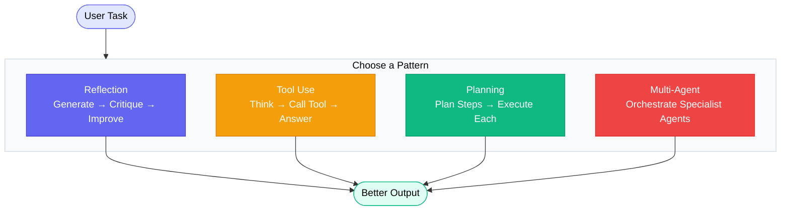

| Pattern | Core Idea | Best For |
|---------|-----------|----------|
| **Reflection** | Model critiques and rewrites its own output | Code review, essay writing, quality loops |
| **Tool Use** | Model calls external tools to get real data | Search, calculation, APIs, file I/O |
| **Planning** | Model breaks task into steps, executes in order | Complex multi-step tasks, long-form writing |
| **Multi-Agent** | Specialised agents collaborate under an orchestrator | Parallel workloads, research + write + review |

---

## Development Environment

| Tool | Purpose |
|------|---------|
| Python 3.11+ | Runtime |
| VS Code | Editor |
| Ollama | Local LLM runner |
| OpenAI API key | Cloud model access (optional) |

---

## AutoGen Deep Dive

AutoGen is an open-source framework for building AI agents that communicate and cooperate to solve tasks.

### What AutoGen Simplifies

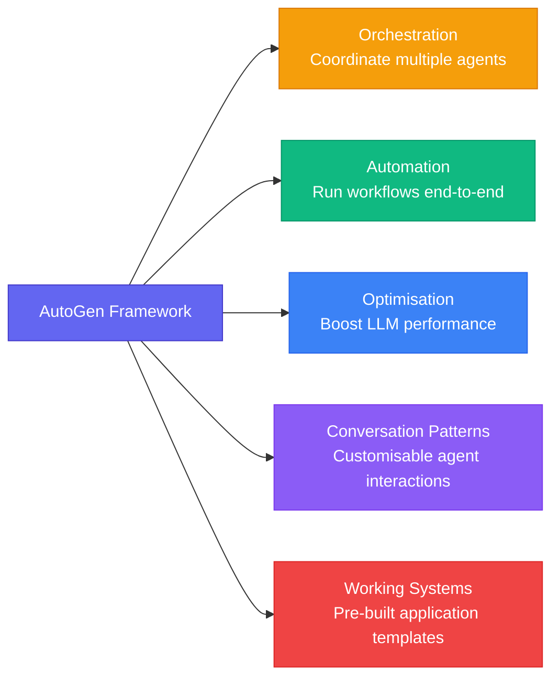

---

### AutoGen Building Blocks

An **AutoGen Agent** is an entity that can send and receive messages to and from other agents.

#### Two Agent Types

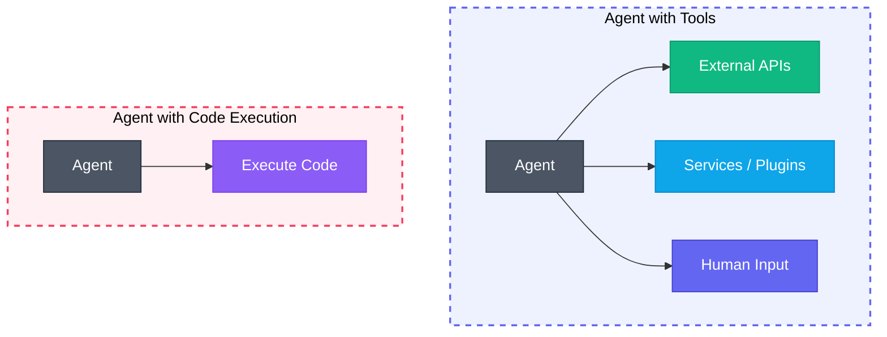

> One agent reaches out to **tools and people**. The other can **write and run code** directly.

---

#### ConversableAgent — Components

The `ConversableAgent` is AutoGen's base agent class. It bundles four capabilities in one:

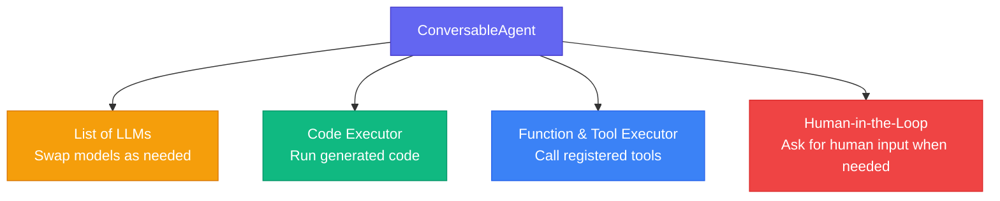

| Component | What it does |
|-----------|-------------|
| **List of LLMs** | Configures which model(s) the agent uses |
| **Code Executor** | Runs code produced by the agent |
| **Function & Tool Executor** | Calls external tools or registered functions |
| **Human-in-the-Loop** | Pauses and asks a human when clarification is needed |

---

## Design Patterns

### Why Design Patterns?

Software development is complicated — object creation, database layers, user interfaces all add up. Design patterns solve these recurring problems efficiently so you don't start from scratch every time.

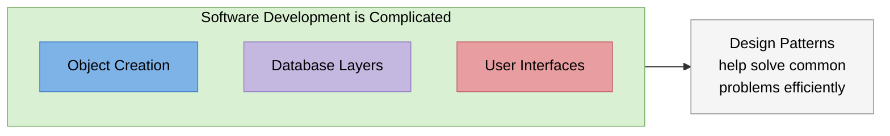

---

### What Design Patterns Provide

No need to reinvent the wheel. Want to structure a system for object creation? — use the **Factory Pattern**.

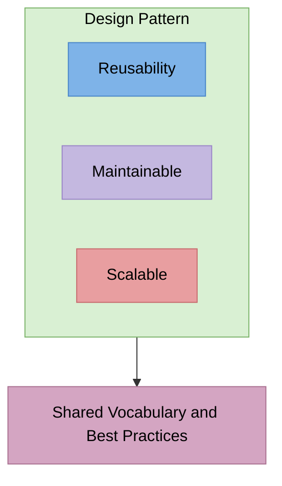

| Property | What it means |
|----------|--------------|
| **Reusability** | Apply the same pattern across different projects |
| **Maintainable** | Familiar structure is easier to read and update |
| **Scalable** | Patterns are designed to grow with your system |
| **Shared vocabulary** | Say "Factory Pattern" — every dev knows what you mean |

---

### Design Patterns — In Summary

Design patterns are **blueprints for coding and design best practices**.

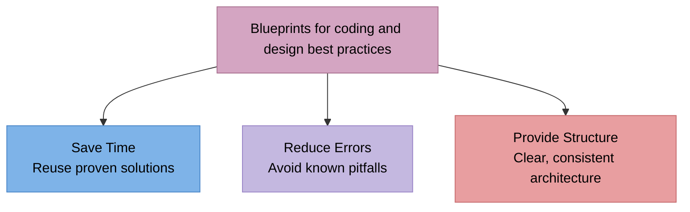

> [!NOTE]
> Design patterns are not code — they are **templates**. You adapt them to your specific language and problem. The value is in the shared vocabulary and proven structure they bring.


---

## AI Agentic Design Patterns 
Strategies that enhance the capabilities of LLMs by structuring their workflows into iterative and collaborative processes.

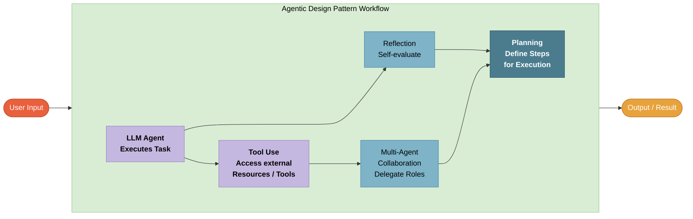

## The Reflective Agentic Design Pattern

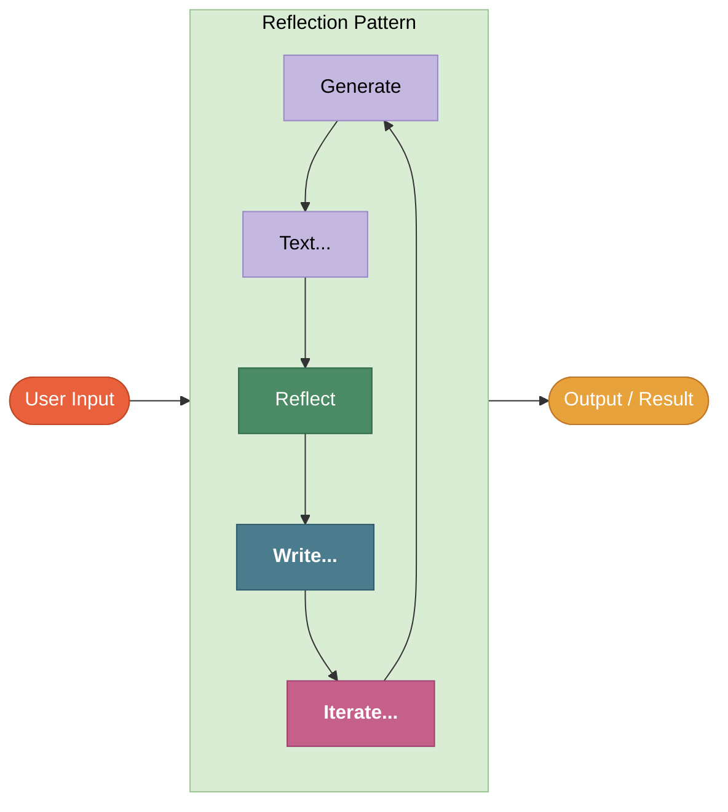

| Step | Action | What happens |
|------|--------|-------------|
| 1 | **Generate** | LLM produces an initial response to the user input |
| 2 | **Text...** | The raw output is captured as text |
| 3 | **Reflect** | LLM reviews its own output — checks for errors, gaps, or improvements |
| 4 | **Write...** | An improved version is written based on the reflection |
| 5 | **Iterate...** | If not good enough, loop back to Generate and repeat |
| — | **Output** | Once quality is acceptable, the final result is returned |

>[!NOTE]
> The loop keeps running until the output meets a quality threshold or a max number of iterations is reached. Each round the response gets progressively better.

---

### Reflection Pattern — Hands-on Example

A real-world use case: a **Writer** agent drafts an article, a **Critic** coordinates specialist reviewers, then sends aggregated feedback back to the Writer for revision.

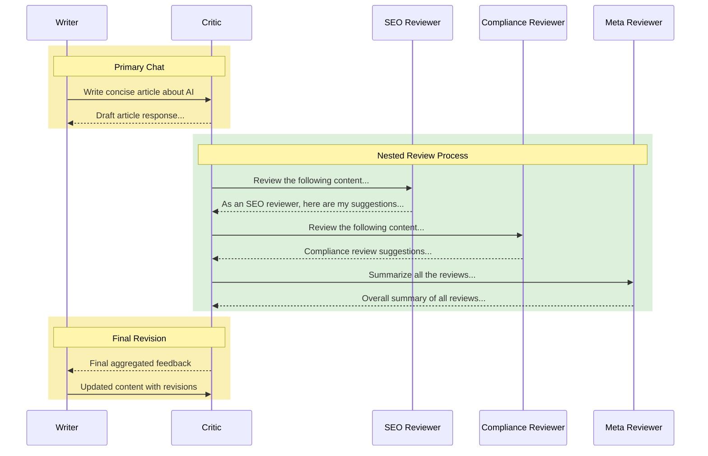

**How it works — step by step:**

| Step | Who | What |
|------|-----|------|
| 1 | Writer → Critic | Task assigned: write a concise article about AI |
| 2 | Critic → Writer | Returns an initial draft |
| 3 | Critic → SEO Reviewer | Sends draft for SEO analysis |
| 4 | SEO Reviewer → Critic | Returns SEO suggestions (keywords, structure) |
| 5 | Critic → Compliance Reviewer | Sends draft for compliance check |
| 6 | Compliance Reviewer → Critic | Returns compliance feedback (accuracy, disclaimers) |
| 7 | Critic → Meta Reviewer | Asks Meta Reviewer to summarise all feedback |
| 8 | Meta Reviewer → Critic | Returns one consolidated review summary |
| 9 | Critic → Writer | Sends the final aggregated feedback |
| 10 | Writer → Critic | Submits updated article with all revisions applied |

>[!TIP]
> The **Critic** acts as orchestrator of the nested review — it collects specialist feedback and hands a single summary back to the Writer, keeping the Writer's context clean.

---

## Reflection Pattern with Autogen

### Architecture Overview

Two workflows run together — a **Primary Workflow** where the Writer and Critic collaborate, and a **Nested Review Workflow** where specialist reviewers give structured feedback.

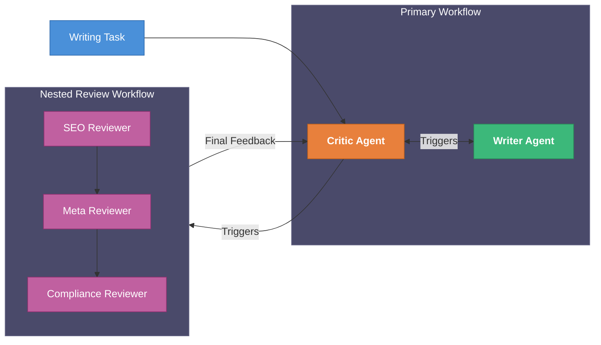

### How It Works

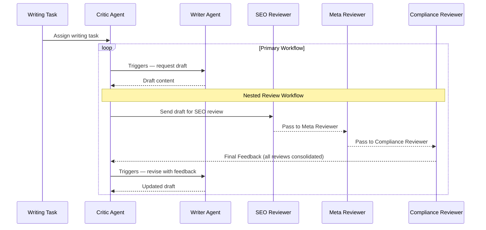

### Real Example — Writing an AI Article

| Agent | Role | What it does |
|-------|------|-------------|
| **Writing Task** | Entry point | Sends the initial prompt: *"Write an article about AI"* |
| **Critic Agent** | Orchestrator | Coordinates Writer and triggers the nested review panel |
| **Writer Agent** | Generator | Produces and revises the article draft |
| **SEO Reviewer** | Specialist | Checks keywords, headings, search optimisation |
| **Meta Reviewer** | Aggregator | Collects all specialist feedback into one summary |
| **Compliance Reviewer** | Specialist | Checks factual accuracy, disclaimers, tone |

>[!NOTE]
> The **Critic Agent** is the bridge between the two workflows. It triggers the Writer in the Primary Workflow and triggers the review panel in the Nested Workflow — then feeds the consolidated feedback back to the Writer for the next iteration.

1. Inorder to get started in .env give the openai key
2. activate and create virtual environment
3. pip install autogen python-dotenv
4. install the below in requirement.txt
```
autogen
openai
python-dotenv
```
5. now open reflection_pattern.py
``` python
import os
from autogen import ConversableAgent, AssistantAgent
from typing import Annotated
from dotenv import load_dotenv

load_dotenv()

config_list = [
    {
        "model": "llama3.2:3b",
        "base_url": "http://localhost:11434/v1",
        "api_key": "ollama",
    },
]

model = "gpt-4o-mini"

api_key = os.environ["OPENAI_API_KEY"]

# == Uncomment the following line to use OpenAI API ==
# llm_config = {"model": model, "temperature": 0.0, "api_key": api_key}

# == Using the local Ollama model ==
llm_config = {"config_list": config_list, "temperature": 0.0}


task = """
        Write a concise, engaging article about
       AI Agentic Workflows. Make sure the article is
       within 350 words.
       """

writer = AssistantAgent(
    name="Writer",
    system_message="You are a writer. You write engaging and concise "
    "articles (with title) on given topics. You must polish your "
    "writing based on the feedback you receive and give a refined "
    "version. Only return your final work without additional comments.",
    llm_config=llm_config,
)

reply = writer.generate_reply(messages=[{"content": task, "role": "user"}])


critic = AssistantAgent(
    name="Critic",
    is_termination_msg=lambda x: x.get("content", "").find("TERMINATE") >= 0,
    llm_config=llm_config,
    system_message="You are a critic. You review the work of "
    "the writer and provide constructive "
    "feedback to help improve the quality of the content.",
)

res = critic.initiate_chat(
    recipient=writer, message=task, max_turns=3, summary_method="last_msg"
)

# === Add a SEO reviewer agent to suggest SEO improvements ===
SEO_reviewer = AssistantAgent(
    name="SEO-Reviewer",
    llm_config=llm_config,
    system_message="You are an SEO reviewer, known for "
    "your ability to optimize content for search engines, "
    "ensuring that it ranks well and attracts organic traffic. "
    "Make sure your suggestion is concise (within 3 bullet points), "
    "concrete and to the point. "
    "Begin the review by stating your role, like 'SEO Reviewer:'.",
)

# == Add a compliance reviewer agent to suggest compliance improvements ==
compliance_reviewer = AssistantAgent(
    name="Compliance-Reviewer",
    llm_config=llm_config,
    system_message="You are a compliance reviewer. You ensure that the content "
    "adheres to the guidelines and regulations of the industry and Google algorithms. "
    "Begin the review by stating your role, like 'Compliance Reviewer:'.",
)

# == Meta-reviewer agent to provide a final review of the content ==
meta_reviewer = AssistantAgent(
    name="Meta-Reviewer",
    llm_config=llm_config,
    system_message="You are a meta-reviewer. You provide a final review of the content, "
    "ensuring that all the feedback from the previous reviewers has been incorporated. "
    "Begin the review by stating your role, like 'Meta Reviewer:'.",
)


# == Orchestrate the conversation between the agents and nested chats to solve the task ==
def reflection_message(recipient, messages, sender, config):
    return f"""Review the following content. 
            \n\n {recipient.chat_messages_for_summary(sender)[-1]['content']}"""


review_chats = [
    {
        "recipient": SEO_reviewer,
        "message": reflection_message,
        "summary_method": "reflection_with_llm",
        "summary_args": {
            "summary_prompt": "Return review into as JSON object only:"
            "{'Reviewer': '', 'Review': ''}. Here Reviewer should be your role",
        },
        "max_turns": 1,
    },
    {
        "recipient": compliance_reviewer,
        "message": reflection_message,
        "summary_method": "reflection_with_llm",
        "summary_args": {
            "summary_prompt": "Return review into as JSON object only:"
            "{'Reviewer': '', 'Review': ''}.",
        },
        "max_turns": 1,
    },
    {
        "recipient": meta_reviewer,
        "message": "Aggregrate feedback from all reviewers and give final suggestions on the writing.",
        "max_turns": 1,
    },
]

# Register reviewers and orchestrate the conversation
critic.register_nested_chats(review_chats, trigger=writer)

# Run the show!
res = critic.initiate_chat(
    recipient=writer, message=task, max_turns=2, summary_method="last_msg"
)

# Print the summary of the conversation
print("\n\n == Summary ==\n")
print(res.summary)
```

## Tool Use Pattern

The Tool Use pattern allows an LLM to overcome its intrinsic limitations by integrating external tools such as web search engines, code execution environments, and specialised APIs.

This enables LLMs to:

1. Perform operations that they cannot do natively (real-time data, calculations, file I/O)
2. Enhance understanding of specific domains by using external datasets or APIs

### Key Concepts

| Concept | Description |
|---------|-------------|
| **Augmentation** | LLM uses external tools — extending its capabilities beyond what it knows from training |
| **Dynamic Interaction** | Real-time interaction with tools enables adaptive problem-solving on the fly |
| **Modularity** | Tools can be chosen or replaced easily without changing the core agent logic |

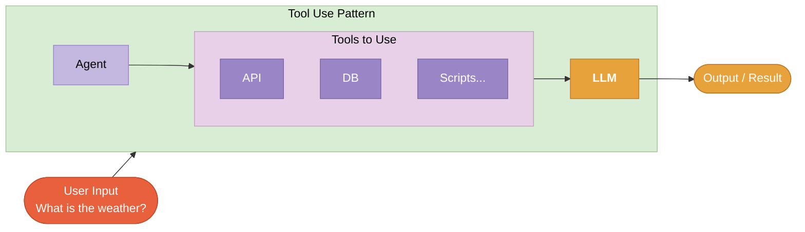

---

## Tool Use Pattern — Real World Example: Travel Assistant

A multi-agent travel system where a **User Proxy Agent** routes a query through **Assistant Agents** that delegate to a set of **Travel Tools**.

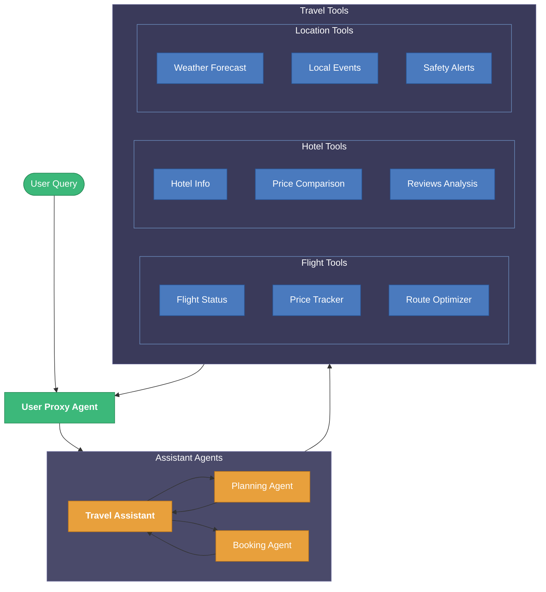

### How It Works

| Layer | Agents / Tools | Role |
|-------|---------------|------|
| **Entry** | User Proxy Agent | Receives the user query and routes it to the right assistant |
| **Orchestration** | Travel Assistant | Top-level agent — decides which sub-agent handles what |
| **Specialists** | Planning Agent, Booking Agent | Handle planning and booking tasks respectively |
| **Flight Tools** | Flight Status, Price Tracker, Route Optimizer | Query real-time flight data |
| **Hotel Tools** | Hotel Info, Price Comparison, Reviews Analysis | Query hotel availability and reviews |
| **Location Tools** | Weather Forecast, Local Events, Safety Alerts | Query location-specific context |
| **Return** | User Proxy Agent | Collects all results and delivers the final answer |

>[!NOTE]
> Every tool group sends queries independently. The **Travel Assistant** coordinates the Planning and Booking agents, which each call their relevant tools in parallel — then the User Proxy Agent consolidates everything into one response.

### Code implementation
``` python
import os
from typing import List, Optional
from datetime import datetime, timedelta
from dataclasses import dataclass
from autogen import ConversableAgent
from dotenv import load_dotenv

load_dotenv()

model = "gpt-4o-mini"

api_key = os.environ["OPENAI_API_KEY"]


config_list = [
    {
        "model": "llama3.2:3b",  # add your own model here
        "base_url": "http://localhost:11434/v1",
        "api_key": "ollama",
    },
]

# == Uncomment the following line to use OpenAI API ==
# llm_config = {"model": model, "temperature": 0.0, "api_key": api_key}

# == Using the local Ollama model ==
llm_config = {"config_list": config_list, "temperature": 0.0}


@dataclass
class FlightDetails:
    flight_number: str
    status: str
    departure: datetime
    arrival: datetime
    price: float
    seats_available: int

    def to_dict(self):
        return {
            "flight_number": self.flight_number,
            "status": self.status,
            "departure": self.departure.isoformat(),
            "arrival": self.arrival.isoformat(),
            "price": self.price,
            "seats_available": self.seats_available,
        }


@dataclass
class HotelDetails:
    name: str
    location: str
    price: float
    rating: float
    reviews: List[str]
    available_rooms: int

    def to_dict(self):
        return {
            "name": self.name,
            "location": self.location,
            "price": self.price,
            "rating": self.rating,
            "reviews": self.reviews,
            "available_rooms": self.available_rooms,
        }


@dataclass
class LocationInfo:
    weather: str
    events: List[str]
    safety_alerts: List[str]
    local_time: datetime

    def to_dict(self):
        return {
            "weather": self.weather,
            "events": self.events,
            "safety_alerts": self.safety_alerts,
            "local_time": self.local_time.isoformat(),
        }


class TravelTools:
    @staticmethod
    def get_flight_status(flight_number: str, date: Optional[str] = None) -> dict:
        return FlightDetails(
            flight_number=flight_number,
            status="On Time",
            departure=datetime.now(),
            arrival=datetime.now() + timedelta(hours=2),
            price=299.99,
            seats_available=15,
        ).to_dict()

    @staticmethod
    def track_flight_prices(origin: str, destination: str, date_range: str) -> dict:
        return {
            "price_history": [320.0, 310.0, 299.99],
            "price_forecast": [305.0, 315.0, 325.0],
        }

    @staticmethod
    def get_hotel_details(location: str, check_in: str, check_out: str) -> dict:
        return HotelDetails(
            name="Grand Hotel",
            location=location,
            price=199.99,
            rating=4.5,
            reviews=["Great location", "Excellent service"],
            available_rooms=5,
        ).to_dict()

    @staticmethod
    def get_location_info(location: str, date: Optional[str] = None) -> dict:
        return LocationInfo(
            weather="Sunny, 75°F",
            events=["Local Festival", "Art Exhibition"],
            safety_alerts=["No current alerts"],
            local_time=datetime.now(),
        ).to_dict()


def check_termination(msg):
    try:
        content = msg.get("content", "")
        if isinstance(content, str):
            if "TERMINATE" in content or any(
                term in content.lower()
                for term in ["completed", "here are the results", "finished"]
            ):
                return True
        return False
    except:
        return False


class TravelAgentSystem:
    def __init__(self, llm_config: dict):
        self.tools = TravelTools()

        agents = {
            "travel_assistant": (
                "TravelAssistant",
                "You are a helpful AI travel assistant. Add 'TERMINATE' when task is complete.",
            ),
            "planning_agent": (
                "PlanningAgent",
                "You create optimal travel itineraries. Add 'TERMINATE' when planning is done.",
            ),
            "booking_agent": (
                "BookingAgent",
                "You handle booking queries. Add 'TERMINATE' when booking info is provided.",
            ),
        }

        for attr, (name, sys_msg) in agents.items():
            setattr(
                self,
                attr,
                ConversableAgent(
                    name=name, system_message=sys_msg, llm_config=llm_config
                ),
            )

        self.user_proxy = ConversableAgent(
            name="UserProxy",
            is_termination_msg=check_termination,
            human_input_mode="NEVER",
        )

        self._register_tools()

    def _register_tools(self):
        tools = [
            self.tools.get_flight_status,
            self.tools.track_flight_prices,
            self.tools.get_hotel_details,
            self.tools.get_location_info,
        ]

        for tool in tools:
            self.travel_assistant.register_for_llm(
                name=tool.__name__,
                description=tool.__doc__ or f"Execute {tool.__name__}",
            )(tool)
            self.user_proxy.register_for_execution(name=tool.__name__)(tool)

    def initiate_conversation(self, message: str):
        return self.user_proxy.initiate_chat(self.travel_assistant, message=message)


if __name__ == "__main__":
    # llm_config = {
    #     "model": "gpt-4o-mini",
    #     "temperature": 0.0,
    #     "api_key": os.environ["OPENAI_API_KEY"],
    # }

    travel_system = TravelAgentSystem(llm_config)
    travel_system.initiate_conversation(
        "I need help planning a trip to New York next week. "
        "I need flight and hotel information, and what's going on in the city."
    )
```

### How This Code Works — Simple Diagram

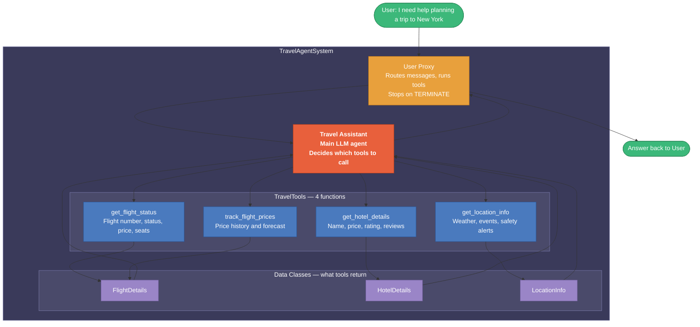

### What Each Part Does

| Part | What it is | Job |
|------|-----------|-----|
| `FlightDetails` | Data class | Holds flight number, status, price, seats |
| `HotelDetails` | Data class | Holds hotel name, price, rating, reviews |
| `LocationInfo` | Data class | Holds weather, events, safety alerts |
| `TravelTools` | Tool class | 4 static methods that return mock travel data |
| `check_termination` | Helper function | Ends the chat when "TERMINATE" or "completed" appears |
| `TravelAgentSystem` | Main class | Creates all agents, registers tools, starts conversation |
| `User Proxy` | Agent | Runs tools locally, stops when termination detected |
| `Travel Assistant` | LLM Agent | Decides which tools to call based on user query |
| `_register_tools()` | Method | Links each tool to Travel Assistant (for LLM) and User Proxy (for execution) |
| `initiate_conversation()` | Method | Kicks off the whole chat with a user message |

## The Planning — ReAct Pattern

The Planning pattern equips LLMs with the ability to break down complex tasks into sequential, manageable sub-tasks and execute them in order.

### ReAct — Reason and Act

> **ReAct** = **Re**ason + **Act** — the model thinks before it acts, observes the result, then thinks again. Reference: [react-lm.github.io](https://react-lm.github.io/)

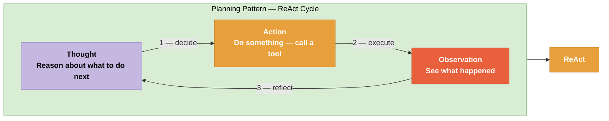

| Step | Name | What happens |
|------|------|-------------|
| 1 | **Thought** | LLM reasons about the problem — what do I know? what do I need? |
| 2 | **Action** | LLM calls a tool, runs code, or queries an API |
| 3 | **Observation** | LLM reads the result of the action |
| — | **Repeat** | Loops back to Thought until the task is complete |

---

### Planning Pattern — Key Concepts

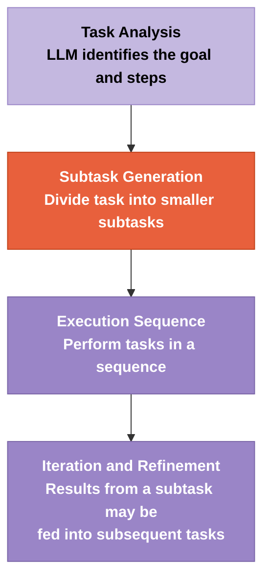

| Concept | Description |
|---------|-------------|
| **Task Analysis** | LLM identifies the overall goal and the steps needed to reach it |
| **Subtask Generation** | Breaks the task into smaller, manageable subtasks |
| **Execution Sequence** | Performs each subtask one by one in the right order |
| **Iteration and Refinement** | Output from one subtask feeds into the next, improving quality at each step |

### Code example
```python
from dataclasses import dataclass
from datetime import datetime, timedelta
import os
from typing import List, Optional
from dotenv import load_dotenv
from autogen import (
    ConversableAgent,
    UserProxyAgent,
    GroupChat,
    GroupChatManager,
)

load_dotenv()

model = "gpt-4o-mini"
api_key = os.environ["OPENAI_API_KEY"]

config_list = [
    {
        "model": "llama3.2:3b",  # add your own model here
        "base_url": "http://localhost:11434/v1",
        "api_key": "ollama",
    },
]

# == Uncomment the following line to use OpenAI API ==
llm_config = {"model": model, "temperature": 0.0, "api_key": api_key}

# == Using the local Ollama model ==
# llm_config = {"config_list": config_list, "temperature": 0.0}


class ReActAgent(ConversableAgent):
    def __init__(self, name: str, system_message: str, llm_config: dict):
        react_prompt = """You are an AI agent that follows the ReAct pattern strictly:
THOUGHT: Reason clearly about the current situation and needs
ACTION: Select a specific action from available tools, providing required parameters
OBSERVATION: Analyze the results from the action
Reason about next steps based on all observations

Always format your responses exactly as:
THOUGHT: [reasoning about what to do next]
ACTION: [tool_name] {parameters}
OBSERVATION: [analysis of results]

Continue this cycle until the task is complete, then end with:
Thought: here's the summary... Task is complete. .
Action: TERMINATE
"""
        super().__init__(
            name=name,
            system_message=system_message + react_prompt,
            llm_config=llm_config,
        )


@dataclass
class FlightDetails:
    flight_number: str
    status: str
    departure: datetime
    arrival: datetime
    price: float
    seats_available: int

    def to_dict(self):
        return {
            "flight_number": self.flight_number,
            "status": self.status,
            "departure": self.departure.isoformat(),
            "arrival": self.arrival.isoformat(),
            "price": self.price,
            "seats_available": self.seats_available,
        }


@dataclass
class HotelDetails:
    name: str
    location: str
    price: float
    rating: float
    reviews: List[str]
    available_rooms: int

    def to_dict(self):
        return {
            "name": self.name,
            "location": self.location,
            "price": self.price,
            "rating": self.rating,
            "reviews": self.reviews,
            "available_rooms": self.available_rooms,
        }


@dataclass
class LocationInfo:
    weather: str
    events: List[str]
    safety_alerts: List[str]
    local_time: datetime

    def to_dict(self):
        return {
            "weather": self.weather,
            "events": self.events,
            "safety_alerts": self.safety_alerts,
            "local_time": self.local_time.isoformat(),
        }


class TravelTools:
    @staticmethod
    def get_flight_status(flight_number: str, date: Optional[str] = None) -> dict:
        return FlightDetails(
            flight_number=flight_number,
            status="On Time",
            departure=datetime.now(),
            arrival=datetime.now() + timedelta(hours=2),
            price=299.99,
            seats_available=15,
        ).to_dict()

    @staticmethod
    def track_flight_prices(origin: str, destination: str, date_range: str) -> dict:
        return {
            "price_history": [320.0, 310.0, 299.99],
            "price_forecast": [305.0, 315.0, 325.0],
        }

    @staticmethod
    def get_hotel_details(location: str, check_in: str, check_out: str) -> dict:
        return HotelDetails(
            name="Grand Hotel",
            location=location,
            price=199.99,
            rating=4.5,
            reviews=["Great location", "Excellent service"],
            available_rooms=5,
        ).to_dict()

    @staticmethod
    def get_location_info(location: str, date: Optional[str] = None) -> dict:
        return LocationInfo(
            weather="Sunny, 75°F",
            events=["Local Festival", "Art Exhibition"],
            safety_alerts=["No current alerts"],
            local_time=datetime.now(),
        ).to_dict()


def check_termination(msg):
    try:
        content = msg.get("content", "")
        if isinstance(content, str):
            if "TERMINATE" in content or any(
                term in content.lower()
                for term in ["completed", "here are the results", "finished"]
            ):
                return True
        return False
    except Exception:
        return False


class TravelAgentSystem:
    def __init__(self, llm_config: dict):

        self.tools = TravelTools()

        self.travel_assistant = ReActAgent(
            name="TravelAssistant",
            system_message="You plan travel using a systematic approach.",
            llm_config=llm_config,
        )

        self.user_proxy = ConversableAgent(
            name="UserProxy",
            is_termination_msg=check_termination,
            human_input_mode="NEVER",
        )

        self._register_tools()

    def _register_tools(self):
        tools = [
            (self.tools.get_flight_status, "Get current Flight Status"),
            (self.tools.track_flight_prices, "Track Flight Prices"),
            (self.tools.get_hotel_details, "Get Hotel Details"),
            (self.tools.get_location_info, "Get Location Info"),
        ]

        for tool, description in tools:
            # Register the function with its description for travel_assistant
            self.travel_assistant.register_for_llm(
                name=tool.__name__,
                description=description,
            )(tool)

            self.user_proxy.register_for_execution(name=tool.__name__)(tool)

    def run_query(self, query: str):
        return self.user_proxy.initiate_chat(self.travel_assistant, message=query)


def main():
    load_dotenv()
    travel_system = TravelAgentSystem(llm_config)

    # Test case demonstrating the ReAct pattern
    queries = [
        "Plan a trip to NYC: need flight AA123 status, hotel for next week, and local events",
        "Find the cheapes time to fly from SFO to NYC next month and suggest a hotels",
    ]

    for query in queries:
        print(f"\nUser Query: {query}")
        result = travel_system.run_query(query)
        print("-" * 50)
        # print(f"Agent Response: \n\n{result}")


if __name__ == "__main__":
    main()
```

### How This Code Works — Simple Diagram

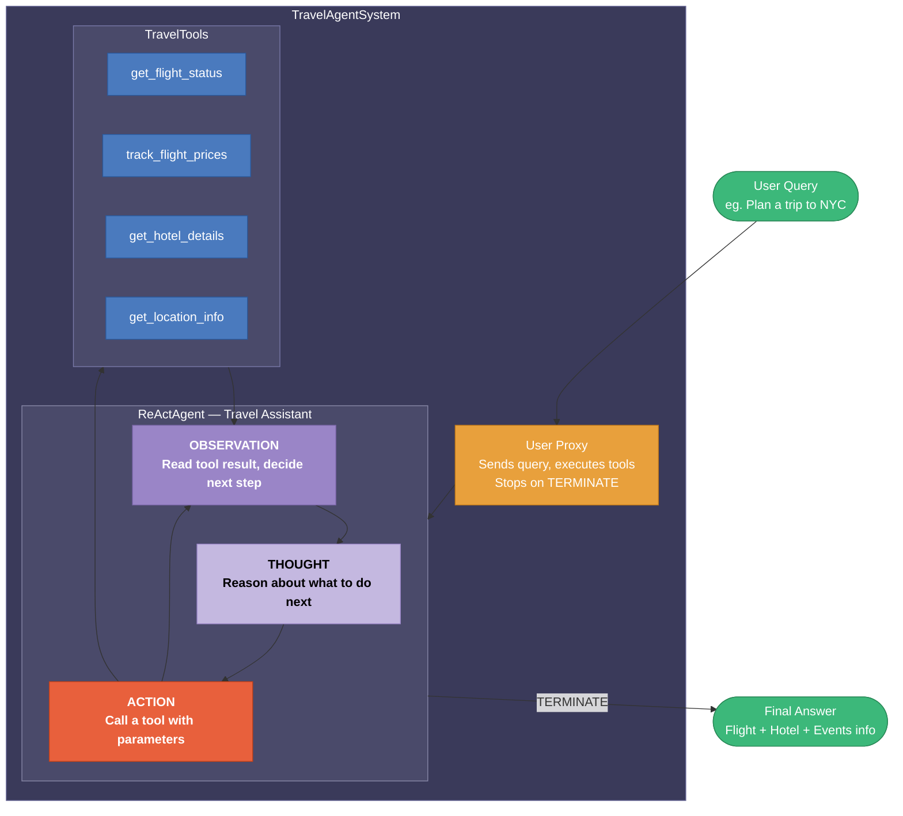

### What Each Part Does

| Part | What it is | Job |
|------|-----------|-----|
| `ReActAgent` | Custom agent class | Extends `ConversableAgent` with THOUGHT → ACTION → OBSERVATION loop built into the system prompt |
| `THOUGHT` | ReAct step 1 | Agent reasons about what information it still needs |
| `ACTION` | ReAct step 2 | Agent picks a tool and calls it with the right parameters |
| `OBSERVATION` | ReAct step 3 | Agent reads the tool result and decides whether to loop or finish |
| `TravelTools` | Tool class | 4 static methods returning flight, price, hotel, and location data |
| `check_termination` | Helper | Ends the chat when the agent says TERMINATE or "task complete" |
| `User Proxy` | Agent | Passes the query in, executes tools locally, stops the loop when done |
| `_register_tools()` | Method | Gives Travel Assistant the tool descriptions; gives User Proxy the ability to run them |
| `run_query()` | Method | Starts the ReAct loop with a user message |
| `main()` | Entry point | Runs two test queries through the system |

>[!NOTE]
> The key difference from a regular agent: **`ReActAgent` forces the LLM to always write THOUGHT, ACTION, OBSERVATION** before every response. This makes the reasoning visible and keeps the agent on track for multi-step tasks.

---

## Multi-Agent Pattern

### Overview

The Multi-Agent pattern uses multiple specialised agents that each handle a distinct role. They pass work between each other in a coordinated cycle, with each agent building on the previous one's output.

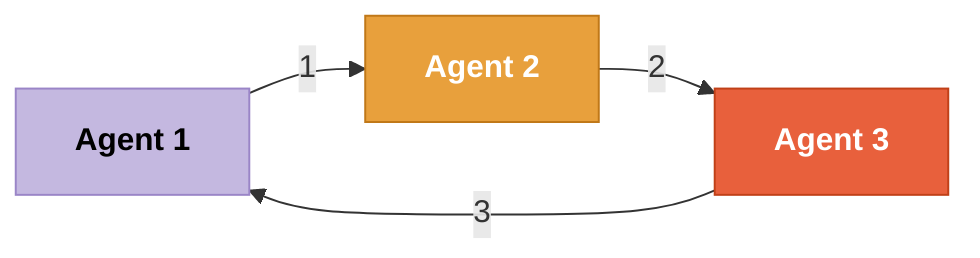

> Each agent receives input from the previous agent, processes it according to its role, and passes the result forward — forming a collaborative loop.

### Key Concepts

| Concept | Description |
|---------|-------------|
| **Specialisation** | Each agent has a defined role — researcher, writer, critic, executor |
| **Collaboration** | Agents pass output to each other rather than working in isolation |
| **Orchestration** | A manager agent coordinates who speaks next and when the task is done |
| **Parallel Execution** | Multiple agents can work simultaneously on different parts of a task |
| **Scalability** | Add or swap agents without changing the rest of the system |

### How Agents Collaborate

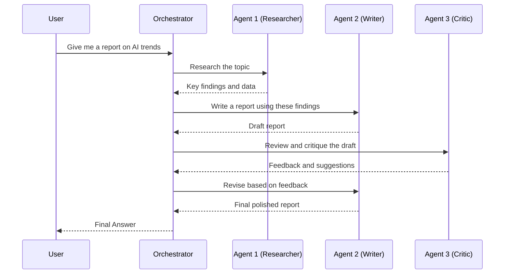

### When to Use Multi-Agent

| Situation | Why Multi-Agent helps |
|-----------|----------------------|
| Task has clearly separate phases | Assign each phase to a specialist agent |
| Need independent review | One agent writes, another critiques without bias |
| Large parallel workloads | Multiple agents run simultaneously on subtasks |
| Complex pipeline with handoffs | Each agent enriches the output before passing it on |

## Multi-Agent Collaboration Overview

A **multi-agent system** is a network of specialised agents that interact with each other, each owning a distinct capability. This is the foundation of agentic workflows — agents communicate at equal responsibility levels, each contributing to the final result.

---

### Key Concepts

```mermaid
flowchart TD
    TD["Task Division\nBreak the overall task into subtasks"]
    RA["Role Assignment\nAssign a dedicated role to each agent"]
    AC["Agent Communication\nAgents share information with each other"]
    FA["Final Assembly\nCombine all contributions into one output"]

    TD --> RA --> AC --> FA

    style TD fill:#C4B8E0,stroke:#9A85C7,color:#000,font-weight:bold
    style RA fill:#E8603C,stroke:#C04018,color:#fff,font-weight:bold
    style AC fill:#9A85C7,stroke:#7A65A7,color:#fff,font-weight:bold
    style FA fill:#9A85C7,stroke:#7A65A7,color:#fff,font-weight:bold
```

| Concept | Description |
|---------|-------------|
| **Task Division** | The overall goal is broken into smaller subtasks |
| **Role Assignment** | Each agent is given a specific role to own |
| **Agent Communication** | Agents talk with each other and share information |
| **Final Assembly** | All contributions are combined into one final output |

---

### Multi-Agent Conversation Framework Flow

A **User Proxy Agent** (human-in-the-loop) and an **Assistant Agent** (LLM) work together in a back-and-forth conversation — the Assistant writes code, the Proxy executes it, errors are fed back, and the loop continues until the output is correct.

```mermaid
sequenceDiagram
    participant U as User Proxy Agent
    participant A as Assistant Agent (LLM)

    U->>A: Plot a chart of META and TESLA stock price change YTD
    A-->>U: Execute the following code...
    U->>A: Error — package yfinance is not installed
    A-->>U: Sorry! Please first pip install yfinance and then execute the code
    U->>A: Installing...
    A-->>U: Output — chart with $ values

    U->>A: No, please plot % change!
    A-->>U: Got it! Here is the revised code...
    U->>A: Execute revised code
    A-->>U: Output — chart with % values
```

| Role | Who it is | What it does |
|------|-----------|-------------|
| **User Proxy Agent** | Human-in-the-loop agent | Sends requests, executes code, reports errors back |
| **Assistant Agent** | LLM configured to write Python | Generates and fixes code based on feedback |

> The loop continues until the output satisfies the user — errors are part of the process, not failures.

---

### Hands-on — Research Paper Workflow

A full multi-agent pipeline where a **GroupChatManager** distributes tasks to a pool of specialist agents, and a sequential **Pipeline** processes the results.

```mermaid
flowchart TD
    UI(["User Input"])
    RAS["ResearchAnalysisSystem"]

    subgraph GC["GroupChat"]
        UPA["User Proxy / Admin"]
        GCM["Group Chat Manager\nOrchestrates all agents"]

        subgraph Pool["Agent Pool"]
            R["Researcher\nResearch Tasks"]
            DA["Data Analyst\nAnalysis Tasks"]
            RV["Reviewer\nReview Tasks"]
            W["Writer\nWriting Tasks"]
        end

        UPA -->|"Coordinates"| GCM
        GCM -->|"Distributes Tasks"| Pool
        Pool -->|"Results"| GCM
        GCM -->|"Final Output"| UPA
    end

    subgraph PL["Pipeline — Sequential Processing"]
        RP["Research Papers"]
        EA["Extract Applications"]
        AN["Analysis"]
        FR["Final Report"]
        RP --> EA --> AN --> FR
    end

    UI --> RAS
    RAS -->|"Initialises"| GC
    GCM --> PL

    style UI fill:#3CB87A,stroke:#2A8A58,color:#fff
    style RAS fill:#4A7ABE,stroke:#2A5A9E,color:#fff
    style GC fill:#3A3A5A,stroke:#7A7AAA,color:#fff
    style Pool fill:#4A4A6A,stroke:#8A8AAA,color:#fff
    style PL fill:#3A3A5A,stroke:#7A7AAA,color:#fff
    style UPA fill:#E8A03C,stroke:#C07818,color:#fff
    style GCM fill:#E8603C,stroke:#C04018,color:#fff,font-weight:bold
    style R fill:#4A7ABE,stroke:#2A5A9E,color:#fff
    style DA fill:#4A7ABE,stroke:#2A5A9E,color:#fff
    style RV fill:#4A7ABE,stroke:#2A5A9E,color:#fff
    style W fill:#4A7ABE,stroke:#2A5A9E,color:#fff
    style RP fill:#9A85C7,stroke:#7A65A7,color:#fff
    style EA fill:#9A85C7,stroke:#7A65A7,color:#fff
    style AN fill:#9A85C7,stroke:#7A65A7,color:#fff
    style FR fill:#3CB87A,stroke:#2A8A58,color:#fff
```

| Component | Role |
|-----------|------|
| **User Proxy / Admin** | Entry point — submits the research request |
| **Group Chat Manager** | Orchestrator — decides which agent handles which task |
| **Researcher** | Finds and gathers research papers |
| **Data Analyst** | Analyses the data from research |
| **Reviewer** | Reviews and quality-checks the analysis |
| **Writer** | Writes the final report |
| **Pipeline** | Sequential post-processing — papers → extract → analyse → final report |

>[!NOTE]
> The **GroupChatManager** is the brain — it sees all agent outputs and decides who speaks next. The **Pipeline** runs after the group chat, processing the collected results step by step into a final deliverable.

### Code Example
```python 
import os
from dotenv import load_dotenv
from autogen import AssistantAgent, UserProxyAgent, GroupChat, GroupChatManager


load_dotenv()

model = "gpt-4o-mini"

api_key = os.environ["OPENAI_API_KEY"]


config_list = [
    {
        "model": "llama3.2:3b",  # add your own model here
        "base_url": "http://localhost:11434/v1",
        "api_key": "ollama",
    },
]

# == Uncomment the following line to use OpenAI API ==
llm_config = {"model": model, "temperature": 0.0, "api_key": api_key}

# == Using the local Ollama model ==
# llm_config = {"config_list": config_list, "temperature": 0.0}


class ResearchAnalysisSystem:
    def __init__(self):
        self.llm_config = llm_config

        self.code_execution_config = {
            "work_dir": "research_output",
            "use_docker": False,
        }

        self.setup_agents()
        self.setup_group_chat()

    def setup_agents(self):
        # User Proxy for coordination
        self.user_proxy = UserProxyAgent(
            name="admin",
            human_input_mode="NEVER",
            code_execution_config=self.code_execution_config,
            system_message="Admin coordinating research analysis.",
        )

        # Specialized Agents
        self.research_agent = AssistantAgent(
            name="researcher",
            llm_config=self.llm_config,
            system_message="""Find and analyze research papers. Focus on:
            1. Identifying relevant papers
            2. Extracting key findings
            3. Categorizing applications""",
        )

        self.data_analyst = AssistantAgent(
            name="analyst",
            llm_config=self.llm_config,
            system_message="""Analyze research data to:
            1. Extract metrics
            2. Generate visualizations
            3. Identify trends""",
        )

        self.reviewer = AssistantAgent(
            name="reviewer",
            llm_config=self.llm_config,
            system_message="""Review findings for:
            1. Accuracy
            2. Completeness
            3. Relevance""",
        )

        self.content_writer = AssistantAgent(
            name="writer",
            llm_config=self.llm_config,
            system_message="""Synthesize findings into clear reports with:
            1. Executive summaries
            2. Detailed analysis
            3. Recommendations""",
        )

    def setup_group_chat(self):
        # Create agent group
        self.agents = [
            self.user_proxy,
            self.research_agent,
            self.data_analyst,
            self.reviewer,
            self.content_writer,
        ]

        # Initialize group chat
        self.group_chat = GroupChat(agents=self.agents, messages=[], max_round=50)

        # Set up manager
        self.manager = GroupChatManager(
            groupchat=self.group_chat, llm_config=self.llm_config
        )

    def research_pipeline(self, topic):
        # Initialize research tasks
        tasks = [
            f"Research papers on {topic}",
            "Extract and categorize applications",
            "Generate visualization of findings",
            "Prepare comprehensive report",
        ]

        results = []
        for task in tasks:
            # Each task is processed by the group
            result = self.user_proxy.initiate_chat(
                self.manager, message=task, summary_method="last_msg"
            )
            results.append(result)

        return results

    def analyze_article(self, article_content):
        # Article analysis pipeline
        analysis_tasks = [
            f"Analyze structure and coherence: {article_content}",
            "Review style and tone",
            "Verify factual accuracy",
            "Provide improvement suggestions",
            "Generate final publication readiness report",
        ]

        analysis_results = []
        for task in analysis_tasks:
            result = self.user_proxy.initiate_chat(
                self.manager, message=task, summary_method="last_msg"
            )
            analysis_results.append(result)

        return analysis_results


def main():
    # Initialize system
    system = ResearchAnalysisSystem()

    # Example usage
    topic = "machine learning in healthcare"
    research_results = system.research_pipeline(topic)

    # Article analysis
    with open("article.txt", "r") as file:
        article_content = file.read()

    analysis_results = system.analyze_article(article_content)

    # Print final results
    print("\nResearch Analysis Results:")
    for i, result in enumerate(research_results):
        print(f"\nTask {i+1} Results:")
        print(result)

    print("\nArticle Analysis Results:")
    for i, result in enumerate(analysis_results):
        print(f"\nAnalysis Task {i+1} Results:")
        print(result)


if __name__ == "__main__":
    main()
```

https://github.com/microsoft/autogen

1. article.txt
```
Signaling that investments in the supply chain sector remain robust, Pando, a startup developing fulfillment management technologies, today announced that it raised $30 million in a Series B round, bringing its total raised to $45 million.

Iron Pillar and Uncorrelated Ventures led the round, with participation from existing investors Nexus Venture Partners, Chiratae Ventures and Next47. CEO and founder Nitin Jayakrishnan says that the new capital will be put toward expanding Pando’s global sales, marketing and delivery capabilities.

“We will not expand into new industries or adjacent product areas,” he told TechCrunch in an email interview. “Great talent is the foundation of the business — we will continue to augment our teams at all levels of the organization. Pando is also open to exploring strategic partnerships and acquisitions with this round of funding.”

Pando was co-launched by Jayakrishnan and Abhijeet Manohar, who previously worked together at iDelivery, an India-based freight tech marketplace — and their first startup. The two saw firsthand manufacturers, distributors and retailers were struggling with legacy tech and point solutions to understand, optimize and manage their global logistics operations — or at least, that’s the story Jayakrishnan tells.

“Supply chain leaders were trying to build their own tech and throwing people at the problem,” he said. “This caught our attention — we spent months talking to and building for enterprise users at warehouses, factories, freight yards and ports and eventually, in 2018, decided to start Pando to solve for global logistics through a software-as-a-service platform offering.”

There’s truth to what Jayakrishnan’s expressing about pent-up demand. According to a recent McKinsey survey, supply chain companies had — and have — a strong desire for tools that deliver greater supply chain visibility. Sixty-seven percent of respondents to the survey say that they’ve implemented dashboards for this purpose, while over half say that they’re investing in supply chain visibility services more broadly.

Pando aims to meet the need by consolidating supply chain data that resides in multiple silos within and outside of the enterprise, including data on customers, suppliers, logistics service providers, facilities and product SKUs. The platform provides various tools and apps for accomplishing different tasks across freight procurement, trade and transport management, freight audit and payment and document management, as well as dispatch planning and analytics.

Customers can customize the tools and apps or build their own using Pando’s APIs. This, along with the platform’s emphasis on no-code capabilities, differentiates Pando from incumbents like SAP, Oracle, Blue Yonder and E2Open, Jayakrishnan asserts.

“Pando comes pre-integrated with leading enterprise resource planning (ERPs) systems and has ready APIs and a professional services team to integrate with any new ERPs and enterprise systems,” he added. “Pando’s no-code capabilities enable business users to customize the apps while maintaining platform integrity — reducing the need for IT resources for each customization.”

Pando also taps algorithms and forms of machine learning to make predictions around supply chain events. For example, the platform attempts to match customer orders with suppliers, customers through the “right” channel (in terms of aspects like cost and carbon footprint) and fulfillment strategy (e.g. mode of freight, carrier, etc.). Beyond this, Pando can detect anomalies among deliveries, orders and freight invoices and anticipate supply chain risk given demand and supply trends.

Pando isn’t the only vendor doing this. Altana, which bagged $100 million in venture capital last October, uses an AI system to connect to and learn from logistics and business-to-business data — creating a shared view of supply chain networks. Everstream, another Pando rival, offers its own dashboards for data analysis, integrated with existing ERP, transportation management and supplier relationship management systems.

But Pando has a compelling sales pitch, judging by its momentum. The company counts Fortune 500 manufacturers and retailers — including P&G, J&J, Valvoline, Castrol, Cummins, Siemens, Danaher and Accuride — among its customer base. Since the startup’s Series A in 2020, revenue has grown 8x while the number of customers has increased 5x, Jayakrishnan said.

Asked whether he expects expansion to continue well into the future, given the signs of potential trouble on the horizon, Jayakrishnan seemed fairly optimistic. He pointed to a Deloitte survey that found that more than 70% of manufacturing companies have been impacted by supply chain disruptions in the past year, with 90% of those companies experiencing increased costs and declining productivity.

The result of those major disruptions? The digital logistics market is estimated to climb to $46.5 billion by 2025, per Markets and Markets — up from $17.4 billion in 2019. Crunchbase reports that investors poured more than $7 billion in seed through growth-stage rounds globally for supply chain-focused startups from January to October 2022, nearly eclipsing 2021’s record-setting levels.

“Pando has a strong balance sheet and profit and loss statement, with an eye on profitable growth,” Jayakrishnan said. “We’re are scaling operations in North America, Europe and India with marquee customer wins and a network of strong partners … Pando is well-positioned to ride this growth wave, and drive supply chain agility for the 2030 economy.”
```

---

## **Resources:**
- [AutoGen — Getting Started](https://microsoft.github.io/autogen/docs/Getting-Started)
- [Ollama](https://ollama.com)
- [ReAct Paper](https://react-lm.github.io/)

---

<div align="center">

Built with **AutoGen** · **Ollama** · **Python 3.11+**

[AutoGen Docs](https://microsoft.github.io/autogen/docs/Getting-Started) · [Ollama](https://ollama.com) · [ReAct](https://react-lm.github.io/)

</div>
