# Deep Agents


> LLMs started as single-pass text generators. They are now autonomous agents capable of reasoning, acting, and completing tasks that span hours — and the capability is doubling every 7 months.

---

## Introduction

LLMs were initially surprisingly good at generating text and reasoning about information in their input context. This made them great for single-pass operations like RAG or chat.

As LLM capacity increased, they could be trained to generate **structured outputs like tool calls** — allowing them to interact with computing infrastructure directly.

### The Evolution of LLM Applications

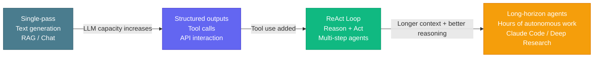

### Key Trends

| Trend | What changed |
|-------|-------------|
| **Logic moved to prompts** | Early LLM apps needed heavy surrounding code to control behaviour — increasingly that logic lives in the prompt itself |
| **Machinery got simpler** | As models improved, the scaffolding around them became lighter |
| **Task scope expanded** | Agents now work on (1) more general tasks and (2) over longer time horizons |

---

## The ReAct Agent

> **ReAct** = **Re**ason + **Act** — the model reasons about what to do, takes an action (tool call), observes the result, and loops until the task is complete.

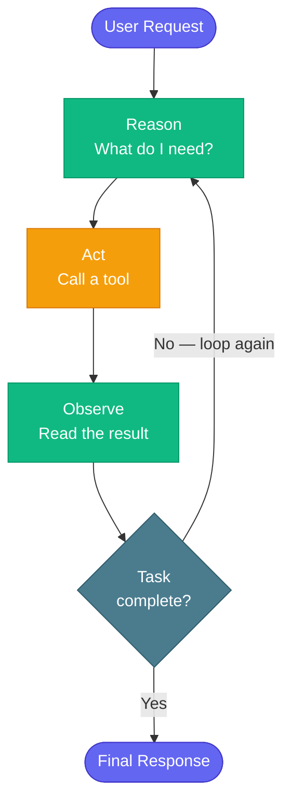

**How it works:**

1. The LLM receives a request
2. It calls a tool to get information or perform an action
3. It receives feedback (the tool result)
4. It decides whether to call another tool or end

>[!NOTE]
> A current model in a basic ReAct loop can be effective over several iterations, but can lose its way over very long sequences. Successful long-running agents like **Anthropic's Claude Code** and **OpenAI's Deep Research** have addressed this through better context management and planning.

---

## AI Task Length is Doubling Every 7 Months

Source: [METR](https://metr.org) — task length at 50% success rate

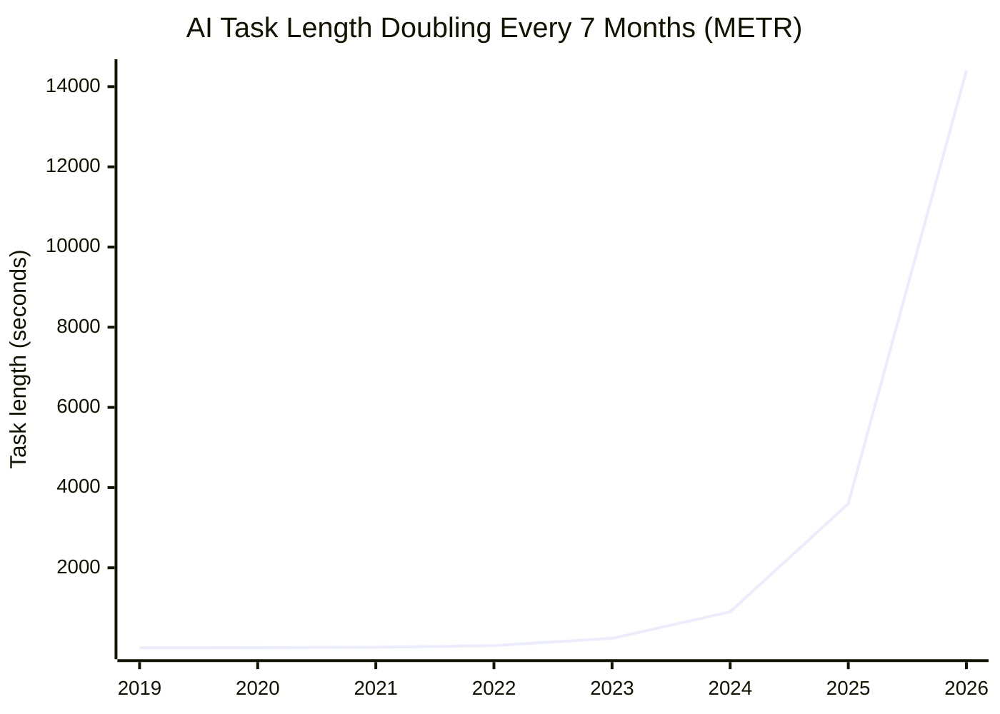

| Model | Release | Task length (50% success) | Example task |
|-------|---------|--------------------------|-------------|
| GPT-2 | ~2019 | ~4 sec | Answer a question |
| GPT-3 | ~2020 | ~15 sec | Answer a question |
| GPT-3.5 | 2022 | ~1 min | Count words in passage |
| GPT-4 | 2023 | ~4 min | Find fact on web |
| GPT-4o | 2024 | ~15 min | |
| o1 | 2024 | ~30 min | |
| Sonnet 3.7 | 2025 | ~1 hr | Train classifier |
| *(projected)* | 2026 | ~4 hrs | Train adversarially robust image model |

>[!NOTE]
> The length of tasks AI can complete at 50% success rate has been **doubling every ~7 months**. What took 4 seconds in 2019 now takes hours — agents are working on increasingly longer time horizons.

---

---

## The Rise of Generalist and Long-Horizon Agents

Two major trends define the current generation of AI agents:

| Trend | Description | Examples |
|-------|-------------|---------|
| **Generalist agents** | Single agent capable of many different task types | Manus, Claude Code |
| **Long-horizon agents** | Agents that operate over extended time periods with many tool calls | Anthropic Research, OpenAI Deep Research |

> A typical **Manus** task requires ~50 tool calls. Anthropic has noted that production agents often engage in **hundreds of turns**.

---

## What Makes a "Deep Agent"

Longer time horizon means more tool calls, more context, and more ways to lose track. Deep agents address this with four core principles:

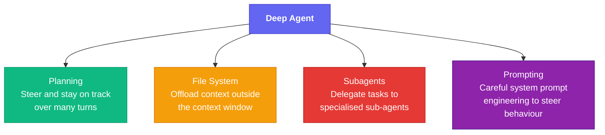

---

## 1 — Planning

> Planning helps steer the agent and keep it on track across many turns.

### Approaches to Planning

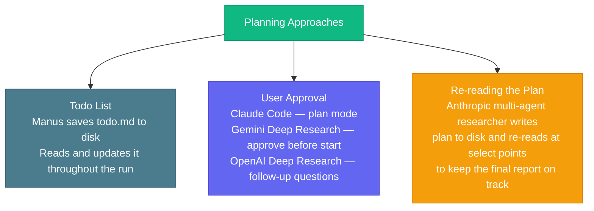

| Agent | Planning method |
|-------|----------------|
| **Manus** | `todo.md` saved to disk, repeatedly read and updated |
| **Claude Code** | Plan mode — user approves plan before any action |
| **Gemini Deep Research** | Asks user to approve plan before starting |
| **OpenAI Deep Research** | Follow-up questions to verify scope |
| **Anthropic Multi-Agent Researcher** | Writes research plan to disk, re-reads at key points |

---

## 2 — File System as Externalized Memory

> The file system serves as an externalized memory for agents — save things for perpetuity and fetch them back as needed.

**Why offload to files?**

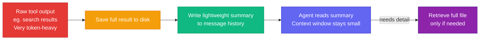

| Use case | How it helps |
|----------|-------------|
| **Preserve plan** | Write plan to disk before long research run; re-read after to stay grounded |
| **Token-heavy tool calls** | Save raw search results to disk; put only a summary in the message list |
| **Long-term memory** | Store memories as files outside context; fetch on demand |
| **Long trajectories** | Agent pulls context back into message history only when needed |

>[!NOTE]
> Raw tool observations from search can be extremely token-heavy. Saving to disk and summarising into the message list prevents context window bloat while keeping the agent informed.

---

## 3 — Subagents for Context Isolation

> Each subagent has its own isolated context window. Work happens inside that window; only the result is passed back to the main agent.

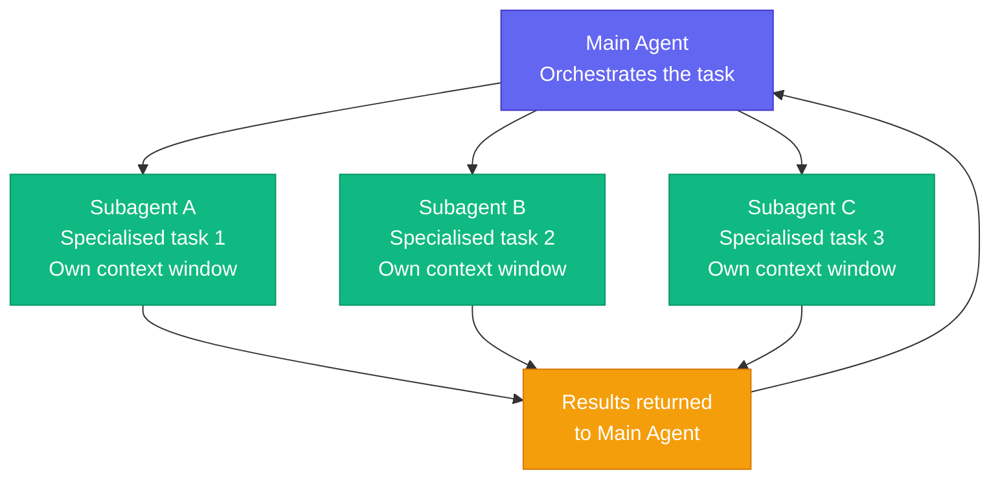

**Used by:** Claude Code · Anthropic Multi-Agent Researcher · Manus · OpenAI Deep Research

>[!WARNING]
> Subagents can make **implicit and sometimes conflicting decisions**. Risk is lowest when subagents only *collect information* (safe to parallelise). Risk is highest when subagents *write independent parts of a final output* — those parts may not fit together.

| Delegation pattern | Risk level | Example |
|-------------------|-----------|---------|
| Subagents collect data, main agent writes final output | Low | OpenAI Deep Research |
| Subagents write independent components of the output | High | Must be designed carefully |

---

## 4 — Prompt Engineering

> The relatively simple architecture of an LLM bound to tools, calling them in a loop, hides the fact that agents can be **very hard to build and steer**. Most of that steering lives in the system prompt.

- Claude Code's system prompt is long and has gone through many revisions
- Careful, thoughtful prompting is what characterises most successful long-running agents
- Prompting works alongside planning, file offloading, and subagents — not instead of them

---

## Agent Comparison — Approaches at a Glance

| Agent | File System | Planning | Subagents | Notes |
|-------|------------|----------|-----------|-------|
| **Manus** | `todo.md` saved to disk | Todo list, iteratively updated | Yes | Saves token-heavy results to disk |
| **Anthropic Multi-Agent Researcher** | Research plan + raw results to disk | Plan written before research, re-read after | Yes | Final report written once all context collected |
| **Claude Code** | Yes | Plan mode — user approval | Yes | Extensive system prompt |
| **OpenAI Deep Research** | LangGraph state object | Follow-up questions | Yes | State object = external context store |
| **Gemini Deep Research** | — | User approves plan before start | — | — |

>[!NOTE]
> LangGraph's state object serves the same purpose as the file system — a place to offload context outside the message list and fetch it back as needed at later points in the trajectory.

---

## The Deep Agents Abstraction

> A pre-built abstraction that wires the four deep agent components together as **tools** given to the LLM. The LLM + prompt drives everything; the tools handle plan, context, sub-agents, and custom integrations.

```mermaid
flowchart LR
    subgraph LLMBox["LLM + Prompt"]
        LLM["🧠 LLM"]
    end

    subgraph Tools["Tools"]
        PLAN["Plan\nTodo list / planning tool"]
        subgraph CTX["Offload Context"]
            WRITE["Write"]
            RETRIEVE["Retrieve"]
            FS["📁 File System"]
            WRITE --> FS
            FS --> RETRIEVE
        end
        SA["Sub-Agent\nDelegated specialist"]
        MCP["Custom / MCP\nUser-supplied tools"]
    end

    LLMBox <-->|"calls tools\nreads results"| Tools

    style LLMBox fill:#F5F5F5,stroke:#999,stroke-dasharray:6,color:#000
    style Tools fill:#F5F5F5,stroke:#999,stroke-dasharray:6,color:#000
    style PLAN fill:#E8F5E9,stroke:#43A047,color:#000,font-weight:bold
    style CTX fill:#FFEBEE,stroke:#E53935,color:#000
    style WRITE fill:#FFCDD2,stroke:#E53935,color:#000
    style RETRIEVE fill:#FFCDD2,stroke:#E53935,color:#000
    style FS fill:#BDBDBD,stroke:#757575,color:#000
    style SA fill:#E3F2FD,stroke:#1E88E5,color:#000,font-weight:bold
    style MCP fill:#F5F5F5,stroke:#9E9E9E,color:#000
    style LLM fill:#FFF9C4,stroke:#F9A825,color:#000,font-weight:bold
```

| Tool category | What it does |
|--------------|-------------|
| **Plan** | Gives the agent a tool to write and re-read a structured plan |
| **Offload Context — Write** | Saves token-heavy content (raw results, memories) to the file system |
| **Offload Context — Retrieve** | Reads saved content back into context on demand |
| **Sub-Agent** | Delegates a task to a specialised agent with its own isolated context window |
| **Custom / MCP** | Any user-supplied tools for the specific use case (e.g. search, code execution) |

>[!NOTE]
> The LLM sees all four categories as **tools** — it decides when to plan, when to save, when to delegate, and when to call custom tools. The prompt steers which tools to prefer and in what order.

---

## What We Are Building

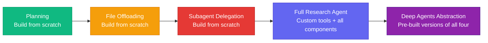

1. **Planning** — build and understand the planning component
2. **File offloading** — build context offloading to the file system
3. **Subagent delegation** — build task delegation to sub-agents
4. **Full research agent** — combine all three with custom tools
5. **Deep Agents abstraction** — a lightweight wrapper with all four components pre-built for rapid prototyping

---

## Building a ReAct Agent

### What is a ReAct Agent?

A **ReAct agent** (Reasoning + Acting) combines chain-of-thought reasoning with external tool use. Built using LangChain's `create_agent` abstraction on top of LangGraph.

Three components:
- **LLM** — the reasoning engine
- **Tools** — functions the LLM can call
- **Prompt** — instructions that steer behaviour

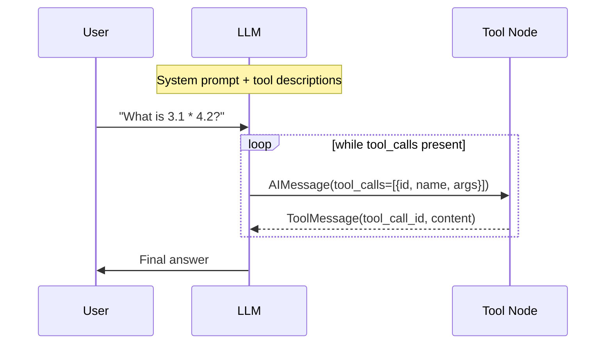

---

### Key Capabilities of `create_agent`

| Feature | Description |
|---------|-------------|
| **Memory** | Short-term (session) and long-term (persistent) memory |
| **Human-in-the-loop** | Pause execution indefinitely for human approval or correction |
| **Streaming** | Real-time streaming of tokens, tool outputs, or combined streams |
| **LangSmith** | Observability, tracing, debugging, and deployment |

>[!NOTE]
> `create_react_agent` was renamed to `create_agent` in LangChain 1.0. The course notebooks have been updated to reflect this.

---

### Building an Agent with Tools

#### Step 1 — Define a Tool

```python
from typing import Literal, Union
from langchain_core.tools import tool

@tool
def calculator(
    operation: Literal["add", "subtract", "multiply", "divide"],
    a: Union[int, float],
    b: Union[int, float],
) -> Union[int, float]:
    """Two-input calculator. Returns the result of the operation."""
    if operation == 'divide' and b == 0:
        return {"error": "Division by zero is not allowed."}
    if operation == 'add':      return a + b
    if operation == 'subtract': return a - b
    if operation == 'multiply': return a * b
    if operation == 'divide':   return a / b
    return "unknown operation"
```

#### Step 2 — Create the Agent

```python
from langchain.chat_models import init_chat_model
from langchain.agents import create_agent

SYSTEM_PROMPT = """
You are a helpful arithmetic assistant who is an expert at using a calculator.
Return all text as plain text without Markdown math delimiters.
"""

model = init_chat_model(model="openai:gpt-4.1-mini", temperature=0.0)
agent = create_agent(
    model,
    tools=[calculator],
    system_prompt=SYSTEM_PROMPT,
).with_config({"recursion_limit": 20})
```

#### Step 3 — Invoke the Agent

```python
result = agent.invoke({
    "messages": [{"role": "user", "content": "What is 3.1 * 4.2?"}]
})
```

**Message flow for `"What is 3.1 * 4.2?"`:**

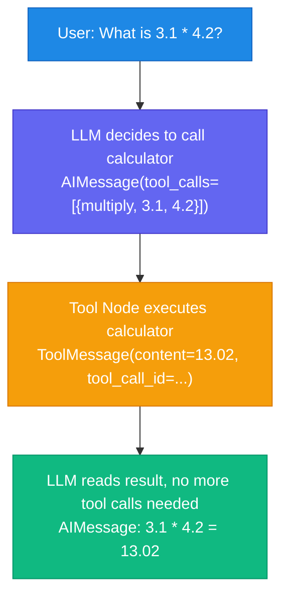

---

### The Graph, State, and Messages

`create_agent` builds and compiles a LangGraph graph under the hood. The default state is `AgentState`:

```python
class AgentState(TypedDict):
    messages: Annotated[Sequence[BaseMessage], add_messages]
    remaining_steps: NotRequired[RemainingSteps]
```

| Field | Type | Purpose |
|-------|------|---------|
| `messages` | `list[BaseMessage]` | All messages to/from the LLM — appended via `add_messages` reducer |
| `remaining_steps` | `int` | Tracks steps remaining (initialised from `recursion_limit`) |

---

### Custom State

Extend `AgentState` to track additional data — here, a log of all calculator operations:

```python
from langchain.agents import AgentState
from typing import Annotated, List

def reduce_list(left: list | None, right: list | None) -> list:
    """Safely combine two lists, treating None as empty."""
    return (left or []) + (right or [])

class CalcState(AgentState):
    ops: Annotated[List[str], reduce_list]
```

---

### Accessing and Injecting State into Tools

The LLM cannot form a `state` argument — it only sees the tool description. Use `InjectedState` to inject it automatically after the LLM generates the tool call.

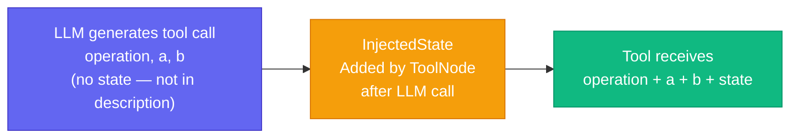

---

### Updating State from a Tool — `Command`

Tools normally return a `ToolMessage` via `messages`. To update additional state fields, return a `Command`:

```python
from typing import Annotated, List, Literal, Union
from langchain_core.messages import ToolMessage
from langchain_core.tools import InjectedToolCallId, tool
from langgraph.prebuilt import InjectedState
from langgraph.types import Command

@tool
def calculator_wstate(
    operation: Literal["add", "subtract", "multiply", "divide"],
    a: Union[int, float],
    b: Union[int, float],
    state: Annotated[CalcState, InjectedState],          # injected — not sent to LLM
    tool_call_id: Annotated[str, InjectedToolCallId],    # injected — not sent to LLM
) -> Union[int, float]:
    """Two-input calculator that also logs operations to state."""
    if operation == 'divide' and b == 0:
        return {"error": "Division by zero is not allowed."}
    if operation == 'add':      result = a + b
    elif operation == 'subtract': result = a - b
    elif operation == 'multiply': result = a * b
    elif operation == 'divide':   result = a / b
    else: result = "unknown operation"

    return Command(update={
        "ops": [f"({operation}, {a}, {b})"],
        "messages": [ToolMessage(f"{result}", tool_call_id=tool_call_id)],
    })
```

Create agent with custom state schema:

```python
agent = create_agent(
    model,
    tools=[calculator_wstate],
    system_prompt=SYSTEM_PROMPT,
    state_schema=CalcState,          # custom state
).with_config({"recursion_limit": 20})
```

---

### Parallel Tool Calls

When a query requires multiple independent operations, the LLM can issue **multiple tool calls in one message** — the `ToolNode` executes them in parallel.

**Example:** `"What is 3.1 * 4.2 + 5.5 * 6.5?"`

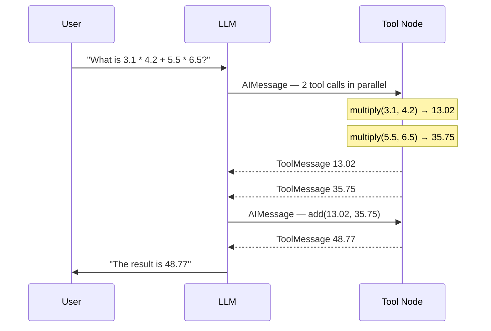

| Step | Tool call | Result |
|------|-----------|--------|
| 1 (parallel) | `multiply(3.1, 4.2)` | `13.02` |
| 1 (parallel) | `multiply(5.5, 6.5)` | `35.75` |
| 2 | `add(13.02, 35.75)` | `48.77` |

>[!NOTE]
> The `ToolNode` executes all tool calls in an `AIMessage` in parallel. This is a key efficiency gain — independent sub-calculations are resolved simultaneously before the LLM continues.

---

---

## Planning with TODO Lists

### Why TODO Lists?

Long-running agents face a problem called **context rot** — as the context window fills with hundreds of tool call results, the agent starts to forget earlier goals and drifts off task. A typical Manus task uses ~50 tool calls, which creates a lot of noise.

The fix: a **TODO list that gets rewritten and re-read** throughout the agent's run, so the current objectives always appear near the end of context where the LLM is most attentive.

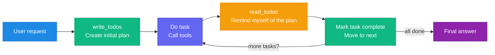

> By continuously rewriting and re-reading the TODO list, the agent effectively **recites its objectives at the end of context** — preventing mission drift over long sequences.

---

### DeepAgentState

The state schema for a deep agent has three core fields:

```python
from typing import Annotated, Literal, NotRequired
from typing_extensions import TypedDict
from langchain.agents import AgentState

class Todo(TypedDict):
    content: str                                      # short, specific task description
    status: Literal["pending", "in_progress", "completed"]

def file_reducer(left, right):
    """Merge two file dicts — right takes precedence."""
    if left is None:  return right
    if right is None: return left
    return {**left, **right}

class DeepAgentState(AgentState):
    todos: NotRequired[list[Todo]]                    # task list — full overwrite on update
    files: Annotated[NotRequired[dict[str, str]], file_reducer]  # virtual file system
```

| Field | Type | Reducer | Purpose |
|-------|------|---------|---------|
| `messages` | `list[BaseMessage]` | `add_messages` — appends | All conversation messages |
| `todos` | `list[Todo]` | None — overwrites | Current task list |
| `files` | `dict[str, str]` | `file_reducer` — merges | Virtual file system (next lesson) |

>[!NOTE]
> `todos` has **no reducer** — every `write_todos` call **replaces the entire list**. This lets the agent reconsider and reprioritise all tasks each time, not just append to a fixed list.

---

### `write_todos` Tool

The tool the LLM calls to create or update the task list. Takes the full list as an argument and overwrites state.

**When to use it (from the tool description prompt):**

| Rule | Detail |
|------|--------|
| Multi-step tasks | Use for anything requiring coordination across multiple steps |
| Multiple user tasks | Always create a list when user gives more than one task |
| Single trivial actions | Skip the list — don't over-engineer |
| Only one `in_progress` | Never mark two tasks in_progress simultaneously |
| Full rewrite every time | Always send the complete updated list, not just the changed item |
| Mark complete immediately | Don't batch completions — update as soon as a task is done |
| If blocked | Keep in_progress and add a new task describing the blocker |

```python
from langchain_core.messages import ToolMessage
from langchain_core.tools import InjectedToolCallId, tool
from langgraph.prebuilt import InjectedState
from langgraph.types import Command

@tool(description=WRITE_TODOS_DESCRIPTION, parse_docstring=True)
def write_todos(
    todos: list[Todo],
    tool_call_id: Annotated[str, InjectedToolCallId],
) -> Command:
    """Create or update the agent's TODO list."""
    return Command(update={
        "todos": todos,
        "messages": [ToolMessage(f"Updated todo list to {todos}", tool_call_id=tool_call_id)],
    })
```

---

### `read_todos` Tool

The tool the LLM calls to **re-read** the current task list — used after completing each task to stay on track.

```python
@tool(parse_docstring=True)
def read_todos(
    state: Annotated[DeepAgentState, InjectedState],
    tool_call_id: Annotated[str, InjectedToolCallId],
) -> str:
    """Read the current TODO list from state."""
    todos = state.get("todos", [])
    if not todos:
        return "No todos currently in the list."

    result = "Current TODO List:\n"
    for i, todo in enumerate(todos, 1):
        emoji = {"pending": "⏳", "in_progress": "🔄", "completed": "✅"}.get(todo["status"], "❓")
        result += f"{i}. {emoji} {todo['content']} ({todo['status']})\n"
    return result.strip()
```

---

### System Prompt — TODO Usage Instructions

```
Based upon the user's request:
1. Use write_todos to create a TODO at the start of every user request
2. After completing a TODO, use read_todos to remind yourself of the plan
3. Reflect on what you've done and the TODO
4. Mark the task completed and proceed to the next TODO
5. Continue until all TODOs are completed

IMPORTANT: Always create a research plan of TODOs for ANY user request.
IMPORTANT: Batch research tasks into a single TODO to minimise the number of TODOs.
```

---

### Full Agent Setup

```python
from langchain.chat_models import init_chat_model
from langchain.agents import create_agent
from deep_agents_from_scratch.state import DeepAgentState
from deep_agents_from_scratch.todo_tools import read_todos, write_todos

model = init_chat_model(model="anthropic:claude-sonnet-4-20250514", temperature=0.0)
tools = [write_todos, web_search, read_todos]

agent = create_agent(
    model,
    tools,
    system_prompt=TODO_USAGE_INSTRUCTIONS + SIMPLE_RESEARCH_INSTRUCTIONS,
    state_schema=DeepAgentState,
)
```

**Invoke with empty todos list:**

```python
result = agent.invoke({
    "messages": [{"role": "user", "content": "Give me a short summary of MCP."}],
    "todos": [],     # start with empty list
})
```

**What the agent does internally:**

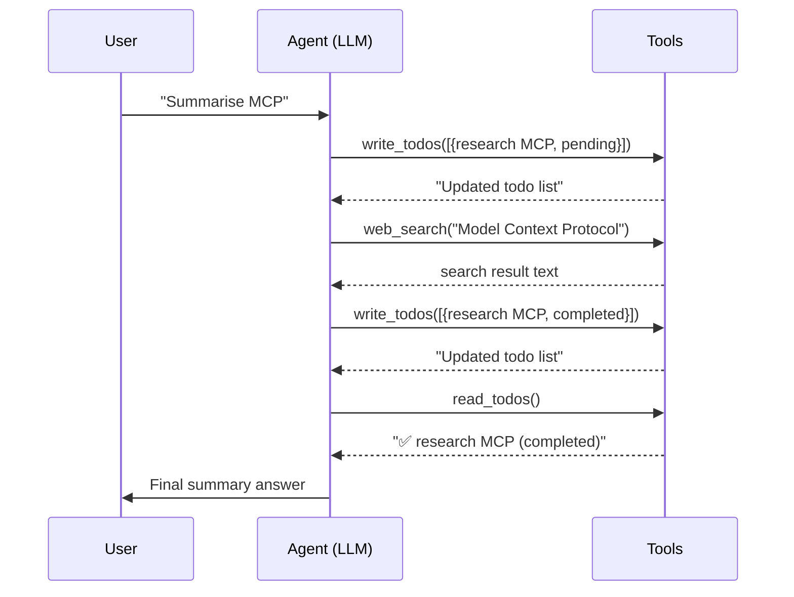

---

###  Summary

> **Problem:** Long agents forget their goals as context fills up.
>
> **Solution:** Give the agent a notepad (`todos` in state). At the start, write the plan. After each task, re-read the plan. Check things off as you go. The plan always appears near the end of context — where the LLM pays most attention.
>
> **Key rule:** The full list is always rewritten — never partially updated — so the agent can reprioritise freely at any point.

---

## Context Offloading with a Virtual File System

### Why Offload to Files?

As an agent runs more tool calls, its context window fills up. Storing everything in-context leads to:
- **Context rot** — the agent starts ignoring or forgetting earlier information
- **Token bloat** — raw tool outputs (e.g. search results) are very large
- **"Game of telephone"** — information degrades as it passes through multiple agents

The fix: **write token-heavy content to files, keep only a lightweight reference in context, and read it back when needed.**

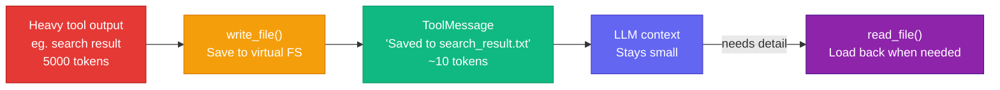

**Used by:** Manus · Hugging Face Open Deep Research · Anthropic multi-agent researcher

---

### The Virtual File System

Files are stored inside `DeepAgentState` as a plain Python dictionary:

```python
files: Annotated[NotRequired[dict[str, str]], file_reducer]
# key   = file path  (e.g. "research_plan.txt")
# value = file content (plain text, newline-delimited)
```

The `file_reducer` merges new files into existing ones — new values overwrite old ones if keys clash:

```python
def file_reducer(left, right):
    if left is None:  return right
    if right is None: return left
    return {**left, **right}   # right overwrites left on duplicate keys
```

This gives the agent **short-term, thread-scoped persistence** — files survive across tool calls within a conversation but not across separate threads.

---

### The Three File Tools

| Tool | What it does | Returns |
|------|-------------|---------|
| `ls()` | List all files in the virtual FS | `list[str]` of file paths |
| `read_file(path, offset, limit)` | Read file content with line numbers + pagination | Formatted string |
| `write_file(path, content)` | Create or fully overwrite a file | `Command` updating state |

#### `ls`

```python
@tool(description=LS_DESCRIPTION)
def ls(state: Annotated[DeepAgentState, InjectedState]) -> list[str]:
    """List all files in the virtual filesystem."""
    return list(state.get("files", {}).keys())
```

#### `read_file`

```python
@tool(description=READ_FILE_DESCRIPTION, parse_docstring=True)
def read_file(
    file_path: str,
    state: Annotated[DeepAgentState, InjectedState],
    offset: int = 0,
    limit: int = 2000,
) -> str:
    """Read file content with line numbers, supports pagination."""
    files = state.get("files", {})
    if file_path not in files:
        return f"Error: File '{file_path}' not found"

    lines = files[file_path].splitlines()
    end_idx = min(offset + limit, len(lines))
    result = []
    for i in range(offset, end_idx):
        result.append(f"{i+1:6d}\t{lines[i][:2000]}")
    return "\n".join(result)
```

>[!NOTE]
> Line numbers are included (like `cat -n`) so the LLM can reference specific lines. Pagination (`offset` + `limit`) prevents a large file from flooding context in one read.

#### `write_file`

```python
@tool(description=WRITE_FILE_DESCRIPTION, parse_docstring=True)
def write_file(
    file_path: str,
    content: str,
    state: Annotated[DeepAgentState, InjectedState],
    tool_call_id: Annotated[str, InjectedToolCallId],
) -> Command:
    """Create or fully overwrite a file in the virtual filesystem."""
    files = state.get("files", {})
    files[file_path] = content
    return Command(update={
        "files": files,
        "messages": [ToolMessage(f"Updated file {file_path}", tool_call_id=tool_call_id)],
    })
```

>[!NOTE]
> `write_file` **replaces the entire file** — there is no append or patch. To update part of a file: read it first, modify the content, then write the whole thing back.

---

### Tool Descriptions (What the LLM Sees)

| Tool | Key rules from prompt |
|------|----------------------|
| `ls` | Call before any file operations to orient yourself |
| `read_file` | Always read a file before editing it; use offset/limit for large files |
| `write_file` | Replaces entire content — use for creation or complete rewrites |

---

### System Prompt — File Workflow

```
You have access to a virtual file system to help retain and save context.

Workflow:
1. Orient  — use ls() to see existing files before starting
2. Save    — use write_file() to store the user's request immediately
3. Read    — after collecting sources, read the saved file to ensure
             your answer directly addresses the user's original question
```

---

### Full Agent Setup

```python
from langchain.agents import create_agent
from langchain.chat_models import init_chat_model
from deep_agents_from_scratch.file_tools import ls, read_file, write_file
from deep_agents_from_scratch.state import DeepAgentState

model = init_chat_model(model="anthropic:claude-sonnet-4-20250514", temperature=0.0)
tools = [ls, read_file, write_file, web_search]

agent = create_agent(
    model,
    tools,
    system_prompt=FILE_USAGE_INSTRUCTIONS + SIMPLE_RESEARCH_INSTRUCTIONS,
    state_schema=DeepAgentState,
)
```

**Invoke with empty files dict:**

```python
result = agent.invoke({
    "messages": [{"role": "user", "content": "Give me an overview of MCP."}],
    "files": {},
})
```

**What happens internally:**

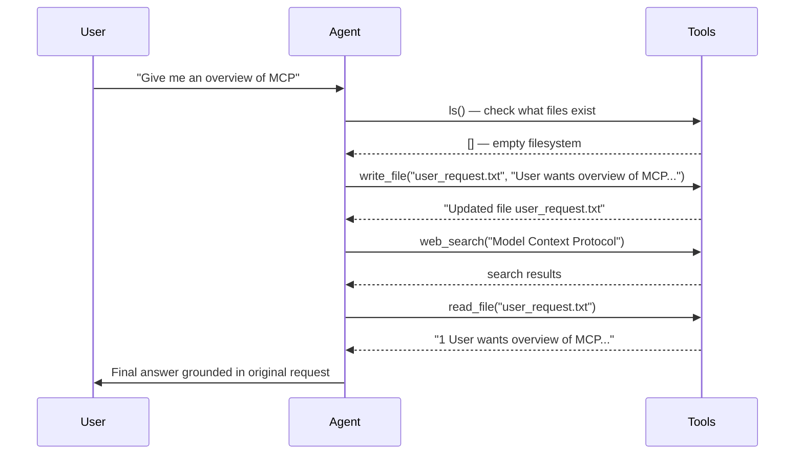

**Result — file saved in state:**

```python
result["files"]
# {'user_request.txt': 'User Request: Give me an overview of MCP.\n\nThe user wants a comprehensive overview including what it is, its purpose, key features, and how it works.'}
```

---

### Summary

> **Problem:** Token-heavy tool results bloat the context window and cause the agent to lose track of earlier goals.
>
> **Solution:** A virtual file system stored in state (`dict[str, str]`). Write heavy content to files, keep only a filename reference in the message list, and read it back only when needed.
>
> **Key insight:** Writing the user's original request to a file at the start — then reading it back before answering — ensures the final response actually addresses what was asked, even after a long trajectory of tool calls.

---

## Context Isolation with Sub-agents

### Why Sub-agents?

As a single agent runs longer, its context window accumulates mixed objectives, tool results, and history. This causes:

- **Context clash** — conflicting goals interfere with each other
- **Context confusion** — agent loses track of which task it's on
- **Context dilution** — important information gets buried

The fix: **delegate tasks to sub-agents, each with a fresh isolated context containing only the specific task description.**

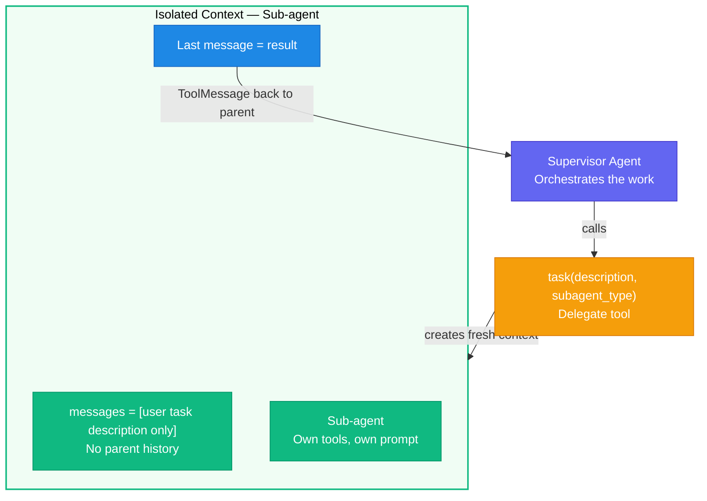

---

### Design — Two-Step Pattern

#### Step 1 — Define Sub-agents as Config Objects

```python
from typing_extensions import TypedDict
from typing import NotRequired

class SubAgent(TypedDict):
    name: str           # key used to call this agent via task()
    description: str    # shown to supervisor LLM — describes capabilities
    prompt: str         # system prompt for this sub-agent
    tools: NotRequired[list[str]]  # tool names this sub-agent can use
```

Each `SubAgent` plays a **dual role**:
- As a **tool** → the `description` tells the supervisor when and how to call it
- As an **agent** → the `prompt` and `tools` define how it does its work

#### Step 2 — Create a `task()` Tool via Factory

```python
task_tool = _create_task_tool(
    tools=sub_agent_tools,
    subagents=[research_sub_agent],
    model=model,
    state_schema=DeepAgentState,
)
```

The factory:
1. Builds a registry `{name → compiled_agent}` from the sub-agent configs
2. Returns a `task(description, subagent_type)` tool the supervisor can call

---

### The `task()` Tool — Core Logic

```python
@tool(description=TASK_DESCRIPTION_PREFIX.format(...))
def task(
    description: str,
    subagent_type: str,
    state: Annotated[DeepAgentState, InjectedState],
    tool_call_id: Annotated[str, InjectedToolCallId],
):
    # Validate sub-agent type
    if subagent_type not in agents:
        return f"Error: allowed types are {list(agents.keys())}"

    sub_agent = agents[subagent_type]

    # KEY: replace full parent history with just the task description
    state["messages"] = [{"role": "user", "content": description}]

    # Run sub-agent in isolation
    result = sub_agent.invoke(state)

    # Return sub-agent's last message as ToolMessage to parent
    return Command(update={
        "files": result.get("files", {}),           # merge file system changes
        "messages": [ToolMessage(
            result["messages"][-1].content,
            tool_call_id=tool_call_id
        )],
    })
```

**The critical line:**
```python
state["messages"] = [{"role": "user", "content": description}]
```
This replaces the entire parent conversation history with a single message — the task. The sub-agent starts completely fresh with no knowledge of what the parent has been doing.

---

### Defining a Research Sub-agent

```python
research_sub_agent = {
    "name": "research-agent",
    "description": "Delegate research to the sub-agent researcher. Only give this researcher one topic at a time.",
    "prompt": "You are a researcher. Research the topic provided. Make a single web_search call and use the result to answer.",
    "tools": ["web_search"],
}
```

| Field | Value | Purpose |
|-------|-------|---------|
| `name` | `"research-agent"` | Key the supervisor uses in `task(subagent_type=...)` |
| `description` | One topic at a time | Tells supervisor how/when to delegate |
| `prompt` | Research instructions | Guides sub-agent behaviour |
| `tools` | `["web_search"]` | Only tools this agent needs |

---

### Supervisor System Prompt — Key Rules

```
You can delegate tasks to sub-agents.

Available Tools:
- task(description, subagent_type) — delegate to a sub-agent
- think_tool(reflection) — reflect on results and plan next steps

PARALLEL RESEARCH: When multiple independent research directions exist,
make multiple task calls in a single response (max {max_concurrent_research_units} parallel).

Hard Limits:
- Stop after {max_researcher_iterations} delegations if sufficient info found
- Bias toward focused research — don't over-delegate

Scaling Rules:
- Simple question     → 1 sub-agent
- Comparison (A vs B) → 1 sub-agent per element, store findings separately
- Multi-faceted topic → parallel sub-agents per aspect

Important:
- Sub-agents cannot see each other's work — give complete standalone instructions
- Avoid acronyms in task descriptions — sub-agents have no shared context
```

---

### Full Agent Setup

```python
from langchain.agents import create_agent
from langchain.chat_models import init_chat_model
from deep_agents_from_scratch.task_tool import _create_task_tool
from deep_agents_from_scratch.state import DeepAgentState

model = init_chat_model(model="anthropic:claude-sonnet-4-20250514", temperature=0.0)

# Create the task delegation tool
task_tool = _create_task_tool(
    sub_agent_tools,
    [research_sub_agent],
    model,
    DeepAgentState,
)

# Supervisor agent — only sees the task tool, not raw web_search
agent = create_agent(
    model,
    tools=[task_tool],
    system_prompt=SUBAGENT_USAGE_INSTRUCTIONS.format(
        max_concurrent_research_units=3,
        max_researcher_iterations=3,
        date=datetime.now().strftime("%a %b %-d, %Y"),
    ),
    state_schema=DeepAgentState,
)
```

**Invoke:**

```python
result = agent.invoke({
    "messages": [{"role": "user", "content": "Give me an overview of MCP."}],
})
```

**What happens:**

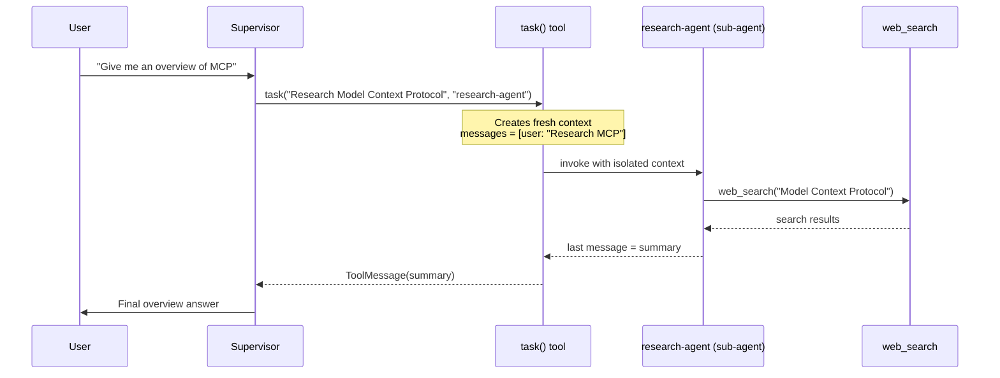

---

### Context Isolation — Why It Matters

| Approach | Context seen by sub-agent | Risk |
|----------|--------------------------|------|
| No isolation (all history) | Everything the parent has done | Context clash, confusion, dilution |
| **Isolation (this pattern)** | **Only the task description** | **Clean, focused execution** |

> Sub-agents also share the **file system** in state — so a sub-agent can write findings to a file and the parent (or another sub-agent) can read them. This lets agents collaborate through files without sharing conversation history.

>[!WARNING]
> Sub-agents cannot see each other's work in context. If a sub-agent needs information from a previous sub-agent's run, the supervisor must explicitly include it in the `description` string passed to `task()`.

---

### Summary

> **Problem:** One agent doing everything sees too much — mixed goals, noisy history, context getting confused.
>
> **Solution:** A supervisor delegates tasks to specialist sub-agents. Each sub-agent gets a fresh context with only one thing: the task description. It does its job and returns just the result.
>
> **Key insight:** The `state["messages"] = [single task]` line is what creates isolation. Everything else — tools, model, state schema — can be shared; it's the message list that determines what the agent "knows".

---

## The Complete Deep Agent

### Everything Combined

This notebook assembles all three prior components into one production-ready research agent:

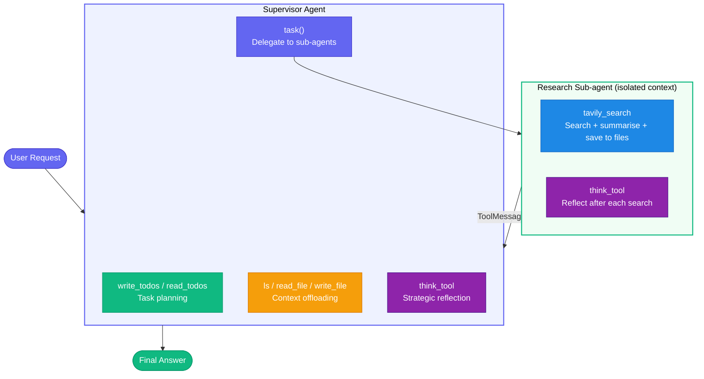

---

### The Real Search Tool — `tavily_search`

The key upgrade from previous notebooks: a search tool that **automatically offloads full content to files** and returns only a minimal summary to keep context small.

#### Architecture — 4 Components

```mermaid
flowchart LR
    Q["Search query"]
    T["run_tavily_search\nTavily API call"]
    P["process_search_results\nFetch HTML → markdownify\nSummarise with GPT-4o-mini"]
    S["summarize_webpage_content\nStructured output:\nfilename + summary"]
    SAVE["Save full content\nto files in state"]
    MSG["Return minimal summary\nto agent context"]

    Q --> T --> P --> S
    P --> SAVE
    P --> MSG

    style Q fill:#1E88E5,stroke:#1565C0,color:#fff
    style T fill:#6366F1,stroke:#4338CA,color:#fff
    style P fill:#F59E0B,stroke:#D97706,color:#fff
    style S fill:#8E24AA,stroke:#4A148C,color:#fff
    style SAVE fill:#E53935,stroke:#B71C1C,color:#fff
    style MSG fill:#10B981,stroke:#059669,color:#fff
```

#### `tavily_search` — Full Code

```python
@tool(parse_docstring=True)
def tavily_search(
    query: str,
    state: Annotated[DeepAgentState, InjectedState],
    tool_call_id: Annotated[str, InjectedToolCallId],
    max_results: Annotated[int, InjectedToolArg] = 1,
    topic: Annotated[Literal["general", "news", "finance"], InjectedToolArg] = "general",
) -> Command:
    """Search web and save detailed results to files, returning minimal context."""

    # 1. Execute search via Tavily
    search_results = run_tavily_search(query, max_results=max_results, topic=topic)

    # 2. Fetch HTML, convert to markdown, summarise each result
    processed_results = process_search_results(search_results)

    # 3. Save full content to files — context offloading
    files = state.get("files", {})
    saved_files, summaries = [], []
    for result in processed_results:
        file_content = f"# {result['title']}\n**URL:** {result['url']}\n\n## Summary\n{result['summary']}\n\n## Raw Content\n{result['raw_content']}"
        files[result['filename']] = file_content
        saved_files.append(result['filename'])
        summaries.append(f"- {result['filename']}: {result['summary']}...")

    # 4. Return only minimal summary to agent — not the full content
    summary_text = f"Found {len(processed_results)} result(s) for '{query}':\n" + \
                   "\n".join(summaries) + \
                   f"\nFiles: {', '.join(saved_files)}\nUse read_file() to access full details."

    return Command(update={
        "files": files,
        "messages": [ToolMessage(summary_text, tool_call_id=tool_call_id)],
    })
```

| What it does | Why |
|-------------|-----|
| Fetch HTML and convert with `markdownify` | Cleaner text than raw HTML for summarisation |
| Summarise with GPT-4o-mini structured output | Gets both filename and key learnings in one call |
| Add unique suffix to filename (`uuid`) | Prevents file collisions across multiple searches |
| Save full content to `files` in state | Context offloading — keeps agent context small |
| Return only a short summary in ToolMessage | Agent gets the gist; fetches full file only if needed |

---

### `think_tool` — Strategic Reflection

A tool that creates a deliberate pause for the agent to reflect before deciding the next step:

```python
@tool(parse_docstring=True)
def think_tool(reflection: str) -> str:
    """Tool for strategic reflection on research progress."""
    return f"Reflection recorded: {reflection}"
```

**When to use it (from prompt):**
- After each search — what did I find? what's missing?
- Before deciding next step — do I have enough?
- When assessing gaps — what specific info is still needed?
- Before concluding — can I answer comprehensively now?

>[!NOTE]
> `think_tool` has no side effects — it just returns the reflection string back. Its value is forcing the LLM to articulate its reasoning before taking the next action, which improves decision quality over long trajectories.

---

### Researcher Sub-agent Prompt

```
You are a research assistant conducting research on the user's input topic.

Task: Use tools to gather information. Call tools in series or parallel.

Available Tools:
1. tavily_search — web search
2. think_tool — reflect after each search (CRITICAL: use after every search)

Instructions (think like a human researcher with limited time):
1. Read the question carefully
2. Start with broader searches
3. After each search, pause and assess — enough? what's missing?
4. Execute narrower searches to fill gaps
5. Stop when you can answer confidently

Hard Limits:
- Simple query:       1–2 searches max
- Normal query:       2–3 searches max
- Complex query:      up to 5 searches max
- Always stop after 5 if sources not found

Stop immediately when:
- Question can be answered comprehensively
- 3+ relevant sources found
- Last 2 searches returned similar info
```

---

### Full Agent Setup

```python
from langchain.agents import create_agent
from langchain.chat_models import init_chat_model

model = init_chat_model(model="anthropic:claude-sonnet-4-20250514", temperature=0.0)

# Sub-agent tools (researcher only gets these)
sub_agent_tools = [tavily_search, think_tool]

# Supervisor built-in tools
built_in_tools = [ls, read_file, write_file, write_todos, read_todos, think_tool]

# Research sub-agent config
research_sub_agent = {
    "name": "research-agent",
    "description": "Delegate research tasks. Only one topic at a time.",
    "prompt": RESEARCHER_INSTRUCTIONS.format(date=get_today_str()),
    "tools": ["tavily_search", "think_tool"],
}

# Create task delegation tool
task_tool = _create_task_tool(sub_agent_tools, [research_sub_agent], model, DeepAgentState)

# All tools for supervisor (search available directly for trivial cases)
all_tools = sub_agent_tools + built_in_tools + [task_tool]

# Combined system prompt — all three instruction sets
INSTRUCTIONS = (
    "# TODO MANAGEMENT\n" + TODO_USAGE_INSTRUCTIONS +
    "\n\n" + "=" * 80 + "\n\n" +
    "# FILE SYSTEM USAGE\n" + FILE_USAGE_INSTRUCTIONS +
    "\n\n" + "=" * 80 + "\n\n" +
    "# SUB-AGENT DELEGATION\n" + SUBAGENT_INSTRUCTIONS
)

# Build agent
agent = create_agent(
    model,
    all_tools,
    system_prompt=INSTRUCTIONS,
    state_schema=DeepAgentState,
)
```

**Invoke:**
```python
result = agent.invoke({
    "messages": [{"role": "user", "content": "Give me an overview of MCP."}],
})
```

---

### Tool Allocation — Who Gets What

| Tool | Supervisor | Research Sub-agent | Why |
|------|:---:|:---:|-----|
| `write_todos` / `read_todos` | ✅ | ❌ | Only supervisor plans the full workflow |
| `ls` / `read_file` / `write_file` | ✅ | ❌ | Supervisor manages files; sub-agent writes via tavily_search |
| `think_tool` | ✅ | ✅ | Both need strategic reflection |
| `tavily_search` | ✅ (trivial cases) | ✅ | Sub-agent does research; supervisor can search directly if simple |
| `task()` | ✅ | ❌ | Only supervisor delegates |

---

### The `deepagents` Package — Quick Abstraction

After building everything from scratch, the same system can be created with the `deepagents` package — it pre-builds file tools, todo tools, and the task tool:

```python
from deepagents import create_deep_agent

research_sub_agent = {
    "name": "research-agent",
    "description": "Delegate research tasks. One topic at a time.",
    "system_prompt": RESEARCHER_INSTRUCTIONS.format(date=get_today_str()),
    "tools": [tavily_search, think_tool],
}

agent = create_deep_agent(
    tools=sub_agent_tools,
    system_prompt=INSTRUCTIONS,
    subagents=[research_sub_agent],
    model=model,
)
```

| `create_agent` (scratch) | `create_deep_agent` (package) |
|--------------------------|-------------------------------|
| You build file tools, todo tools, task tool manually | Pre-built — just pass sub-agent config |
| Full control over every component | Faster prototyping |
| Good for learning / custom behaviour | Good for production use cases |

>[!TIP]
> Build from scratch first to understand what each component does — then switch to `create_deep_agent` for real projects. The package has the same four components pre-wired, but understanding them individually lets you customise when needed.

---

### Full Flow — End to End

```mermaid
sequenceDiagram
    participant U as User
    participant SUP as Supervisor
    participant FS as File System
    participant TASK as task() tool
    participant SA as research-agent
    participant WEB as tavily_search

    U->>SUP: "Overview of MCP"
    SUP->>SUP: write_todos([research MCP, draft answer, ...])
    SUP->>TASK: task("Research Model Context Protocol", "research-agent")

    Note over SA: Fresh context — only task description
    SA->>WEB: tavily_search("Model Context Protocol")
    WEB->>FS: Save full HTML → mcp_overview_abc123.md
    WEB-->>SA: "Found 1 result. Summary: ... Use read_file() for details."
    SA->>SA: think_tool("I have enough to answer")
    SA-->>TASK: Final research summary

    TASK-->>SUP: ToolMessage(research summary)
    SUP->>FS: read_file("mcp_overview_abc123.md") if needed
    SUP->>SUP: write_todos([research MCP ✅, draft answer 🔄])
    SUP->>U: Final comprehensive answer
```

---

### Summary

> **This notebook is the payoff.** All four components — planning (todos), memory (files), delegation (sub-agents), and steering (prompts) — work together as one system.
>
> The supervisor thinks at a high level: plan tasks, delegate research, read saved files, draft the answer. The sub-agent thinks at a low level: search the web, reflect, search again if needed, return findings.
>
> The `tavily_search` tool is the glue — it runs real web searches, saves the full content to files so it doesn't bloat the context, and returns only a short summary. The agent reads the full file only if it actually needs the detail.

---

<div align="center">

Notes on **Deep Agents** · Sources: [METR](https://metr.org) · [Anthropic](https://anthropic.com) · [OpenAI](https://openai.com) · [LangChain](https://langchain.com)

</div>
