# Model Context Protocol (MCP)


> Comprehensive study notes covering MCP architecture, server primitives, transport layers, sampling, roots, and horizontal scaling.

<details>
<summary><strong>📚 Table of Contents</strong></summary>

- [Course Overview](#course-overview)
- [MCP — Complete Reference Diagram](#mcp--complete-reference-diagram)
- [Introducing MCP](#introducing-mcp)
  - [Tools — A Concrete Example](#tools--a-concrete-example)
  - [The Problem with Writing Tools Manually](#the-problem-with-writing-tools-manually)
  - [Common Questions](#common-questions)
- [MCP Clients](#mcp-clients)
  - [Message Types](#message-types)
  - [Full Request Flow](#full-request-flow)
- [Hands-On with MCP Servers — Project Setup](#hands-on-with-mcp-servers--project-setup)
- [Defining Tools with MCP](#defining-tools-with-mcp)
- [The Server Inspector](#the-server-inspector)
- [Implementing a Client](#implementing-a-client)
- [Defining Resources](#defining-resources)
  - [Direct Resource](#direct-resource)
  - [Templated Resource](#templated-resource)
- [Accessing Resources](#accessing-resources)
- [Defining Prompts](#defining-prompts)
- [Prompts in the Client](#prompts-in-the-client)
- [MCP Server Primitives](#mcp-server-primitives)
- [Sampling](#sampling)
  - [Option 1 — Direct Claude Access](#option-1--give-the-mcp-server-access-to-claude)
  - [Option 2 — Client Delegates](#option-2--server-asks-the-client-to-call-claude)
  - [Client-side Handling](#client-side--handling-the-sampling-request)
- [Logging and Progress Notifications](#logging-and-progress-notifications)
- [Roots](#roots)
- [JSON Message Types](#json-message-types)
- [The STDIO Transport](#the-stdio-transport)
- [The StreamableHTTP Transport](#the-streamablehttp-transport)
- [Streamable HTTP in Depth](#streamable-http-in-depth)
  - [StreamableHTTP Demo Server](#streamablehttp-demo-server)
- [Horizontal Scaling & Load Balancers](#horizontal-scaling--load-balancers)
- [The `stateless_http` and `json_response` Flags](#the-stateless_http-and-json_response-flags)

</details>

---

## Course Overview

- **MCP Introduction** — Understand what problems MCP solves
- **MCP Clients and Servers** — Servers host resources, tools, and more; clients consume them
- **Tools** — Implemented on a server to extend an LLM's capabilities
- **Resources** — Servers can deliver any kind of document or information to clients
- **Prompts** — Servers can provide clients with pre-optimized prompts

> **Setup:** Install `uv` (Python package manager used in this course)
> [https://github.com/astral-sh/uv](https://github.com/astral-sh/uv)

---

## MCP — Complete Reference Diagram

### Master Map of All Concepts

<details>
<summary><strong>View mindmap</strong></summary>

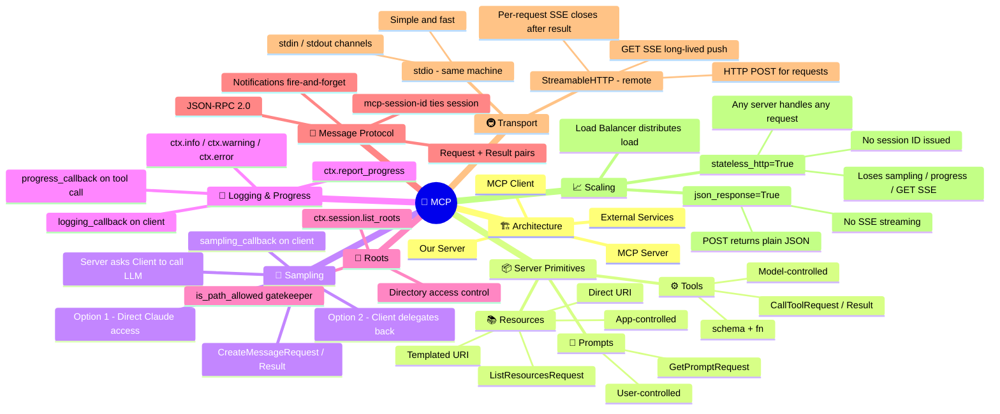

</details>

---

### Full Architecture — End to End

<details>
<summary><strong>View full architecture diagram</strong></summary>

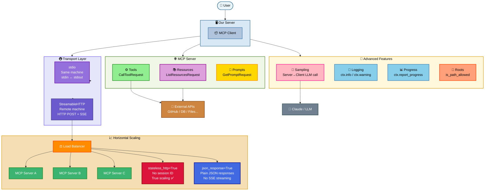

</details>

---

### Cheat Sheet — Every Key Concept at a Glance

| Concept | What it is | Who controls it | Key message |
|---------|-----------|----------------|-------------|
| **Tool** | A function the LLM can call | Model (LLM decides when) | `CallToolRequest / CallToolResult` |
| **Resource** | Data/document the app loads | App (loads on demand) | `ListResourcesRequest / ReadResourceRequest` |
| **Prompt** | Pre-built prompt template | User (picks from list) | `ListPromptsRequest / GetPromptRequest` |
| **Sampling** | Server asks client to call LLM | Server-initiated | `CreateMessageRequest / CreateMessageResult` |
| **Logging** | Server sends log events to client | Server-initiated | `notifications/message` |
| **Progress** | Tool reports % done to client | Server-initiated | `notifications/progress` |
| **Roots** | Directories the client shares | Client declares | `roots/list` |
| **stdio** | Transport over stdin/stdout | Same machine | Binary pipe, no network |
| **StreamableHTTP** | Transport over HTTP + SSE | Remote machine | POST for requests, SSE for push |
| **mcp-session-id** | Ties all requests to one session | Set at Initialize | Header on every request |
| **GET SSE** | Long-lived push channel from server | Open after Initialize | `GET /mcp` stays open |
| **Per-request SSE** | SSE for one response only | Opens with POST | Closes after result |
| **stateless_http=True** | No session ID, enables scaling | Flag on server | Disables sampling/progress/GET SSE |
| **json_response=True** | Plain JSON instead of SSE stream | Flag on server | Simpler clients, no streaming |

---

### Message Flow — Request vs Notification

```mermaid
graph LR
    subgraph Pairs["  Request ↔ Result Pairs  "]
        direction TB
        LTR["ListToolsRequest → ListToolsResult"]
        CTR["CallToolRequest → CallToolResult"]
        LRR["ListResourcesRequest → ListResourcesResult"]
        RRR["ReadResourceRequest → ReadResourceResult"]
        LPR["ListPromptsRequest → ListPromptsResult"]
        GPR["GetPromptRequest → GetPromptResult"]
        CMR["CreateMessageRequest → CreateMessageResult"]
    end

    subgraph Notif["  Notifications (fire-and-forget)  "]
        direction TB
        IN["initialized — handshake done"]
        LOG["notifications/message — log event"]
        PROG["notifications/progress — % complete"]
        CANCEL["notifications/cancelled — abort"]
    end

    Pairs -.->|"always get a response"| Pairs
    Notif -.->|"no response expected"| Notif

    style Pairs fill:#DDEEFF,stroke:#4682B4,stroke-width:2px,color:#000
    style Notif fill:#FFE4B5,stroke:#FF8C00,stroke-width:2px,color:#000
    style LTR fill:#87CEEB,stroke:#4682B4,stroke-width:1px,color:#000
    style CTR fill:#87CEEB,stroke:#4682B4,stroke-width:1px,color:#000
    style LRR fill:#87CEEB,stroke:#4682B4,stroke-width:1px,color:#000
    style RRR fill:#87CEEB,stroke:#4682B4,stroke-width:1px,color:#000
    style LPR fill:#87CEEB,stroke:#4682B4,stroke-width:1px,color:#000
    style GPR fill:#87CEEB,stroke:#4682B4,stroke-width:1px,color:#000
    style CMR fill:#87CEEB,stroke:#4682B4,stroke-width:1px,color:#000
    style IN fill:#FFD700,stroke:#FF8C00,stroke-width:1px,color:#000
    style LOG fill:#FFD700,stroke:#FF8C00,stroke-width:1px,color:#000
    style PROG fill:#FFD700,stroke:#FF8C00,stroke-width:1px,color:#000
    style CANCEL fill:#FFD700,stroke:#FF8C00,stroke-width:1px,color:#000
```

---

### Transport Decision Tree

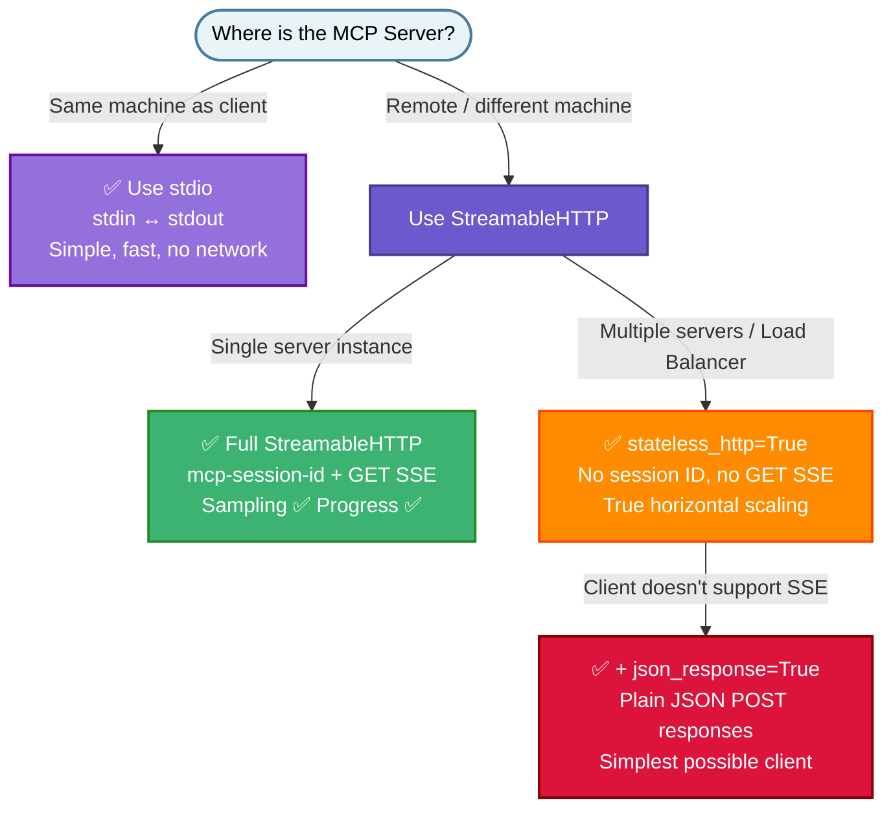

---

## Introducing MCP

MCP is designed to provide context and tools to LLMs without requiring you, the developer, to write a lot of tedious boilerplate code.

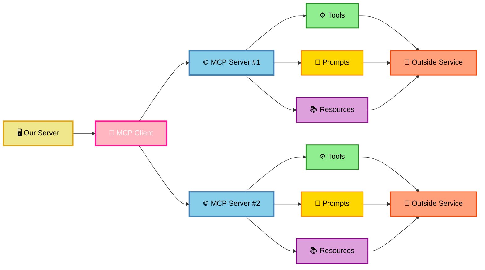

Each MCP server exposes three main building blocks: **Tools**, **Resources**, and **Prompts**.

### Tools — A Concrete Example

Consider a GitHub integration where a user asks: *"What open pull requests do I have across all my repositories?"*

The AI needs to reach out to GitHub, access the user's account, and retrieve open PRs. This is done via a **Tool**. Each tool has two parts:
- **Schema** — describes the tool's inputs/outputs so the LLM knows how to call it
- **Function** — the actual implementation that calls the external API

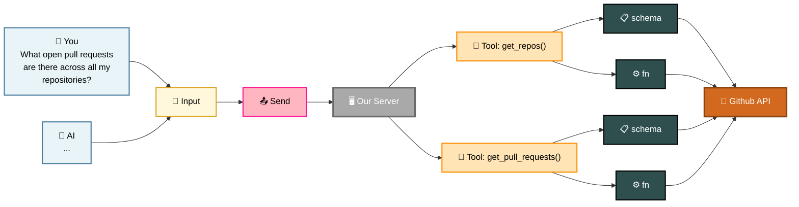

### The Problem with Writing Tools Manually

GitHub alone has a huge surface area — PRs, issues, projects, file operations, and more. Writing, testing, and maintaining all those tool schemas and functions is a significant burden:

```mermaid
graph TB
    OurServer["🖥️ Our Server"]
    
    Tool1["🔧 get_repos()"]
    Schema1["📋 schema"]
    Fn1["⚙️ fn"]
    
    Tool2["🔧 list_repos()"]
    Schema2["📋 schema"]
    Fn2["⚙️ fn"]
    
    Tool3["🔧 create_repos()"]
    Schema3["📋 schema"]
    Fn3["⚙️ fn"]
    
    Tool4["🔧 search_issues()"]
    Schema4["📋 schema"]
    Fn4["⚙️ fn"]
    
    Tool5["🔧 update_issue()"]
    Schema5["📋 schema"]
    Fn5["⚙️ fn"]
    
    Tool6["🔧 create_issue()"]
    Schema6["📋 schema"]
    Fn6["⚙️ fn"]
    
    Tool7["🔧 get_issue()"]
    Schema7["📋 schema"]
    Fn7["⚙️ fn"]
    
    Tool8["🔧 create_file()"]
    Schema8["📋 schema"]
    Fn8["⚙️ fn"]
    
    OurServer --> Tool1
    OurServer --> Tool2
    OurServer --> Tool3
    OurServer --> Tool4
    OurServer --> Tool5
    OurServer --> Tool6
    OurServer --> Tool7
    OurServer --> Tool8
    
    Tool1 --> Schema1 & Fn1
    Tool2 --> Schema2 & Fn2
    Tool3 --> Schema3 & Fn3
    Tool4 --> Schema4 & Fn4
    Tool5 --> Schema5 & Fn5
    Tool6 --> Schema6 & Fn6
    Tool7 --> Schema7 & Fn7
    Tool8 --> Schema8 & Fn8
    
    style OurServer fill:#A9A9A9,stroke:#696969,stroke-width:3px,color:#fff,font-size:18px,font-weight:bold
    
    style Tool1 fill:#FFE4B5,stroke:#FF8C00,stroke-width:2px,color:#000,font-weight:bold
    style Tool2 fill:#FFE4B5,stroke:#FF8C00,stroke-width:2px,color:#000,font-weight:bold
    style Tool3 fill:#FFE4B5,stroke:#FF8C00,stroke-width:2px,color:#000,font-weight:bold
    style Tool4 fill:#FFE4B5,stroke:#FF8C00,stroke-width:2px,color:#000,font-weight:bold
    style Tool5 fill:#FFE4B5,stroke:#FF8C00,stroke-width:2px,color:#000,font-weight:bold
    style Tool6 fill:#FFE4B5,stroke:#FF8C00,stroke-width:2px,color:#000,font-weight:bold
    style Tool7 fill:#FFE4B5,stroke:#FF8C00,stroke-width:2px,color:#000,font-weight:bold
    style Tool8 fill:#FFE4B5,stroke:#FF8C00,stroke-width:2px,color:#000,font-weight:bold
    
    style Schema1 fill:#2F4F4F,stroke:#000,stroke-width:2px,color:#FFD700
    style Fn1 fill:#2F4F4F,stroke:#000,stroke-width:2px,color:#FFD700
    
    style Schema2 fill:#2F4F4F,stroke:#000,stroke-width:2px,color:#FFD700
    style Fn2 fill:#2F4F4F,stroke:#000,stroke-width:2px,color:#FFD700
    
    style Schema3 fill:#2F4F4F,stroke:#000,stroke-width:2px,color:#FFD700
    style Fn3 fill:#2F4F4F,stroke:#000,stroke-width:2px,color:#FFD700
    
    style Schema4 fill:#2F4F4F,stroke:#000,stroke-width:2px,color:#FFD700
    style Fn4 fill:#2F4F4F,stroke:#000,stroke-width:2px,color:#FFD700
    
    style Schema5 fill:#2F4F4F,stroke:#000,stroke-width:2px,color:#FFD700
    style Fn5 fill:#2F4F4F,stroke:#000,stroke-width:2px,color:#FFD700
    
    style Schema6 fill:#2F4F4F,stroke:#000,stroke-width:2px,color:#FFD700
    style Fn6 fill:#2F4F4F,stroke:#000,stroke-width:2px,color:#FFD700
    
    style Schema7 fill:#2F4F4F,stroke:#000,stroke-width:2px,color:#FFD700
    style Fn7 fill:#2F4F4F,stroke:#000,stroke-width:2px,color:#FFD700
    
    style Schema8 fill:#2F4F4F,stroke:#000,stroke-width:2px,color:#FFD700
    style Fn8 fill:#2F4F4F,stroke:#000,stroke-width:2px,color:#FFD700
```

>[!TIP]
> **MCP solves this** by shifting the burden of tool definitions and execution into dedicated MCP servers. The MCP server provides tool schemas and functions already written and maintained for you — your server just connects to it.

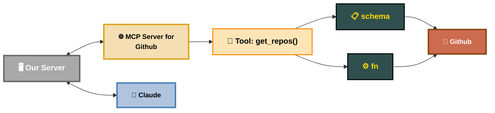

### Common Questions

**1. Who authors MCP servers?**
Anyone. Often the service provider itself publishes an official MCP implementation. You can also write your own MCP server to wrap any service or API.

**2. How is using an MCP Server different from calling a service's API directly?**
When you call an API directly, you write all the tool schemas and functions yourself. An MCP server ships those already implemented — you just connect and use them.

**3. Aren't MCP Servers and tool use the same thing?**
Not quite. Tool use is the mechanism; MCP servers are a standardized way to *package and distribute* tool schemas and functions so they can be shared and reused across different applications.

---

## MCP Clients

The **MCP Client** handles communication between your server and an MCP Server.

Key points:
- MCP is **transport agnostic** — the client and server can communicate over many different protocols
- The most common setup today is running both the client and server on the **same machine**, communicating over **stdio** (standard input/output)
- They can also communicate over **HTTP**, **WebSockets**, or other transports
- Once connected, the client and server exchange structured messages defined in the MCP specification

### Message Types

The two primary request/response pairs you'll work with:

**`ListToolsRequest` / `ListToolsResult`** — ask the server what tools it provides

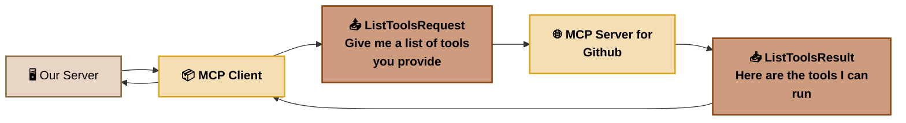

**`CallToolRequest` / `CallToolResult`** — invoke a specific tool with arguments and receive the result

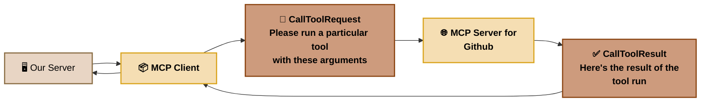

### Full Request Flow

Here's the complete sequence from a user question all the way to a response, involving Our Server, the MCP Client, MCP Server, Claude, and GitHub:

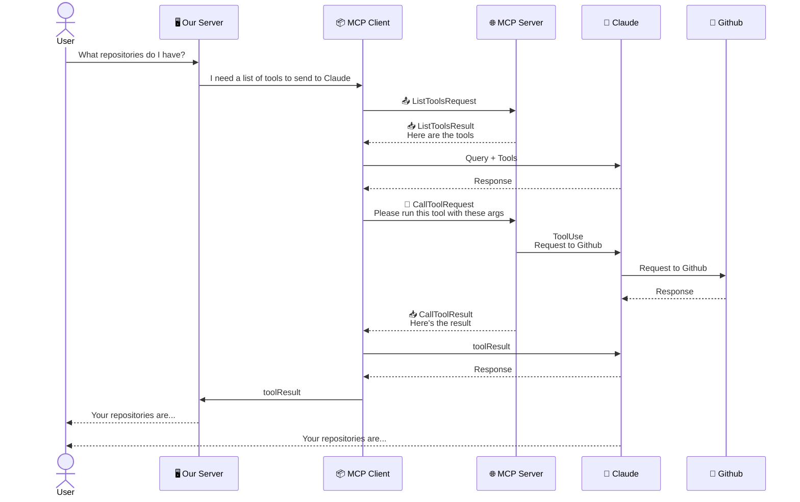

---

## Hands-On with MCP Servers — Project Setup

**Project:** A CLI-based chatbot that lets users chat with a set of documents.

| Feature | Description |
|---------|-------------|
| Read documents | Claude can read any document in the set |
| Edit documents | Claude can update the contents of a document |
| `@doc_name` | Mention a document by name — its contents are automatically included as context |
| `/command_name` | Users can run named commands |

The MCP server exposes two tools that operate on a collection of local files:

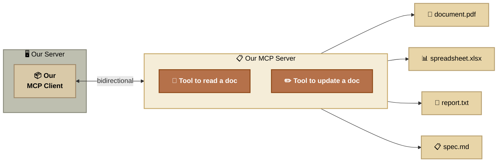

>[!NOTE]
> In most real projects you implement either an MCP client *or* an MCP server — not both. This project builds both intentionally as a learning exercise to understand each side.

---

## Defining Tools with MCP

MCP SDK 
- The MCP Project provides SDK's for building servers and clients in a variety of languages.
- Our project is using Python MCP SDK.
- The Python SDK makes it very easy to declare tools.

example
``` python
@mcp.tool(
    name= "add_ints"
    description= "Add 2 integers together"
)
def tool_fn(
    a=Field(description="First number to add"),
    b=Field(description="Second number to add"),
) -> int:
    return a + b
```

below are the code for mcp_server.py
```python
from mcp.server.fastmcp import FastMCP
from pydantic import field
mcp= FastMCP("DocumentMCP", log_level="ERROR")
docs= {
    "deposition.md":"This deposition covers the ...",
    "report.pdf":"The report details the state of a 20m condenser tower."
}
# TODO: Write a tool to read a document
@mcp.tool(
    name= "read_doc_contents"
    description="Read the contents of a document and return it as a string."
)
def read_document(
    doc_id: str = Field(description="Id of the document to read")
):
    if doc_id not in docs:
        raise ValueError(f"Doc with id {doc_id} not found")
    return docs[doc_id]

# TODO: Write a tool to edit a doc
@mcp.tool(
    name="edit_document",
    description="Edit a document by replacing a string in the documents content with a new string"
)
def edit_document(
    doc_id:str = Field(description="Id of the document that will be edited"),
    old_str: str= Field(description="The text to replace. Must match exactly, including whitespace"),
    new_str: str= Field(description="The new text to insert in place of old text ")
):
    if doc_id not in docs:
        raise ValueError(f"Doc with id {doc_id} not found")
    docs[doc_id] = docs[doc_id].replace(old_str, new_str)


```

## The Server Inspector

The **MCP Server Inspector** is a built-in development tool that gives you a browser-based UI to connect to, explore, and test your MCP server — without needing a full client implementation. It is the fastest way to verify your server works correctly during development.

### Launching the Inspector

```bash
mcp dev mcp_server.py
```

This starts your server and opens the Inspector UI at `http://localhost:5173`.

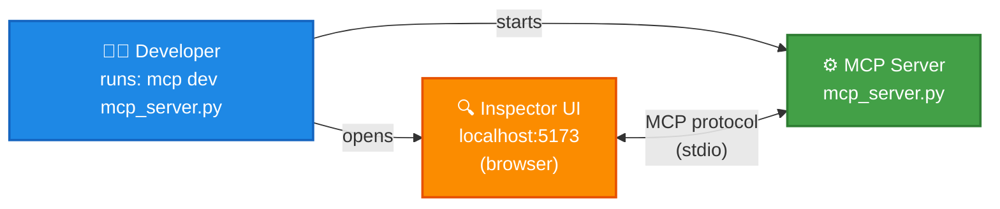

---

### Inspector UI — Sections

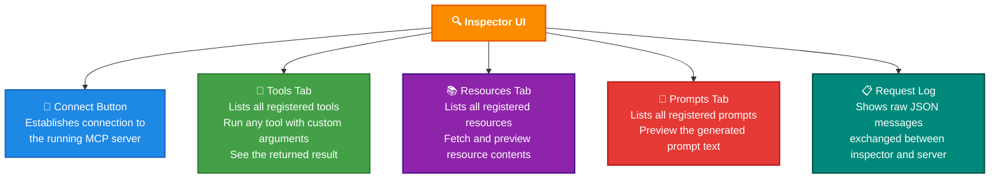

### How to Use It — Step by Step

| Step | Action | What happens |
|------|--------|--------------|
| 1 | Run `mcp dev mcp_server.py` | Server starts; browser opens Inspector |
| 2 | Click **Connect** | Inspector connects to your server via stdio |
| 3 | Go to **Tools → List Tools** | Fetches all tools your server exposes |
| 4 | Click a tool → fill in arguments → **Run Tool** | Calls the tool and shows the result |
| 5 | Edit your server code and save | Inspector reflects changes live — no restart needed |

### Key Features

- **Live development** — changes to your server code are picked up automatically; you do not need to relaunch
- **Raw message view** — the request log shows the exact `ListToolsRequest`, `CallToolRequest`, and response JSON so you can verify the MCP protocol messages
- **No client needed** — you can fully test tools, resources, and prompts before writing a single line of client code

## Implementing a Client

The client lives in `mcp_client.py` and is made up of two parts: a custom **MCP Client** class we author to make working with the session easier, and the **Client Session** which handles the actual connection to the server.

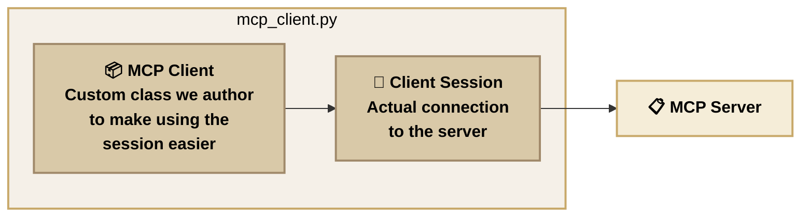

> mcp_client.py
``` python
import sys
import asyncio
from typing import Optional, Any
from contextlib import AsyncExitStack
from mcp import ClientSession, StdioServerParameters, types
from mcp.client.studio import stdio_client

class MCPClient:
    def __init__(
        self,
        command: str,
        args: list[str],
        env: Optional[dict] = None,
    ):
        self._command =command
        self._args =args
        self._env =env
        self._session: Optional[ClientSession] =None
        self._exit_stack: AsyncExitStack = AsyncExitStack()
    async def connect(self):
        server_params = StdioServerParameters(
            command=self._command,
            args=self._args,
            env=self._env,
        )
        stdio_transport =await self._exit_stack.enter_async_context(
            stdio_client(server_params)
        )
        _stdio, _write = stdio_transport
        self._session - await self._exit_stack.enter_async_context(
            ClientSession(_stdio,_write)
        )
        await self._session.initialize()
    def session(self) -> ClientSession:
        if self._session is None:
            raise ConnectionError(
                "Client session not initialized or cache not populated. Call connect"
            )
        return self._session
    async def list_tools(self) -> list[types.Tool]:
        # TODO: Return a list of tools defined by the MCP server
        result = await self.session().list_tools()
        return result.tools
      
    async def call_tool(
        self, tool_name: str, tool_input:dict
    ) -> types.CallToolResult | None:
        return await self.session().call_tool(tool_name, tool_input)

    async def list_prompts(self) -> list[types.Prompt]:
        # TODO: Return a list of prompts defined by the MCP server
        return []
    
    async def get_prompt(self, prompt_name, args: dict[str, str]):
        # TODO: Get a particulat prompt defined by the MCP server
        return []
    
    async def read_resource(self, uri:str) -> Any:
        # TODO: Read a resource, parse the contents and return it
        return []
    
    async def cleanup(self):
        await self._exit_stack.aclose()
        self._session = None
    
    async def __aenter__(self):
        await self.connect()
        return self
    
    async def __aexit__(self, exc_type, exc_val, exc_tb):
        await self.cleanup()

async def main():
    async with MCPClient(
        command="uv", args=["run","mcp_server.py"]
    ) as _client:
        result = await _client.list_tools()
        print(result)

if __name__ == "__main__":
    if sys.platform == "win32":
        asyncio.set_event_loop_policy(asyncio.WindowsProactorEventLoopPolicy())
    asyncio.run(main())

```
---

## Defining Resources

> Next Feature 
- Users can "mention" a document by writing out "@doc_name"
   - Typing "@" should show a list of all available documents
   - When a document is mentioned, its contents should be automatically injected into the prompt

When a user mentions `@report.pdf`, our code detects it, fetches the document contents, and injects them into the prompt before sending it to Claude:

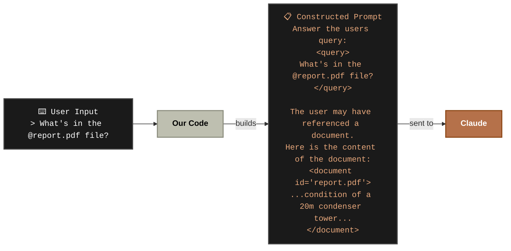

When the user types `@`, our code asks the MCP Client for a list of document names to populate the autocomplete. The MCP Client sends a `ReadResourceRequest` to the server using the `docs://documents` URI, and the server responds with a `ReadResourceResult` containing the list of doc names:

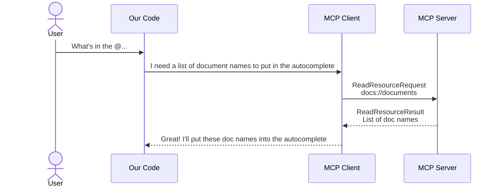

There are two types of resources you can define on an MCP server:

| | Direct Resource | Templated Resource |
|---|---|---|
| **URI** | Fixed — no parameters | Contains `{param}` placeholders |
| **Example URI** | `docs://documents` | `docs://documents/{doc_id}` |
| **Returns** | Same thing every time | Different result per parameter |
| **Use case** | Lists, indexes, configs | Fetching one specific item |
| **SDK behaviour** | Calls function with no args | Parses URI → passes params as args |

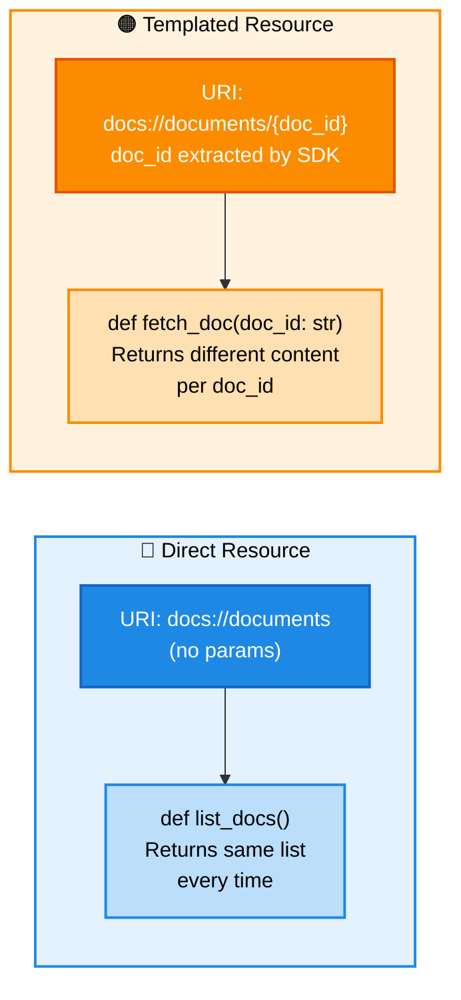

### Direct Resource

Fixed URI — no parameters. Returns the same data every time it is called. Used for listing indexes or configs.

```python
@mcp.resource(
    "docs://documents",        # fixed URI — no placeholders
    mime_type="application/json"
)
def list_docs():
    return list(docs.keys())   # always returns the full list of doc names
```

### Templated Resource

URI contains `{param}` placeholders. The Python SDK automatically parses the URI and passes the extracted values as arguments to your function. Used for fetching one specific item.

```python
@mcp.resource(
    "docs://documents/{doc_id}",   # {doc_id} is extracted from the URI
    mime_type="text/plain"
)
def fetch_doc(doc_id: str):        # SDK passes doc_id in automatically
    return docs[doc_id]            # returns the content of that specific doc
```

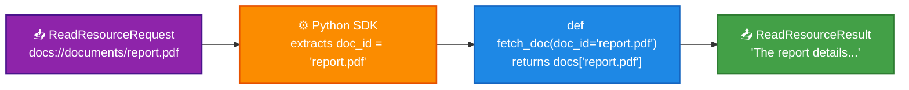

---

## Accessing Resources

Resources are accessed by the MCP Client using `ReadResourceRequest` with a URI. The server matches the URI to either a direct or templated resource handler and returns the result.

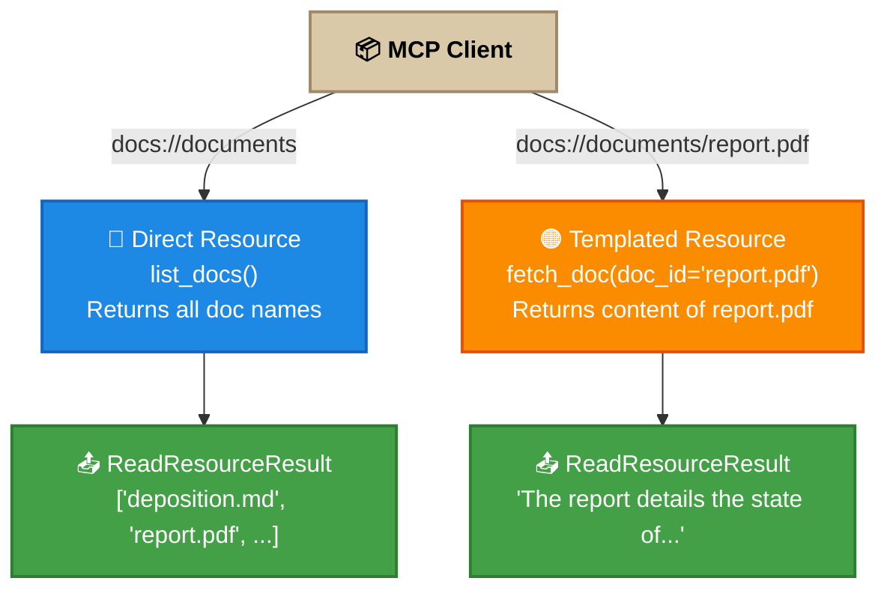
> mcp_server.py
``` python
from mcp.server.fastmcp import FastMCP
from pydantic import field
mcp= FastMCP("DocumentMCP", log_level="ERROR")
docs= {
    "deposition.md":"This deposition covers the ...",
    "report.pdf":"The report details the state of a 20m condenser tower."
}
# TODO: Write a tool to read a document
@mcp.tool(
    name= "read_doc_contents"
    description="Read the contents of a document and return it as a string."
)
def read_document(
    doc_id: str = Field(description="Id of the document to read")
):
    if doc_id not in docs:
        raise ValueError(f"Doc with id {doc_id} not found")
    return docs[doc_id]

# TODO: Write a tool to edit a doc
@mcp.tool(
    name="edit_document",
    description="Edit a document by replacing a string in the documents content with a new string"
)
def edit_document(
    doc_id:str = Field(description="Id of the document that will be edited"),
    old_str: str= Field(description="The text to replace. Must match exactly, including whitespace"),
    new_str: str= Field(description="The new text to insert in place of old text ")
):
    if doc_id not in docs:
        raise ValueError(f"Doc with id {doc_id} not found")
    docs[doc_id] = docs[doc_id].replace(old_str, new_str)
# TODO: Write a resource to return all doc id's
@mcp.resource(
    "docs://documents",
    mime_type="application/json"
)
def list_doc() -> list[str]:
    return list(docs.keys())

# TODO: Write a resource to return the contents of a particular doc

@mcp.resource(
    "docs://documents/{doc_id}",
    mime_type="text/plian"
)
def fetch_doc(doc_id: str) -> str:
    if doc_id not in docs:
        raise ValueError(f"Doc with id {doc_id} not found")
    return docs[doc_id]
# TODO: Write a prompt to rewrite a doc in markdown format

# TODO: Write a prompt to summarize a doc
```

### Testing Resources in the Inspector

Once both resources (`list_docs` and `fetch_doc`) are defined in `mcp_server.py`, launch the Inspector to verify them:

```bash
uv run mcp dev mcp_server.py
```

The Inspector opens in your browser (typically on port **6277**). Here's what to do:

| Step | Action | What you see |
|------|--------|--------------|
| 1 | Go to the **Resources** tab | Click **List Resources** — the Direct resource `docs://documents` appears |
| 2 | Click `docs://documents` → **Read Resource** | Returns the full list of doc names: `["deposition.md", "report.pdf"]` |
| 3 | Click the **Resource Template** tab | The Templated resource `docs://documents/{doc_id}` appears |
| 4 | Enter a `doc_id` (e.g. `report.pdf`) → **Read Resource** | Calls `fetch_doc("report.pdf")` and returns `"The report details the state of a 20m condenser tower."` |

> **Why this matters:** Step 2 confirms your Direct resource works — the `list_docs()` function is returning data. Step 4 confirms the SDK correctly extracts `doc_id` from the URI and passes it into `fetch_doc()`. If `doc_id` is not in `docs`, the `ValueError` you wrote will surface here before any client code is involved.

Here is the full flow of how the autocomplete is populated when a user types `@`:

```mermaid
sequenceDiagram
    actor User
    participant OurCode as Our Code
    participant MCPClient as MCP Client
    participant MCPServer as MCP Server

    User->>OurCode: What's in the @...
    OurCode->>MCPClient: I need a list of document names to put in the autocomplete
    MCPClient->>MCPServer: ReadResourceRequest<br/>docs://documents
    MCPServer-->>MCPClient: ReadResourceResult<br/>List of doc names
    MCPClient-->>OurCode: Great! I'll put these doc names into the autocomplete
```
> mcp_client.py
``` python
import sys
import asyncio
from typing import Optional, Any
from contextlib import AsyncExitStack
from mcp import ClientSession, StdioServerParameters, types
from mcp.client.studio import stdio_client
import json
from pydantic import AnyUrl
class MCPClient:
    def __init__(
        self,
        command: str,
        args: list[str],
        env: Optional[dict] = None,
    ):
        self._command =command
        self._args =args
        self._env =env
        self._session: Optional[ClientSession] =None
        self._exit_stack: AsyncExitStack = AsyncExitStack()
    async def connect(self):
        server_params = StdioServerParameters(
            command=self._command,
            args=self._args,
            env=self._env,
        )
        stdio_transport =await self._exit_stack.enter_async_context(
            stdio_client(server_params)
        )
        _stdio, _write = stdio_transport
        self._session - await self._exit_stack.enter_async_context(
            ClientSession(_stdio,_write)
        )
        await self._session.initialize()
    def session(self) -> ClientSession:
        if self._session is None:
            raise ConnectionError(
                "Client session not initialized or cache not populated. Call connect"
            )
        return self._session
    async def list_tools(self) -> list[types.Tool]:
        # TODO: Return a list of tools defined by the MCP server
        result = await self.session().list_tools()
        return result.tools
      
    async def call_tool(
        self, tool_name: str, tool_input:dict
    ) -> types.CallToolResult | None:
        return await self.session().call_tool(tool_name, tool_input)

    async def list_prompts(self) -> list[types.Prompt]:
        # TODO: Return a list of prompts defined by the MCP server
        return []
    
    async def get_prompt(self, prompt_name, args: dict[str, str]):
        # TODO: Get a particulat prompt defined by the MCP server
        return []
    
    async def read_resource(self, uri:str) -> Any:
        # TODO: Read a resource, parse the contents and return it
        result = await self.session().read_resource(AnyUrl(uri))
        resource = result.contents[0]
        if isinstance(resource, type. TextResourceContents):
            if resource.mimeType == "application/json":
                return json.loads(reource.text)
            return resource.text
        
    async def cleanup(self):
        await self._exit_stack.aclose()
        self._session = None
    
    async def __aenter__(self):
        await self.connect()
        return self
    
    async def __aexit__(self, exc_type, exc_val, exc_tb):
        await self.cleanup()

async def main():
    async with MCPClient(
        command="uv", args=["run","mcp_server.py"]
    ) as _client:
        result = await _client.list_tools()
        print(result)

if __name__ == "__main__":
    if sys.platform == "win32":
        asyncio.set_event_loop_policy(asyncio.WindowsProactorEventLoopPolicy())
    asyncio.run(main())

```
### Running the Client

Once the client code is in place, run it with:

```bash
uv run main.py
```

| Step | What you do | What happens |
|------|-------------|--------------|
| 1 | Run `uv run main.py` | Client starts, connects to the MCP server, and fetches available tools |
| 2 | Type a message with `@doc_name` (e.g. `What's in the @report.pdf?`) | Our code detects the `@` mention and sends a `ReadResourceRequest` to the server for that document |
| 3 | Server responds | The document's contents are returned via `ReadResourceResult` and injected into the prompt sent to Claude |
---

## Defining Prompts

> Next feature
- users can ask claude to format a document as markdown
- user will initiate the process by typing a "/" to list out possible commands
- user will specify the id of the document to format 
- claude should read the documents content then print a markdown formatted version.

drawback is
- If users start to write themselves in different versions to convert to markdown instead of /format

solution is
- we can write custom tailored prompts which definesa set of User and Assistant messages and can be used by the client.
- These prompt should be high quality, well-tested, and relevant to the overall purpose of the MCP.

> mcp_server.py
``` python
from mcp.server.fastmcp import FastMCP
from pydantic import field
mcp= FastMCP("DocumentMCP", log_level="ERROR")
docs= {
    "deposition.md":"This deposition covers the ...",
    "report.pdf":"The report details the state of a 20m condenser tower."
}
# TODO: Write a tool to read a document
@mcp.tool(
    name= "read_doc_contents"
    description="Read the contents of a document and return it as a string."
)
def read_document(
    doc_id: str = Field(description="Id of the document to read")
):
    if doc_id not in docs:
        raise ValueError(f"Doc with id {doc_id} not found")
    return docs[doc_id]

# TODO: Write a tool to edit a doc
@mcp.tool(
    name="edit_document",
    description="Edit a document by replacing a string in the documents content with a new string"
)
def edit_document(
    doc_id:str = Field(description="Id of the document that will be edited"),
    old_str: str= Field(description="The text to replace. Must match exactly, including whitespace"),
    new_str: str= Field(description="The new text to insert in place of old text ")
):
    if doc_id not in docs:
        raise ValueError(f"Doc with id {doc_id} not found")
    docs[doc_id] = docs[doc_id].replace(old_str, new_str)
# TODO: Write a resource to return all doc id's
@mcp.resource(
    "docs://documents",
    mime_type="application/json"
)
def list_doc() -> list[str]:
    return list(docs.keys())

# TODO: Write a resource to return the contents of a particular doc

@mcp.resource(
    "docs://documents/{doc_id}",
    mime_type="text/plian"
)
def fetch_doc(doc_id: str) -> str:
    if doc_id not in docs:
        raise ValueError(f"Doc with id {doc_id} not found")
    return docs[doc_id]
# TODO: Write a prompt to rewrite a doc in markdown format
def format_document(
    doc_id: str=Field(description= "Id of the document to format")
)-> list[base.Message]:
    prompt = f"""
    Your goal is to reformat a document to be written with markdown syntax.

    The id of the document you need to reformat is:
    <document_id>
    {doc_id}
    </document_id>
    Add in headers, bullet points, tables, etc as necessary. Feel free to add in extra points. Use the 'edit_document' tool to edit the document. After the document has been completed
    """
    return [base.UserMessage(prompt)]
# TODO: Write a prompt to summarize a doc
```


## Prompts in the Client

> mcp_client.py
``` python
import sys
import asyncio
from typing import Optional, Any
from contextlib import AsyncExitStack
from mcp import ClientSession, StdioServerParameters, types
from mcp.client.studio import stdio_client
import json
from pydantic import AnyUrl
class MCPClient:
    def __init__(
        self,
        command: str,
        args: list[str],
        env: Optional[dict] = None,
    ):
        self._command =command
        self._args =args
        self._env =env
        self._session: Optional[ClientSession] =None
        self._exit_stack: AsyncExitStack = AsyncExitStack()
    async def connect(self):
        server_params = StdioServerParameters(
            command=self._command,
            args=self._args,
            env=self._env,
        )
        stdio_transport =await self._exit_stack.enter_async_context(
            stdio_client(server_params)
        )
        _stdio, _write = stdio_transport
        self._session - await self._exit_stack.enter_async_context(
            ClientSession(_stdio,_write)
        )
        await self._session.initialize()
    def session(self) -> ClientSession:
        if self._session is None:
            raise ConnectionError(
                "Client session not initialized or cache not populated. Call connect"
            )
        return self._session
    async def list_tools(self) -> list[types.Tool]:
        # TODO: Return a list of tools defined by the MCP server
        result = await self.session().list_tools()
        return result.tools
      
    async def call_tool(
        self, tool_name: str, tool_input:dict
    ) -> types.CallToolResult | None:
        return await self.session().call_tool(tool_name, tool_input)

    async def list_prompts(self) -> list[types.Prompt]:
        # TODO: Return a list of prompts defined by the MCP server
        result = await self.session().list_prompts()
        return result.prompts
    
    async def get_prompt(self, prompt_name, args: dict[str, str]):
        # TODO: Get a particulat prompt defined by the MCP server
        result = await self.session().get_prompt(prompt_name, args)
        return result.messages
    
    async def read_resource(self, uri:str) -> Any:
        # TODO: Read a resource, parse the contents and return it
        result = await self.session().read_resource(AnyUrl(uri))
        resource = result.contents[0]
        if isinstance(resource, type. TextResourceContents):
            if resource.mimeType == "application/json":
                return json.loads(reource.text)
            return resource.text
        
    async def cleanup(self):
        await self._exit_stack.aclose()
        self._session = None
    
    async def __aenter__(self):
        await self.connect()
        return self
    
    async def __aexit__(self, exc_type, exc_val, exc_tb):
        await self.cleanup()

async def main():
    async with MCPClient(
        command="uv", args=["run","mcp_server.py"]
    ) as _client:
        result = await _client.list_tools()
        print(result)

if __name__ == "__main__":
    if sys.platform == "win32":
        asyncio.set_event_loop_policy(asyncio.WindowsProactorEventLoopPolicy())
    asyncio.run(main())

```
1. when I run mcp uv run main.py
2. then hit /format and then space then select documents
## MCP Server primitives

```mermaid
flowchart LR
    Tools["🛠️ **Tools**\n─────────────────\nModel-controlled\nClaude decides when\nto call these.\nResults used by Claude\n─────────────────\nUsed for:\n• Giving additional\n  functionality to Claude"]

    Resources["📚 **Resources**\n─────────────────\nApp-controlled\nOur app decides when\nto call these.\nResults used primarily\nby our app.\n─────────────────\nUsed for:\n• Getting data into our app\n• Adding context to messages"]

    Prompts["💬 **Prompts**\n─────────────────\nUser-controlled\nThe user decides\nwhen to use these.\n─────────────────\nUsed for:\n• Workflows triggered by\n  user input e.g. slash\n  command, button click,\n  or menu option"]

    style Tools     fill:#F5ECD7,stroke:#C8A96E,stroke-width:2px,color:#1a1a1a
    style Resources fill:#D4836B,stroke:#A0522D,stroke-width:2px,color:#fff
    style Prompts   fill:#B85C44,stroke:#8B3A2A,stroke-width:2px,color:#fff
```

| Primitive | Controlled by | Results used by | Use case |
|-----------|--------------|-----------------|----------|
| 🛠️ **Tools** | Model — Claude decides when to call | Claude | Giving additional functionality to Claude |
| 📚 **Resources** | App — our app decides when to call | Our app | Getting data into the app; adding context to messages |
| 💬 **Prompts** | User — user decides when to use | User workflows | Slash commands, button clicks, menu options |

# Model Context Protocol: (Advanced Topics)
1. Sampling - allows mcp servers to make calls to claude through a client
2. Log and Progress Notifications - Give users better feedback during long-running operations
3. Roots - Direct local MCP servers to specific files/folders
4. Messages Format - Understand how MCP clientss and servers communicate.
5. StandardIO Transport - See how the stdio transport works
6. StreamableHTTP Transport - Explore how remotely hosted MCP servers work.

## Sampling
- Sampling allows a server to access a language model like CLAUD through a connected MCP client.
- Example

```mermaid
sequenceDiagram
    participant Claude as Claude
    participant NextJS as Next JS +\nMCP Client
    participant MCPServer as MCP Server
    participant Wikipedia as Wikipedia

    Claude->>NextJS: Research a topic
    NextJS->>MCPServer: Run the 'research' tool — Tool Call Request
    MCPServer->>Wikipedia: Research...
    MCPServer->>Wikipedia: Research...
    MCPServer->>Wikipedia: Research...
    MCPServer-->>NextJS: Research complete!
    Note over MCPServer: I need to use Claude\nto summarize the results!
    MCPServer-->>NextJS: Please summarize this...
    NextJS-->>Claude: Please summarize this...
```

### Option 1 — Give the MCP Server Access to Claude

> Give the MCP server access to Claude, have the research tool generate the summary itself.

```mermaid
sequenceDiagram
    participant Claude as Claude
    participant NextJS as Next JS +\nMCP Client
    participant MCPServer as MCP Server
    participant Wikipedia as Wikipedia

    Claude->>NextJS: Research a topic
    NextJS->>MCPServer: Run the 'research' tool — Tool Call Request
    MCPServer->>Wikipedia: Research...
    MCPServer->>Wikipedia: Research...
    MCPServer->>Wikipedia: Research...
    MCPServer-->>NextJS: Research complete!
    Note over MCPServer: I need to use Claude\nto summarize the results!
    MCPServer->>NextJS: Sampling Request — Please summarize this...
    NextJS->>Claude: Please summarize this...
    Claude-->>NextJS: Here is the summary...
    NextJS-->>MCPServer: Here is the summary...
    MCPServer-->>NextJS: Tool Call Result — Summary ready!
```
### Option 2 — Server Asks the Client to Call Claude

> Server generates a prompt, then asks the **client** to send it to Claude and report back.

```mermaid
sequenceDiagram
    participant Claude as Claude
    participant NextJS as Next JS +\nMCP Client
    participant MCPServer as MCP Server
    participant Wikipedia as Wikipedia

    Claude->>NextJS: Research a topic
    NextJS->>MCPServer: Run the 'research' tool — Tool Call Request
    MCPServer->>Wikipedia: Research...
    MCPServer->>Wikipedia: Research...
    MCPServer->>Wikipedia: Research...
    Note over MCPServer: I need to use Claude\nto summarize the results!
    MCPServer->>NextJS: Could you call Claude for me?
    NextJS->>Claude: Call to Claude on behalf of the server
    Claude-->>NextJS: Claude responds to the client
    NextJS-->>MCPServer: Here's the results of the call you asked for
```
- Allows the server to request the client to run Claude (for any LLM app)
- Server can request a LLM call by using the create_message() function on the context.
- Reduces the amount of configuration we need to provide to the server
- shifts the cost and config burden to the client.

```python
@mcp.tool()
async def summarize(text_to_summarize: str, ctx: Context):
    prompt = f"""
Please summarize the following text:
{text_to_summarize}
"""

    result = await ctx.session.create_message(
        messages=[
            SamplingMessage(
                role="user",
                content=TextContent(
                    type="text",
                    text=prompt
                )
            )
        ],
        max_tokens=4000,
        system_prompt="You are a helpful research assistant",
    )

    if result.content.type == "text":
        return result.content.text
    else:
        raise ValueError("Sampling failed")
```

### Client-side — Handling the Sampling Request

The client needs a `sampling_callback` function that gets triggered whenever the server asks Claude to be called.

```python
# ① Called when the server sends a sampling request
async def sampling_callback(
    context: RequestContext, params: CreateMessageRequestParams
):
    # ② Call a LLM of your choice using the Anthropic SDK
    text = await chat(params.messages)

    # ③ Return the generated text in a CreateMessageResult
    return CreateMessageResult(
        role="assistant",
        model=model,
        content=TextContent(type="text", text=text),
    )


async def run():
    async with stdio_client(server_params) as (read, write):
        async with ClientSession(
            read,
            write,
            sampling_callback=sampling_callback   # ④ Pass the callback to the ClientSession
        ) as session:
            await session.initialize()

            result = await session.call_tool(
                name="summarize",
                arguments={"text_to_summarize": "lots of text"},
            )
            print(result.content)
```

### How It All Fits Together

```mermaid
sequenceDiagram
    participant Client as 🖥️ MCP Client\n(Next JS)
    participant Session as 🔌 ClientSession
    participant Server as ⚙️ MCP Server
    participant Callback as 🔁 sampling_callback
    participant Claude as 🤖 Claude\n(Anthropic SDK)

    Client->>Session: Start session with\nsampling_callback attached
    Client->>Session: call_tool("summarize", text)
    Session->>Server: Tool Call Request
    Note over Server: Needs Claude to summarize —\ncalls ctx.session.create_message()
    Server->>Session: Sampling Request\n(send this to Claude for me)
    Session->>Callback: Triggers sampling_callback(params)
    Callback->>Claude: chat(params.messages)
    Claude-->>Callback: Summary text
    Callback-->>Session: CreateMessageResult
    Session-->>Server: Here's Claude's response
    Server-->>Session: Tool Call Result
    Session-->>Client: Final result
    Client->>Client: print(result.content)
```

### Plain English Breakdown

| Step | What happens | Who does it |
|------|-------------|-------------|
| ① | Client starts a session and registers `sampling_callback` | MCP Client |
| ② | Client calls the `summarize` tool with some text | MCP Client |
| ③ | Server receives the tool call and realises it needs Claude | MCP Server |
| ④ | Server calls `ctx.session.create_message()` — asking the client to call Claude | MCP Server |
| ⑤ | ClientSession triggers `sampling_callback` with the request params | ClientSession |
| ⑥ | Callback calls Claude (via Anthropic SDK or any LLM) and gets the summary | sampling_callback |
| ⑦ | Callback wraps the result in `CreateMessageResult` and returns it | sampling_callback |
| ⑧ | Server gets Claude's response and returns the final tool result | MCP Server |
| ⑨ | Client prints the result | MCP Client |

> **Key idea:** The server never talks to Claude directly. It asks the client via a sampling request, the client's callback handles the actual LLM call, and brings the answer back. This keeps API keys and model config on the client side only.

## Logging and progress notifications
- Notifications emitted from the server to help the client track the status of long running tasks.
- In the Python MCP SDK, logging and progress are done through the Context argument provided to tools
- It's up to the client to decide how (if at all) to present these to the user

```python
from mcp.server.fastmcp import Context

@mcp.tool(
    name="research",
    description="Research a given topic"
)
async def research(
    topic: str = Field(description="Topic to research"),
    *,
    context: Context
):
    await context.info("About to do research...")
    await context.report_progress(20, 100)
    sources = await do_research(topic)

    await context.info("Writing report...")
    await context.report_progress(70, 100)
    results = await generate_report(sources)

    return results
```

### Client-side — Handling Log and Progress Notifications

```python
# ① Called whenever the server emits a log statement
async def logging_callback(params: LoggingMessageNotificationParams):
    print(params.data)


# ② Called whenever the server emits a progress update
async def print_progress_callback(
    progress: float, total: float | None, message: str | None
):
    if total is not None:
        percentage = (progress / total) * 100
        print(f"Progress: {progress}/{total} ({percentage:.1f}%)")
    else:
        print(f"Progress: {progress}")


async def run():
    async with stdio_client(server_params) as (read, write):
        async with ClientSession(
            read,
            write,
            logging_callback=logging_callback,   # ③ Provide the logging callback to the client session
        ) as session:
            await session.initialize()

            await session.call_tool(
                name="add",
                arguments={"a": 1, "b": 3},
                progress_callback=print_progress_callback,   # ④ Provide the progress callback to the tool call
            )
```

### How It All Fits Together

```mermaid
sequenceDiagram
    participant Client as 🖥️ MCP Client
    participant Session as 🔌 ClientSession
    participant Server as ⚙️ MCP Server
    participant LogCB as 📋 logging_callback
    participant ProgCB as 📊 print_progress_callback

    Client->>Session: Start session with logging_callback attached
    Client->>Session: call_tool("research", progress_callback=...)
    Session->>Server: Tool Call Request

    Note over Server: context.info("About to do research...")
    Server-->>Session: Log Notification
    Session->>LogCB: logging_callback(params)
    LogCB->>Client: print(params.data)

    Note over Server: context.report_progress(20, 100)
    Server-->>Session: Progress Notification
    Session->>ProgCB: print_progress_callback(20, 100)
    ProgCB->>Client: Progress: 20/100 (20.0%)

    Note over Server: context.report_progress(70, 100)
    Server-->>Session: Progress Notification
    Session->>ProgCB: print_progress_callback(70, 100)
    ProgCB->>Client: Progress: 70/100 (70.0%)

    Server-->>Session: Tool Call Result
    Session-->>Client: Final result
```

### Plain English Breakdown

| Step | What happens | Who does it |
|------|-------------|-------------|
| ① | Client starts a session and registers `logging_callback` | MCP Client |
| ② | Client calls a tool and passes `print_progress_callback` | MCP Client |
| ③ | Server runs the tool — emits `context.info(...)` log messages along the way | MCP Server |
| ④ | ClientSession receives log notifications and triggers `logging_callback` | ClientSession |
| ⑤ | `logging_callback` prints the log message to the console | logging_callback |
| ⑥ | Server emits `context.report_progress(current, total)` at key points | MCP Server |
| ⑦ | ClientSession triggers `print_progress_callback` with progress values | ClientSession |
| ⑧ | Callback calculates the percentage and prints it | print_progress_callback |
| ⑨ | Server finishes and returns the tool result | MCP Server |

> **Key idea:** Log and progress callbacks are registered separately — logging goes on the **session**, progress goes on the **tool call**. The server just calls `context.info()` and `context.report_progress()` — the client decides how to display them.

## Roots
- allows users to grant access to particular set of files and users
- the problem root solves shown below 

> **If roots didn't exist...**

```mermaid
flowchart TD
    Problem["⚠️ If roots didn't exist..."]

    subgraph MCPServer["  🖥️ MCP Server  "]
        subgraph Tools["  Tools  "]
            Tool["convert_video"]
        end
    end

    Note["Tool that will convert a .mp4 video file to .mov\nRequires a path to a video file on the local machine"]

    Note -->|needs a file path| Tool

    style Problem   fill:#fff0f0,stroke:#cc0000,stroke-width:2px,color:#cc0000
    style MCPServer fill:#f9f9f9,stroke:#aaa,stroke-width:2px,color:#000
    style Tools     fill:#fff,stroke:#bbb,stroke-width:1px,color:#555
    style Tool      fill:#fff,stroke:#333,stroke-width:2px,color:#000
    style Note      fill:#fffbe6,stroke:#ccc,stroke-width:1px,color:#333
```

**The problem in action — what happens without roots:**

```mermaid
sequenceDiagram
    participant You as 👤 You
    participant AI as 🤖 AI
    participant MCPServer as 🖥️ MCP Server\n(Tools)

    You->>AI: Convert biking.mp4 to mov format
    AI->>MCPServer: I'll call convert_video\n{"path": "biking.mp4"}
    Note over MCPServer: ❌ Where is biking.mp4?\nServer has no idea which\nfolder to look in!
```

- The AI calls `convert_video` with `{"path": "biking.mp4"}` — but the server has no idea where that file lives on your machine
- Roots fix this: the client tells the server upfront which local folders it's allowed to access

**Tools the MCP Server exposes to work with roots:**

| Tool Name | Purpose |
|-----------|---------|
| `convert_video` | Unchanged — converts a `.mp4` file to `.mov` |
| `read_dir` | Return a list of files/folders in a specified directory |
| `list_roots` | Return a list of roots: files/folders that the user has granted permission to be read. The `read_dir` and `convert_video` tools are only allowed to work on files/folders contained in one of these roots |

### How Roots Work in Practice

When you run the MCP client, you pass in the directories you want to grant the server access to as command-line arguments:

```bash
uv run main.py ~/Desktop
```

- `~/Desktop` is passed as the root — the server is now only allowed to work with files inside that folder
- In this example, only one directory is granted, so `convert_video` and `read_dir` can only touch files on the Desktop
- If `biking.mp4` is on the Desktop, the tool works. If it's somewhere else (e.g. `~/Downloads`), the server will refuse — it's outside the granted roots

**What happens step by step:**

```mermaid
sequenceDiagram
    participant User as 👤 You
    participant Client as 🖥️ MCP Client
    participant Server as ⚙️ MCP Server

    User->>Client: uv run main.py ~/Desktop
    Client->>Server: Here are your roots:\n[~/Desktop]
    User->>Client: Convert biking.mp4 to .mov
    Client->>Server: call convert_video\n{"path": "biking.mp4"}
    Server->>Server: Is biking.mp4 inside ~/Desktop? ✅
    Server-->>Client: Conversion done!
    Note over Server: If the file were in ~/Downloads ❌\nServer would reject the request —\nnot inside any granted root
```

**Multiple roots example:**

```bash
uv run main.py ~/Desktop ~/Videos ~/Projects
```

Now the server can access files in any of those three folders — and `list_roots` would return all three so the AI knows where it's allowed to look.

- Roots allow users to specify specific files/folders that should be accessible.
- Helps point Claude to specific files folders; avoids forcing Claude to search the whole filesystem.
You can provide roots to Clause through a tool, or just inject them into a prompt
-  Your server has to ensure that files/folders that other tools try to access are contained within a root.

```python
# Helper function to see if a given path is contained within a root
async def is_path_allowed(requested_path: Path, ctx: Context) -> bool:
    roots_result = await ctx.session.list_roots()
    client_roots = roots_result.roots

    if not requested_path.exists():
        return False

    if requested_path.is_file():
        requested_path = requested_path.parent

    for root in client_roots:
        root_path = file_url_to_path(root.uri)
        try:
            requested_path.relative_to(root_path)
            return True
        except ValueError:
            continue

    return False


@mcp.tool()
async def convert_video(
    input_path: str = Field(description="Path to the input MP4 file"),
    *,
    ctx: Context
):
    """Convert an MP4 video file to another format using ffmpeg"""

    # Ensure the input file is contained in a root
    if not await is_path_allowed(input_path, ctx):
        raise ValueError(f"Access to path is not allowed: {input_path}")

    return await VideoConverter.convert(input_path, format)
```

```mermaid
flowchart TD
    A["👤 User calls convert_video\nwith input_path"] --> B["is_path_allowed()"]
    B --> C["Ask server for list of roots\nctx.session.list_roots()"]
    C --> D{"Does the path\nexist?"}
    D -->|No| E["❌ return False\nAccess denied"]
    D -->|Yes| F{"Is path\ninside a root?"}
    F -->|No| E
    F -->|Yes| G["✅ return True\nAccess granted"]
    G --> H["VideoConverter.convert()\nDo the actual work"]

    style A fill:#1E88E5,color:#fff,stroke:#1565C0
    style B fill:#FB8C00,color:#fff,stroke:#E65100
    style C fill:#8E24AA,color:#fff,stroke:#4A148C
    style D fill:#F5F5F5,color:#000,stroke:#999
    style E fill:#E53935,color:#fff,stroke:#B71C1C
    style F fill:#F5F5F5,color:#000,stroke:#999
    style G fill:#43A047,color:#fff,stroke:#2E7D32
    style H fill:#00897B,color:#fff,stroke:#004D40
```

## Transports and Communication
1. Messages Format - Examine communication between MCP servers and clients
2. Stdio Transport - See how the stdio transport receives and responds to messages
3. Streamable HTTP Transport- Understand critical limitations of HTTP transport

## JSON message types
MCP Messages
- There are many types of messages, each designed to achieve a particular goal (list tools, call tools, get a resource, etc)
- The MCP specification defines a full list of all the different message types

All communication between the MCP Client and MCP Server happens via **JSON messages** passed back and forth:

```mermaid
flowchart TD
    Client["📦 MCP Client"] <-->|"JSON Message"| Server["🖥️ MCP Server"]

    style Client fill:#f5f0e8,stroke:#888,stroke-width:2px,color:#000
    style Server fill:#f5f0e8,stroke:#888,stroke-width:2px,color:#000
```

**Example Message:**
```json
{
  "jsonrpc": "2.0",
  "id": 1,
  "method": "tools/call",
  "params": {
    "name": "add",
    "arguments": {"a": 5, "b": 3}
  }
}
```

- `jsonrpc` — always `"2.0"`, the version of the JSON-RPC protocol MCP uses
- `id` — unique ID to match the response back to this request
- `method` — what action to perform e.g. `tools/call`, `tools/list`, `resources/read`
- `params` — the data for that action — here, calling the `add` tool with arguments `a=5, b=3`

### Full Request → Response Cycle

```mermaid
sequenceDiagram
    participant Client as 📦 MCP Client
    participant Server as 🖥️ MCP Server

    Note over Client: I need to call a tool!
    Client->>Server: Call Tool Request
    Note over Server: I'll call that tool\nand respond with the result
    Server-->>Client: Call Tool Result
```

**Call Tool Request** — sent from client to server:
```json
{
  "jsonrpc": "2.0",
  "id": 1,
  "method": "tools/call",
  "params": {
    "name": "add", "arguments": {"a": 5, "b": 3}
  }
}
```

**Call Tool Result** — sent back from server to client:
```json
{
  "jsonrpc": "2.0",
  "id": 1,
  "result": {
    "content": [{"type": "text", "text": "8"}],
    "isError": false
  }
}
```

- `id` is the same in both — this is how the client matches the result to the original request
- `content` — array of result objects, here a text result with value `"8"` (5 + 3)
- `isError` — `false` means the tool ran successfully; `true` would indicate something went wrong

---

### MCP Specification

> github.com/modelcontextprotocol/modelcontextprotocol

- **Defines how MCP clients and servers should behave**
- **Defines all the different valid message types** — written in TypeScript for convenience

Schema file: `schema/2025-11-25/schema.ts`

| Section | What it defines |
|---------|----------------|
| **JSON-RPC Foundation** | `JSONRPCRequest`, `JSONRPCResponse`, `JSONRPCNotification` — base message shapes |
| **Initialization** | Client/server handshake and capability negotiation |
| **Tools** | Callable functions with schema-defined inputs/outputs |
| **Resources** | URI-based file/data access |
| **Prompts** | Template prompts with arguments |
| **Sampling** | LLM invocation through the client |
| **Logging** | Severity-level log notifications |
| **Content Types** | `TextContent`, `ImageContent`, `AudioContent`, `ToolResultContent` |

### Message Types

```mermaid
flowchart LR
    subgraph RR["📨 Request → Result Messages\nMake a request, expect a response back"]
        direction TB
        A1["🔧 Call Tool Request"] <--> A2["✅ Call Tool Result"]
        B1["💬 List Prompts Request"] <--> B2["✅ List Prompts Result"]
        C1["📚 Read Resource Request"] <--> C2["✅ Read Resource Result"]
        D1["🤝 Initialize Request"] <--> D2["✅ Initialize Result"]
    end

    subgraph N["🔔 Notification Messages\nInform client or server about an event — no response needed"]
        direction TB
        N1["📊 Progress Notification"]
        N2["📋 Logging Message Notification"]
        N3["🔄 Tool List Changed Notification"]
        N4["📝 Resource Updated Notification"]
    end

    style RR fill:#F0F4FF,stroke:#4A6FA5,stroke-width:2px,color:#000
    style N  fill:#FFF4E6,stroke:#D4820A,stroke-width:2px,color:#000

    style A1 fill:#1E88E5,color:#fff,stroke:#1565C0
    style A2 fill:#43A047,color:#fff,stroke:#2E7D32
    style B1 fill:#1E88E5,color:#fff,stroke:#1565C0
    style B2 fill:#43A047,color:#fff,stroke:#2E7D32
    style C1 fill:#1E88E5,color:#fff,stroke:#1565C0
    style C2 fill:#43A047,color:#fff,stroke:#2E7D32
    style D1 fill:#1E88E5,color:#fff,stroke:#1565C0
    style D2 fill:#43A047,color:#fff,stroke:#2E7D32

    style N1 fill:#FB8C00,color:#fff,stroke:#E65100
    style N2 fill:#FB8C00,color:#fff,stroke:#E65100
    style N3 fill:#FB8C00,color:#fff,stroke:#E65100
    style N4 fill:#FB8C00,color:#fff,stroke:#E65100
```

**Full Client ↔ Server message map:**

```mermaid
sequenceDiagram
    participant Client as 📦 MCP Client
    participant Server as 🖥️ MCP Server

    Note over Client,Server: Client → Server Requests
    Client->>Server: Call Tool Request
    Server-->>Client: Call Tool Result
    Client->>Server: List Prompts Request
    Server-->>Client: List Prompts Result
    Client->>Server: Read Resource Request
    Server-->>Client: Read Resource Result
    Client->>Server: Initialize Request
    Server-->>Client: Initialize Result

    Note over Client,Server: Server → Client Requests (Sampling & Roots)
    Server->>Client: Create Message Request
    Client-->>Server: Create Message Result
    Server->>Client: List Roots Request
    Client-->>Server: List Roots Result

    Note over Client,Server: Notifications — no response required
    Client-->>Server: Initialized Notification
    Client-->>Server: Cancelled Notification
    Server-->>Client: Progress Notification
    Server-->>Client: Logging Notification
```
## The STDIO Transport
- All messages exchanged between a client and a server are in JSON format.
- There's a tremendous number of ways to send/receive JSON.
- The communication channel used is referred to as a transport

```mermaid
flowchart TD
    Client["📦 MCP Client"]
    Server["🖥️ MCP Server"]
    Transport["🔀 Transport\n──────────\nJSON Message"]

    Client <--> Transport
    Transport <--> Server

    style Client    fill:#f5f0e8,stroke:#888,stroke-width:2px,color:#000
    style Server    fill:#f5f0e8,stroke:#888,stroke-width:2px,color:#000
    style Transport fill:#fff,stroke:#E53935,stroke-width:3px,color:#000
```
- Client launches the MCP server as a subprocess
- Client sends messages to the MCP Server using the server's 'stdin'
- Server responds by writing to 'stdout'
- Critical: either the server or the client can send a message at any time.
- Only appropriate when the client and server are running on the same machine.

```mermaid
flowchart TD
    Client["📦 MCP Client"]

    subgraph Server["  🖥️ MCP Server  "]
        stdin["stdin"]
        stdout["stdout"]
    end

    Client -->|"Client sends message to server"| stdin
    stdout -->|"Server sends message to client"| Client

    style Client  fill:#f0f0f0,stroke:#888,stroke-width:2px,color:#000
    style Server  fill:#f0f0f0,stroke:#888,stroke-width:2px,color:#000
    style stdin   fill:#fff,stroke:#aaa,stroke-width:1px,color:#000
    style stdout  fill:#fff,stroke:#aaa,stroke-width:1px,color:#000
```

```python
from mcp.server.fastmcp import FastMCP, Context
import asyncio

mcp = FastMCP(name="Demo Server", log_level="ERROR")

print("=== MCP STDIO Transport Demo ===")

print("Example messages:")
print(
    '{"jsonrpc": "2.0", "method": "initialize", "params": {"pr'
)
print('{"jsonrpc": "2.0", "method":"notifications/initialized"')
print(
    '{"jsonrpc": "2.0", "method": "tools/call", "params": {"_m'
)
print("\n" + "=" * 50 + "\n")
```

```python
@mcp.tool()
async def add(a: int, b: int, ctx: Context) -> int:
    await ctx.info("Preparing to add...")
    await asyncio.sleep(2)
    await ctx.report_progress(80, 100)

    return a + b


if __name__ == "__main__":
    mcp.run(transport="stdio")
```

### What this code does — step by step

```mermaid
sequenceDiagram
    participant Client as 📦 MCP Client
    participant Server as 🖥️ MCP Server\n(stdio)
    participant Tool as 🔧 add()

    Note over Server: mcp.run(transport="stdio")\nServer starts, listens on stdin
    Client->>Server: {"method": "initialize", ...}
    Server-->>Client: Initialize Result
    Client->>Server: {"method": "notifications/initialized"}

    Client->>Server: tools/call → add(a=5, b=3)
    Server->>Tool: Run add()
    Note over Tool: ctx.info("Preparing to add...")
    Tool-->>Client: 📋 Logging Notification
    Note over Tool: asyncio.sleep(2)\n2 second delay
    Note over Tool: ctx.report_progress(80, 100)
    Tool-->>Client: 📊 Progress Notification → 80%
    Tool-->>Server: return 5 + 3 = 8
    Server-->>Client: Tool Result → "8"
```

### Code breakdown

```mermaid
flowchart TD
    A["FastMCP(name='Demo Server', log_level='ERROR')\nCreate the server instance"] --> B["@mcp.tool()\nasync def add(a, b, ctx)\nRegister the add tool"]
    B --> C["ctx.info('Preparing to add...')\nSend a log notification to the client"]
    C --> D["asyncio.sleep(2)\nSimulate a slow/long operation"]
    D --> E["ctx.report_progress(80, 100)\nTell the client we're 80% done"]
    E --> F["return a + b\nReturn the result"]
    F --> G["mcp.run(transport='stdio')\nStart server — read from stdin, write to stdout"]

    style A fill:#1E88E5,color:#fff,stroke:#1565C0
    style B fill:#8E24AA,color:#fff,stroke:#4A148C
    style C fill:#FB8C00,color:#fff,stroke:#E65100
    style D fill:#546E7A,color:#fff,stroke:#263238
    style E fill:#FB8C00,color:#fff,stroke:#E65100
    style F fill:#43A047,color:#fff,stroke:#2E7D32
    style G fill:#E53935,color:#fff,stroke:#B71C1C
```

```mermaid
sequenceDiagram
    participant Client as 📦 MCP Client
    participant Server as 🖥️ MCP Server

    Client->>Server: Initialize Request
    Server-->>Client: Initialize Result

    Client->>Server: Initialized Notification
    Note over Client,Server: Notification — no result comes back

    Client->>Server: Tool Call Request
    Server-->>Client: Logging Message Notification
    Server-->>Client: Logging Message Notification
    Server-->>Client: Tool Call Result
```

**How can we implement each of these with stdio?**

- Initial request from **Client → Server**
- Response from **Server → Client**
- Initial request from **Server → Client**
- Response from **Client → Server**

## The StreamableHTTP transport

```mermaid
flowchart LR
    subgraph YourPC["  🖥️ Your Computer  "]
        Client["📦 MCP Client"]
    end

    subgraph Remote["  ☁️ Remote Machine  "]
        Server["🌐 MCP Server"]
    end

    Client <-->|"Streamable HTTP Transport"| Server

    style YourPC fill:#f5f0e8,stroke:#888,stroke-width:2px,color:#000
    style Remote fill:#f5f0e8,stroke:#888,stroke-width:2px,color:#000
    style Client fill:#fff,stroke:#555,stroke-width:2px,color:#000
    style Server fill:#fff,stroke:#555,stroke-width:2px,color:#000
```

Unlike stdio where client and server run on the **same machine**, Streamable HTTP allows the MCP Server to run on a **remote machine** — client and server communicate over the network via HTTP.

- The client sends requests as HTTP POST requests to the server's URL
- The server can stream responses back using Server-Sent Events (SSE)
- Enables MCP servers to be hosted in the cloud and accessed by many clients
- This is how publicly hosted MCP servers work

```mermaid
flowchart TD
    subgraph YourPC["  🖥️ Your Computer  "]
        Client["📦 MCP Client"]
    end

    Transport["🔗 HTTP Connection\n──────────────\nJSON Message"]

    subgraph RemoteServer["  Hosted at https://mcp-server.com/mcp  "]
        Server["🌐 MCP Server"]
    end

    Client <-->|"HTTP Connection"| Transport
    Transport <-->|"JSON Message"| Server

    style YourPC       fill:#f5f0e8,stroke:#888,stroke-width:2px,color:#000
    style RemoteServer fill:#f5f0e8,stroke:#888,stroke-width:2px,color:#000
    style Client       fill:#fff,stroke:#555,stroke-width:2px,color:#000
    style Server       fill:#fff,stroke:#555,stroke-width:2px,color:#000
    style Transport    fill:#fff,stroke:#E53935,stroke-width:2px,color:#000
```

- **Allows a client to access a remotely hosted MCP server** — the server lives at a URL like `https://mcp-server.com/mcp`
- The client connects via HTTP and JSON messages flow through that connection
- **Some configuration settings can apply limitations to the MCP server's functionality** — because implementing all four communication patterns (client→server request, server→client request, and both notification directions) is challenging with HTTP
- Specifically, server-initiated requests (like sampling and roots) are harder to support over plain HTTP compared to stdio

### Streamable HTTP Server Example

```python
from mcp.server.fastmcp import FastMCP
from mcp_server.tools.research import research

mcp = FastMCP(
    "mcp-server",
    stateless_http=True,
    # json_response=True
)

mcp.add_tool(research)


def run():
    mcp.run(transport="streamable-http")
```

**What each part does:**

| Line | Explanation |
|------|-------------|
| `stateless_http=True` | Server doesn't maintain session state between requests — each HTTP request is independent. Simpler to scale and deploy |
| `# json_response=True` | Commented out — if enabled, server returns plain JSON instead of SSE streaming. Useful for simpler clients that don't support streaming |
| `mcp.add_tool(research)` | Registers the `research` tool — imported from a separate module rather than defined inline |
| `mcp.run(transport="streamable-http")` | Starts the server using HTTP transport instead of stdio — now accessible over the network |

**What the left panel shows:**

The Claude Desktop client called the `research` tool and you can see it working in real time:
- `Total content size: 8518 characters` — fetched research content
- `Generating LLM summary...` — passing content to the model
- `Estimated tokens being sent to LLM: 1587` — token count before the summary call

This is the Streamable HTTP transport in action — a remotely hosted MCP server being used through a client UI.

### HTTP Communication

```mermaid
sequenceDiagram
    participant Client as 📦 HTTP Client
    participant Server as 🌐 HTTP Server

    Note over Client,Server: HTTP clients can easily initiate requests to servers\nThe server is hosted at a known URL

    Client->>Server: POST https://my-server.com/api
    Server-->>Client: Response from server

    Note over Client,Server: The server can easily respond to these requests
```

- **Client → Server is easy** — the server is at a known URL, the client just sends an HTTP POST
- **Server → Client response is easy** — the server replies directly to the open request
- **The problem** — what if the *server* needs to initiate a message to the client? (e.g. sampling request, roots request) HTTP wasn't designed for this — the server can't just reach out unprompted

```mermaid
sequenceDiagram
    participant Client as 📦 HTTP Client
    participant Server as 🌐 HTTP Server

    Note over Server: HTTP servers cannot easily initiate\ncommunication with a client\nClients don't have a known URL!
    Server--xClient: ??? I don't know the address of the client!
```

- The server has no URL to send to — clients don't expose a known address
- This is why features like **sampling** and **roots** (which require the server to initiate) are difficult to implement over HTTP

**StreamableHTTP Transport has a clever solution to this, but there are caveats:**

| Communication Pattern | Works? |
|----------------------|--------|
| ✅ Initial request from **Client → Server** | Easy — client POSTs to the server's known URL |
| ✅ Response from **Server → Client** | Easy — server replies to the open request |
| ❌ Initial request from **Server → Client** | Hard — server doesn't know the client's address |
| ❓ Response from **Client → Server** | Depends on how the server-initiated request was handled |

## Streamable HTTP in depth

### StreamableHTTP Issues

- Some MCP functionality relies on a server making a request to a client
- With HTTP, it's challenging to allow a server to make a request to a client
- **StreamableHTTP has a workaround to fix all of this!** — you can get full MCP functionality with StreamableHTTP
- In some scenarios, you'll want to set `stateless_http` and `json_response` to `True`, which breaks the workaround

```mermaid
sequenceDiagram
    participant Client as 📦 MCP Client
    participant Server as 🖥️ MCP Server

    Client->>Server: Initialize Request
    Server-->>Client: Initialize Result\nResponse Headers:\nmcp-session-id: 7089d4160bbb4d

    Client->>Server: Initialized Notification\nRequest Headers:\nmcp-session-id: 7089d4160bbb4d
    Note over Client,Server: Notification — no result comes back
```

**How the session ID works:**

- When the client sends the first `Initialize Request`, the server responds with an `Initialize Result` and includes an **`mcp-session-id`** in the response headers (e.g. `7089d4160bbb4d`)
- Every subsequent message the client sends (like the `Initialized Notification`) must include that same `mcp-session-id` in its **request headers**
- This is how StreamableHTTP solves the server→client problem — the server uses the session ID to identify which client connection to send back to
- Without `stateless_http=True`, the server maintains this session — enabling sampling and roots to work over HTTP

### How StreamableHTTP handles all communication — full flow

```mermaid
sequenceDiagram
    participant Client as 📦 MCP Client
    participant Server as 🖥️ MCP Server

    Note over Client,Server: ── STEP 1: Handshake ──
    Client->>Server: Initialize Request
    Server-->>Client: Initialize Result\nResponse Headers: mcp-session-id: 7089d4160bbb4d
    Client->>Server: Initialized Notification\nRequest Headers: mcp-session-id: 7089d4160bbb4d
    Note over Client,Server: Notification — no result comes back

    Note over Client,Server: ── STEP 2: Client opens SSE connection (long-lived) ──
    Client->>Server: GET mcp-server.com/mcp/\nRequest Headers: mcp-session-id: 7089d4160bbb4d
    Server-->>Client: SSE Response for session 7089..\n(held open arbitrarily long)
    Note over Server: This SSE connection is kept open\nso the server can send requests\nto the client at any time!

    Note over Client,Server: ── STEP 3: Client calls a tool via POST ──
    Client->>Server: Call Tool Request\nPOST mcp-server.com/mcp/\nmcp-session-id: 7089d4160bbb4d
    Note over Server: Tool runs — produces messages\nduring execution

    Note over Client,Server: ── STEP 4: Server streams results back via SSE ──
    Server-->>Client: SSE Response for session 7089..\nProgress Notification
    Server-->>Client: SSE Response for session 7089..\nLogging Message Notification
    Server-->>Client: SSE Response for session 7089..\nCall Tool Result ✅\n(this SSE closes once result is sent)
```

**How this differs from stdio:**

| | stdio | StreamableHTTP |
|--|-------|---------------|
| Location | Same machine | Client and server on different machines |
| Client → Server | Write to `stdin` | HTTP POST with `mcp-session-id` header |
| Server → Client (response) | Write to `stdout` | SSE response on the same POST connection |
| Server → Client (initiated) | Write to `stdout` anytime | Long-lived GET SSE connection held open |
| Notifications (logging, progress) | `stdout` stream | SSE response — can carry multiple messages |
| Session tracking | Not needed | `mcp-session-id` header ties all requests together |

**Key insight — the two SSE connections:**
- **Long-lived GET SSE** — opened by the client after init, held open indefinitely so the server can push sampling/roots requests to the client at any time
- **Per-request SSE** — opened when the client POSTs a tool call, carries back notifications + the final result, then closes

### StreamableHTTP Demo Server

```python
from mcp.server.fastmcp import FastMCP, Context

mcp = FastMCP(
    "mcp-server",
    # stateless_http=True,
    # json_response=True
)


@mcp.tool()
async def add(a: int, b: int, ctx: Context) -> int:
    await ctx.info("Preparing to add...")
    await asyncio.sleep(2)
    await ctx.report_progress(80, 100)

    return a + b


# Load the demo HTML page
@mcp.custom_route("/", methods=["GET"])
async def get(request: Request) -> Response:
    with open("index.html", "r") as f:
        html_content = f.read()
    return Response(content=html_content, media_type="text/html")
```

| Setting | Effect |
|---------|--------|
| `stateless_http` commented out | Keeps SSE workaround active — all 4 communication patterns work |
| `json_response` commented out | Responses stay as SSE streams, not plain JSON |
| `@mcp.custom_route("/")` | Serves the demo HTML UI at `localhost:8000` |

---

### Step 2 — Initialized Notification

**Request** `POST` with session ID in headers:

| Header | Value |
|--------|-------|
| `Content-Type` | `application/json` |
| `Accept` | `application/json, text/event-stream` |
| `mcp-session-id` | `eaa24154e8214a64b59c4245de2d2672` |

```json
{ "jsonrpc": "2.0", "method": "notifications/initialized", "params": {} }
```

**Response** — HTTP 202, no body:

| Header | Value |
|--------|-------|
| `content-type` | `application/json` |
| `mcp-session-id` | `eaa24154e8214a64b59c4245de2d2672` |
| Status | `202 Accepted — Notification acknowledged` |

> Notifications don't get a result back — 202 just means "received". After this the long-lived **GET SSE connection** opens.

---

### Step 3 — Tool Call: Add Function

**Request** `POST mcp-server.com/mcp/`:

```json
{
  "jsonrpc": "2.0",
  "id": 3,
  "method": "tools/call",
  "params": { "name": "add", "arguments": { "a": 5, "b": 3 } }
}
```

**SSE Response headers:**

| Header | Value | Why it matters |
|--------|-------|----------------|
| `content-type` | `text/event-stream` | Confirms SSE stream, not plain JSON |
| `transfer-encoding` | `chunked` | Data sent in chunks as it's produced |
| `connection` | `keep-alive` | Connection stays open until stream ends |
| `mcp-session-id` | `eaa24...2672` | Ties response to this client session |

**SSE stream events received:**

```
stream: SSE connection established

event: message
data: {"method":"notifications/message","params":{"level":"info","data":"Preparing to add..."},"jsonrpc":"2.0"}

event: message
data: {"jsonrpc":"2.0","id":3,"result":{"content":[{"type":"text","text":"8"}],"isError":false}}

stream: SSE connection closed
```

**Long-lived GET SSE also receives:**
```
GET SSE connection established
Event Type: message
Server Notification: {"method":"notifications/progress","params":{"progressToken":"abc","progress":80.0,...}}
```

**Summary of what flows where:**

| Message | Channel |
|---------|---------|
| Logging Notification (`"Preparing to add..."`) | Per-request SSE |
| Progress Notification (80%) | Long-lived GET SSE |
| Tool Result (`"8"`) | Per-request SSE — then SSE closes |

---

## Horizontal Scaling & Load Balancers

### The Problem — One Server, Many Clients

When more users connect, a single MCP Server becomes a bottleneck:

```
┌──────────┐
│ Client 1 │──┐
└──────────┘  │
┌──────────┐  │    ┌────────────┐
│ Client 2 │──┼───▶│ MCP Server │   ← everything hits one machine
└──────────┘  │    └────────────┘
┌──────────┐  │
│+99999... │──┘
└──────────┘
```

One server can't handle infinite load. The fix is horizontal scaling — run multiple server instances behind a **load balancer**.

---

### The Solution — Load Balancer + Multiple Servers

```
┌──────────┐
│ Client 1 │──┐
└──────────┘  │                 ┌────────────────┐
┌──────────┐  │   ┌──────────┐  │ MCP Server  A  │
│ Client 2 │──┼──▶│  Load    │──│ MCP Server  B  │
└──────────┘  │   │ Balancer │  │ MCP Server  C  │
┌──────────┐  │   └──────────┘  │ MCP Server  D  │
│ Client N │──┘                 └────────────────┘
└──────────┘
```

The load balancer distributes requests across server instances. Each new request can land on **any** server.

---

### The Problem with GET SSE Through a Load Balancer

With standard StreamableHTTP, the client opens a **long-lived GET SSE** connection to receive server-initiated messages. Through a load balancer this breaks down:

```
sequenceDiagram
    participant C as Client
    participant LB as Load Balancer
    participant A as MCP Server A
    participant B as MCP Server B

    Note over C,B: Step 1 — Client opens GET SSE (lands on Server A)
    C->>LB: GET /mcp (open SSE)
    LB->>A: GET /mcp (open SSE)
    A-->>LB: SSE stream open ✅
    LB-->>C: SSE stream open ✅

    Note over C,B: Step 2 — Client sends a tool call (lands on Server B)
    C->>LB: POST /mcp (CallToolRequest)
    LB->>B: POST /mcp (CallToolRequest)
    B-->>LB: POST SSE result
    LB-->>C: POST SSE result ✅

    Note over C,B: ⚠️ Server B wants to send via GET SSE — but GET SSE is on Server A!
    B--xA: ❌ Can't push to Client's GET SSE (wrong server)
    Note over A,B: Server B has no access to the SSE stream held by Server A
```

**The core issue:** GET SSE is a persistent connection to one specific server. If the next request routes to a *different* server, that server can't write to the GET SSE open on the first server.

---

### What This Breaks

| Feature | Why it breaks with load balancing |
|---------|----------------------------------|
| **Sampling** | Server needs to send `CreateMessageRequest` via GET SSE — impossible if GET SSE is on a different instance |
| **Progress notifications** | Same problem — progress events go through GET SSE |
| **Subscriptions** | Resource subscription updates rely on GET SSE |
| **Session state** | Session ID is tied to one server; another server doesn't know about it |

---

## The `stateless_http` and `json_response` Flags

FastMCP provides two flags to handle load balancing scenarios by trading features for scalability.

### Flag 1 — `stateless_http=True`

```python
mcp.run(
    transport="streamable-http",
    stateless_http=True,   # ← disables session IDs
)
```

```
WITHOUT stateless_http          WITH stateless_http=True
─────────────────────────       ─────────────────────────
Client gets mcp-session-id      No session ID issued
All requests tied to session    Every request is independent
GET SSE works (pinned server)   No GET SSE (no session to pair)
Sampling ✅                      Sampling ❌
Progress reports ✅              Progress reports ❌
Subscriptions ✅                 Subscriptions ❌
Init handshake required ✅       Init not required (stateless) ✅
```

**What it does:**
- Clients receive **no session ID** in the `Initialize` response
- Without a session ID, the client cannot open a GET SSE connection (nothing to pair it to)
- This removes all server→client push features
- But now **any request can land on any server** — true horizontal scaling works

```
Client ──▶ Load Balancer ──▶ Server A  (request 1)
Client ──▶ Load Balancer ──▶ Server B  (request 2)
Client ──▶ Load Balancer ──▶ Server C  (request 3)
                                        ✅ all fine — no shared state
```

---

### Flag 2 — `json_response=True`

```python
mcp.run(
    transport="streamable-http",
    stateless_http=True,
    json_response=True,    # ← disables SSE streaming on POST responses
)
```

**What it does:**
- POST request responses are returned as **plain JSON**, not SSE streams
- Simpler for clients that don't support SSE parsing
- Still works fine with load balancers

```
WITHOUT json_response           WITH json_response=True
─────────────────────────       ─────────────────────────
POST response: SSE stream       POST response: plain JSON body
Content-Type: text/event-stream Content-Type: application/json
Client must parse SSE           Client reads JSON directly
```

---

### Combined Effects Table

| Flag | Session IDs | GET SSE | Sampling | Progress | Scaling |
|------|-------------|---------|----------|----------|---------|
| Neither (default) | ✅ issued | ✅ works | ✅ | ✅ | ❌ (pinned) |
| `stateless_http=True` | ❌ none | ❌ disabled | ❌ | ❌ | ✅ |
| `json_response=True` | ✅ issued | ✅ works | ✅ | ✅ | ❌ (pinned) |
| Both flags | ❌ none | ❌ disabled | ❌ | ❌ | ✅ |

---

### No Session ID — What Changes

When `stateless_http=True` removes the session ID:

```
Normal flow:
  Initialize ──▶ Server sends mcp-session-id
  Client stores session ID
  Client opens GET SSE (sends mcp-session-id header)
  Client sends all requests with mcp-session-id header

Stateless flow:
  Initialize ──▶ Server sends NO session ID  (or init not needed at all)
  Client has nothing to store
  Client cannot open GET SSE (no session to reference)
  Each POST request is completely self-contained
```

**Practical implication:** Use `stateless_http=True` when your MCP server is **purely a tool executor** — it receives a request, runs the tool, returns the result. No streaming back, no sampling, no progress.

---

### Development vs Production Consideration

>[!WARNING]
> Use the **same transport** in development as you plan to use in production.

| Environment | Recommended transport | Why |
|-------------|----------------------|-----|
| Local dev (same machine) | `stdio` | Simple, no network, fast |
| Single-server production | `streamable-http` | Full features, session support |
| Multi-server / load balanced | `streamable-http` + `stateless_http=True` | Enables true horizontal scaling |

If you build and test with `stateless_http=True` locally, you won't accidentally rely on features (sampling, progress, GET SSE) that will break in production under a load balancer.

---

<div align="center">

Built with **FastMCP** · **Python MCP SDK** · **JSON-RPC 2.0**

[MCP Specification](https://github.com/modelcontextprotocol/modelcontextprotocol) · [FastMCP Docs](https://github.com/jlowin/fastmcp) · [Astral uv](https://github.com/astral-sh/uv)

</div>

