# 🦙 Ollama — Local LLM Development Guide


> Run, customize, and build applications with local LLMs — no cloud, no API keys, no cost.

---

## Table of Contents

- [What is Ollama?](#what-is-ollama)
- [Setup](#setup)
  - [Requirements](#requirements)
  - [Environment Variables](#environment-variables)
  - [Data Files](#data-files)
- [CLI Reference](#cli-reference)
- [Model Parameters](#model-parameters)
- [Custom Modelfile](#custom-modelfile)
- [REST API](#rest-api)
- [Python Examples](#python-examples)
  - [start-1.py — Requests Library](#start-1py--requests-library)
  - [start-2.py — Ollama Python Library](#start-2py--ollama-python-library)
  - [categorizer.py — Grocery List App](#categorizerpy--grocery-list-app)
- [RAG Systems](#rag-systems)
  - [pdf-rag.py — Basic RAG](#pdf-ragpy--basic-rag)
  - [pdf-rag-clean.py — Clean RAG](#pdf-rag-cleanpy--clean-rag)
  - [pdf-rag-streamlit.py — RAG with UI](#pdf-rag-streamlitpy--rag-with-ui)
- [Function Calling](#function-calling)
- [Voice RAG](#voice-rag)
- [DeepSeek R1](#deepseek-r1)
  - [deepseek.py — OpenAI-compatible Client](#deepseekpy--openai-compatible-client)
  - [research_assis.py — Document Analyzer](#research_assistpy--document-analyzer)
  - [code_assis.py — Code Assistant](#code_assistpy--code-assistant)
  - [ai_multi_assis.py — Multi-Assistant](#ai_multi_assistpy--multi-assistant)
- [Quick Reference](#quick-reference)

---

## What is Ollama?

Ollama is an open-source tool that lets you run large language models locally on your machine — free, private, and fully offline.

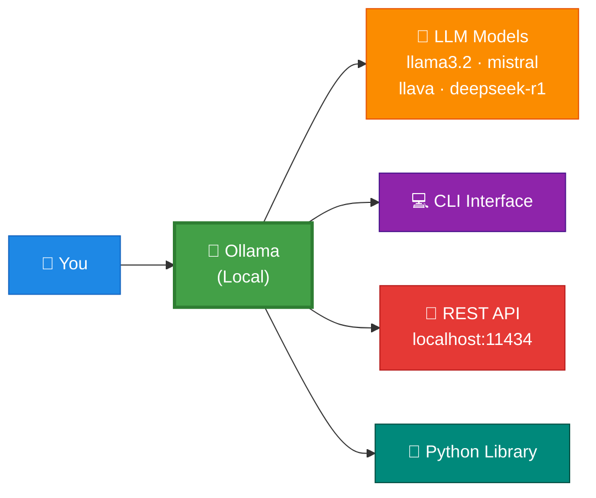

**Why use Ollama?**

| Benefit | Detail |
|---------|--------|
| 🔒 Privacy | Data never leaves your machine |
| 💸 Cost | Completely free — no API charges |
| ⚡ Latency | Local inference, no network round-trip |
| 🎛️ Control | Full control over model params and system prompts |
| 🚀 Ease of use | One command to pull and run any model |

---

## Setup

### Requirements

```bash
pip install -r requirements.txt
```

**`requirements.txt`**
```
requests
ollama
langchain
langchain-community
langchain-ollama
langchain-text-splitters
chromadb
fastembed
streamlit
openai
PyPDF2
python-docx
pdfplumber
elevenlabs
python-dotenv
unstructured
```

**System requirements**
- OS: macOS, Linux, Windows
- Storage: 10 GB+ free (models are large)
- CPU: Modern multi-core (GPU optional but faster)

### Environment Variables

Create a `.env` file in your project root:

```env
ELEVENLABS_API_KEY=your_key_here
```

> [!NOTE]
> The `.env` file is only required for `final-rag-voice.py`. Get a free key at [elevenlabs.io](https://elevenlabs.io).

### Data Files

| File | Required by | Notes |
|------|-------------|-------|
| `./data/grocery_list.txt` | `categorizer.py`, `function-calling.py` | One grocery item per line |
| `./data/BOI.pdf` | All RAG scripts | Any PDF works |
| `Modelfile` | Custom model creation | Create manually — see [Custom Modelfile](#custom-modelfile) |
| `./db/vector_db/` | `final-rag-voice.py` | Auto-created on first run |
| `./chroma_db/` | `pdf-rag-streamlit.py` | Auto-created on first run |

---

## CLI Reference

### Model Management

```bash
ollama pull model_name      # download a model
ollama run model_name       # run a model
ollama list                 # list all locally downloaded models
ollama rm model_name        # remove a model
ollama show model_name      # show model details
ollama ps                   # see currently running models
ollama stop model_name      # stop a running model
```

### In-Session Commands

While chatting via `ollama run`:

| Command | Description |
|---------|-------------|
| `/clear` | Clear conversation context |
| `/bye` | Exit the session |
| `/help` | Show all available commands |
| `"""` | Start a multi-line message |

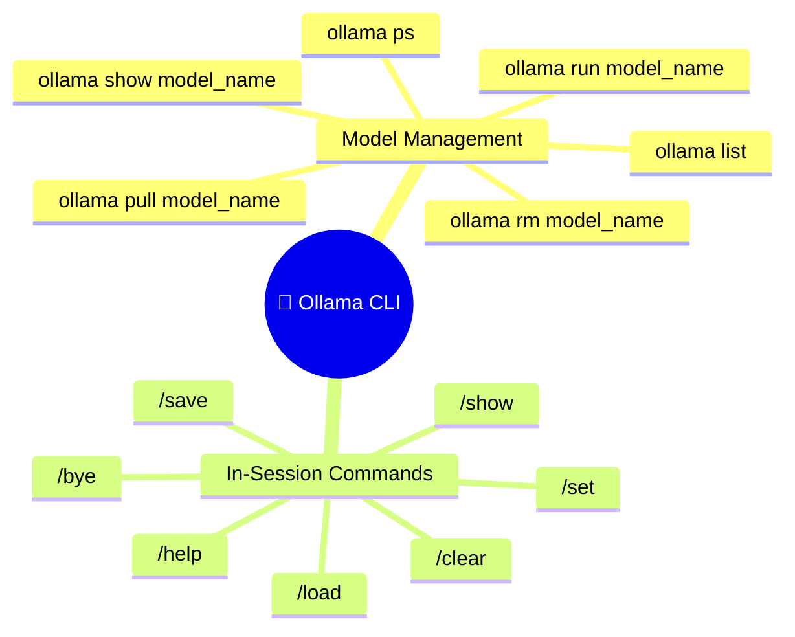

---

## Model Parameters

Understanding what `llama3.2:3b` means:

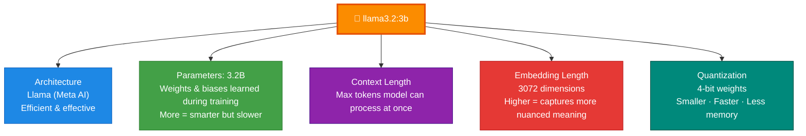

| Parameter | What it means |
|-----------|---------------|
| **Parameters** | Internal weights learned during training. More = smarter but slower and larger |
| **Context length** | Max tokens the model can hold in memory at once |
| **Embedding length** | Vector size per token — higher = richer semantic understanding |
| **Quantization** | Precision reduction (4-bit) → smaller file, faster inference, slight quality drop |

---

## Custom Modelfile

Create a `Modelfile` to give a model a custom personality, system prompt, and temperature:

```
FROM llama3.2

# higher is more creative, lower is more coherent
PARAMETER temperature 0.3

SYSTEM """
    You are James, a very smart assistant who answers
    questions succinctly and informatively.
"""
```

```bash
ollama create james -f ./Modelfile   # build the model
ollama list                          # confirm it exists
ollama run james                     # run it
```

---

## REST API

Ollama exposes a local REST API at `http://localhost:11434`.

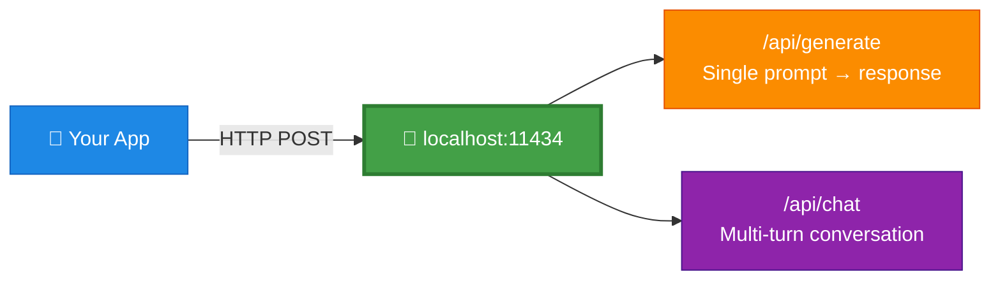

<details>
<summary><b>Generate endpoint</b></summary>

```bash
curl http://localhost:11434/api/generate -d '{
    "model": "llama3.2",
    "prompt": "Why is the sky blue?",
    "stream": false
}'
```

</details>

<details>
<summary><b>Chat endpoint</b></summary>

```bash
curl http://localhost:11434/api/chat -d '{
    "model": "llama3.2",
    "messages": [
        {"role": "user", "content": "tell me a fun fact"}
    ],
    "stream": false
}'
```

</details>

<details>
<summary><b>JSON mode</b></summary>

```bash
curl http://localhost:11434/api/generate -d '{
    "model": "llama3.2",
    "prompt": "What is the color of the sky at different times of the day? Respond using JSON",
    "format": "json",
    "stream": false
}'
```

</details>

> [!TIP]
> Full API reference: [github.com/ollama/ollama/blob/main/docs/api.md](https://github.com/ollama/ollama/blob/main/docs/api.md)

---

## Python Examples

### start-1.py — Requests Library

Calls the REST API directly with streaming — prints tokens as they generate.

<details>
<summary><b>View code</b></summary>

```python
import requests
import json

url = "http://localhost:11434/api/generate"

data = {
    "model": "llama3.2",
    "prompt": "tell me a short story and make it funny.",
}

response = requests.post(url, json=data, stream=True)

if response.status_code == 200:
    print("Generated Text:", end=" ", flush=True)
    for line in response.iter_lines():
        if line:
            decoded_line = line.decode("utf-8")
            result = json.loads(decoded_line)
            generated_text = result.get("response", "")
            print(generated_text, end="", flush=True)
else:
    print("Error:", response.status_code, response.text)
```

</details>

**Key points:**
- `stream=True` in `requests.post` — gets the response token by token
- `response.iter_lines()` — reads each streamed JSON chunk one at a time
- `result.get("response", "")` — extracts generated text from the JSON payload

---

### start-2.py — Ollama Python Library

The `ollama` Python library wraps the REST API into clean function calls.

<details>
<summary><b>View code</b></summary>

```python
import ollama

# list all local models
response = ollama.list()

# basic chat
res = ollama.chat(
    model="llama3.2",
    messages=[
        {"role": "user", "content": "why is the sky blue?"},
    ],
)
print(res["message"]["content"])

# streaming chat — prints word by word
res = ollama.chat(
    model="llama3.2",
    messages=[
        {"role": "user", "content": "why is the ocean so salty?"},
    ],
    stream=True,
)
for chunk in res:
    print(chunk["message"]["content"], end="", flush=True)

# single-turn generate
res = ollama.generate(
    model="llama3.2",
    prompt="why is the sky blue?",
)

# show model info
print(ollama.show("llama3.2"))

# create a custom model in code
modelfile = """
FROM llama3.2
SYSTEM You are very smart assistant who knows everything about oceans.
PARAMETER temperature 0.1
"""
ollama.create(model="knowitall", modelfile=modelfile)
res = ollama.generate(model="knowitall", prompt="why is the ocean so salty?")
print(res["response"])

# clean up
ollama.delete("knowitall")
```

</details>

**Library functions:**

| Function | Description |
|----------|-------------|
| `ollama.list()` | List all locally downloaded models |
| `ollama.chat(...)` | Multi-turn conversation |
| `ollama.generate(...)` | Single prompt → response |
| `ollama.show(...)` | Model metadata |
| `ollama.create(...)` | Create custom model from a modelfile string |
| `ollama.delete(...)` | Remove a model |

---

### categorizer.py — Grocery List App

Reads a grocery list from a `.txt` file, categorizes and sorts it using LLaMA, then saves the result.

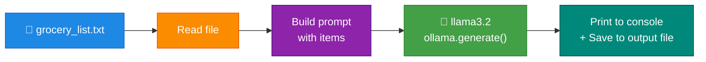

**Run:**
```bash
# place grocery_list.txt in ./data/ first
python categorizer.py
```

<details>
<summary><b>View code</b></summary>

```python
import ollama
import os

model = "llama3.2"
input_file  = "./data/grocery_list.txt"
output_file = "./data/categorized_grocery_list.txt"

if not os.path.exists(input_file):
    print(f"Input file '{input_file}' not found.")
    exit(1)

with open(input_file, "r") as f:
    items = f.read().strip()

prompt = f"""
You are an assistant that categorizes and sorts grocery items.

Here is a list of grocery items:
{items}

Please:
1. Categorize these items into appropriate categories such as Produce, Dairy, Meat, Bakery, Beverages, etc.
2. Sort the items alphabetically within each category.
3. Present the categorized list in a clear and organized manner, using bullet points or numbering.
"""

try:
    response = ollama.generate(model=model, prompt=prompt)
    generated_text = response.get("response", "")
    print("==== Categorized List: ===== \n")
    print(generated_text)

    with open(output_file, "w") as f:
        f.write(generated_text.strip())

    print(f"Categorized grocery list has been saved to '{output_file}'.")
except Exception as e:
    print("An error occurred:", str(e))
```

</details>

---

## RAG Systems

RAG (Retrieval-Augmented Generation) lets you chat with your own documents by injecting relevant chunks into the LLM's context.

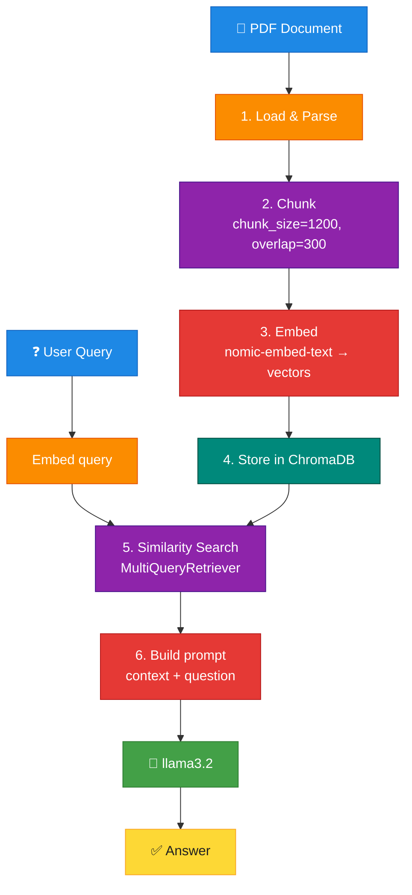

**Stack used:**

| Component | Tool |
|-----------|------|
| PDF Loader | `UnstructuredPDFLoader` |
| Text Splitter | `RecursiveCharacterTextSplitter` |
| Embeddings | `nomic-embed-text` via Ollama |
| Vector DB | `ChromaDB` |
| Retriever | `MultiQueryRetriever` |
| LLM | `ChatOllama` with `llama3.2` |

---

### pdf-rag.py — Basic RAG

<details>
<summary><b>View code</b></summary>

```python
from langchain_community.document_loaders import UnstructuredPDFLoader
from langchain_ollama import OllamaEmbeddings
from langchain_text_splitters import RecursiveCharacterTextSplitter
from langchain_community.vectorstores import Chroma
from langchain.prompts import ChatPromptTemplate, PromptTemplate
from langchain_core.output_parsers import StrOutputParser
from langchain_ollama import ChatOllama
from langchain_core.runnables import RunnablePassthrough
from langchain.retrievers.multi_query import MultiQueryRetriever
import ollama

doc_path = "./data/BOI.pdf"
model    = "llama3.2"

loader = UnstructuredPDFLoader(file_path=doc_path)
data = loader.load()
print("done loading....")

text_splitter = RecursiveCharacterTextSplitter(chunk_size=1200, chunk_overlap=300)
chunks = text_splitter.split_documents(data)
print("done splitting....")

ollama.pull("nomic-embed-text")
vector_db = Chroma.from_documents(
    documents=chunks,
    embedding=OllamaEmbeddings(model="nomic-embed-text"),
    collection_name="simple-rag",
)
print("done adding to vector database....")

llm = ChatOllama(model=model)

QUERY_PROMPT = PromptTemplate(
    input_variables=["question"],
    template="""You are an AI language model assistant. Your task is to generate five
    different versions of the given user question to retrieve relevant documents from
    a vector database. By generating multiple perspectives on the user question, your
    goal is to help the user overcome some of the limitations of the distance-based
    similarity search. Provide these alternative questions separated by newlines.
    Original question: {question}""",
)

retriever = MultiQueryRetriever.from_llm(
    vector_db.as_retriever(), llm, prompt=QUERY_PROMPT
)

template = """Answer the question based ONLY on the following context:
{context}
Question: {question}
"""
prompt = ChatPromptTemplate.from_template(template)

chain = (
    {"context": retriever, "question": RunnablePassthrough()}
    | prompt
    | llm
    | StrOutputParser()
)

res = chain.invoke(input=("how to report BOI?",))
print(res)
```

</details>

---

### pdf-rag-clean.py — Clean RAG

Same pipeline as above but refactored into reusable functions.

<details>
<summary><b>View code</b></summary>

```python
import os
import logging
from langchain_community.document_loaders import UnstructuredPDFLoader
from langchain_text_splitters import RecursiveCharacterTextSplitter
from langchain_community.vectorstores import Chroma
from langchain_ollama import OllamaEmbeddings
from langchain.prompts import ChatPromptTemplate, PromptTemplate
from langchain_ollama import ChatOllama
from langchain_core.output_parsers import StrOutputParser
from langchain_core.runnables import RunnablePassthrough
from langchain.retrievers.multi_query import MultiQueryRetriever
import ollama

logging.basicConfig(level=logging.INFO)

DOC_PATH          = "./data/BOI.pdf"
MODEL_NAME        = "llama3.2"
EMBEDDING_MODEL   = "nomic-embed-text"
VECTOR_STORE_NAME = "simple-rag"


def ingest_pdf(doc_path):
    if os.path.exists(doc_path):
        loader = UnstructuredPDFLoader(file_path=doc_path)
        data = loader.load()
        logging.info("PDF loaded successfully.")
        return data
    else:
        logging.error(f"PDF file not found at path: {doc_path}")
        return None


def split_documents(documents):
    text_splitter = RecursiveCharacterTextSplitter(chunk_size=1200, chunk_overlap=300)
    chunks = text_splitter.split_documents(documents)
    logging.info("Documents split into chunks.")
    return chunks


def create_vector_db(chunks):
    ollama.pull(EMBEDDING_MODEL)
    vector_db = Chroma.from_documents(
        documents=chunks,
        embedding=OllamaEmbeddings(model=EMBEDDING_MODEL),
        collection_name=VECTOR_STORE_NAME,
    )
    logging.info("Vector database created.")
    return vector_db


def create_retriever(vector_db, llm):
    QUERY_PROMPT = PromptTemplate(
        input_variables=["question"],
        template="""You are an AI language model assistant. Your task is to generate five
different versions of the given user question to retrieve relevant documents from
a vector database. Provide these alternative questions separated by newlines.
Original question: {question}""",
    )
    retriever = MultiQueryRetriever.from_llm(
        vector_db.as_retriever(), llm, prompt=QUERY_PROMPT
    )
    logging.info("Retriever created.")
    return retriever


def create_chain(retriever, llm):
    template = """Answer the question based ONLY on the following context:
{context}
Question: {question}
"""
    prompt = ChatPromptTemplate.from_template(template)
    chain = (
        {"context": retriever, "question": RunnablePassthrough()}
        | prompt
        | llm
        | StrOutputParser()
    )
    logging.info("Chain created successfully.")
    return chain


def main():
    data      = ingest_pdf(DOC_PATH)
    if data is None:
        return
    chunks    = split_documents(data)
    vector_db = create_vector_db(chunks)
    llm       = ChatOllama(model=MODEL_NAME)
    retriever = create_retriever(vector_db, llm)
    chain     = create_chain(retriever, llm)
    res = chain.invoke(input="How to report BOI?")
    print("Response:")
    print(res)


if __name__ == "__main__":
    main()
```

</details>

---

### pdf-rag-streamlit.py — RAG with UI

Adds a browser-based chat interface and persists the vector DB to disk so it doesn't re-embed on every run.

**Run:**
```bash
streamlit run pdf-rag-streamlit.py
```

**Key differences from the clean version:**

| Feature | Detail |
|---------|--------|
| `@st.cache_resource` | Builds the vector DB only once per session |
| `persist_directory="./chroma_db"` | Saves DB to disk — survives restarts |
| `st.text_input` / `st.write` | Browser UI instead of terminal |

<details>
<summary><b>View code</b></summary>

```python
import streamlit as st
import os
import logging
from langchain_community.document_loaders import UnstructuredPDFLoader
from langchain_text_splitters import RecursiveCharacterTextSplitter
from langchain_community.vectorstores import Chroma
from langchain_ollama import OllamaEmbeddings
from langchain.prompts import ChatPromptTemplate, PromptTemplate
from langchain_ollama import ChatOllama
from langchain_core.output_parsers import StrOutputParser
from langchain_core.runnables import RunnablePassthrough
from langchain.retrievers.multi_query import MultiQueryRetriever
import ollama

logging.basicConfig(level=logging.INFO)

DOC_PATH          = "./data/BOI.pdf"
MODEL_NAME        = "llama3.2"
EMBEDDING_MODEL   = "nomic-embed-text"
VECTOR_STORE_NAME = "simple-rag"
PERSIST_DIRECTORY = "./chroma_db"


def ingest_pdf(doc_path):
    if os.path.exists(doc_path):
        loader = UnstructuredPDFLoader(file_path=doc_path)
        data = loader.load()
        logging.info("PDF loaded successfully.")
        return data
    else:
        st.error("PDF file not found.")
        return None


def split_documents(documents):
    text_splitter = RecursiveCharacterTextSplitter(chunk_size=1200, chunk_overlap=300)
    return text_splitter.split_documents(documents)


@st.cache_resource
def load_vector_db():
    ollama.pull(EMBEDDING_MODEL)
    embedding = OllamaEmbeddings(model=EMBEDDING_MODEL)

    if os.path.exists(PERSIST_DIRECTORY):
        vector_db = Chroma(
            embedding_function=embedding,
            collection_name=VECTOR_STORE_NAME,
            persist_directory=PERSIST_DIRECTORY,
        )
        logging.info("Loaded existing vector database.")
    else:
        data = ingest_pdf(DOC_PATH)
        if data is None:
            return None
        chunks = split_documents(data)
        vector_db = Chroma.from_documents(
            documents=chunks,
            embedding=embedding,
            collection_name=VECTOR_STORE_NAME,
            persist_directory=PERSIST_DIRECTORY,
        )
        vector_db.persist()
        logging.info("Vector database created and persisted.")
    return vector_db


def create_retriever(vector_db, llm):
    QUERY_PROMPT = PromptTemplate(
        input_variables=["question"],
        template="""Generate five different versions of the user question to retrieve
relevant documents from a vector database. Newline-separated.
Original question: {question}""",
    )
    return MultiQueryRetriever.from_llm(
        vector_db.as_retriever(), llm, prompt=QUERY_PROMPT
    )


def create_chain(retriever, llm):
    template = """Answer the question based ONLY on the following context:
{context}
Question: {question}
"""
    prompt = ChatPromptTemplate.from_template(template)
    return (
        {"context": retriever, "question": RunnablePassthrough()}
        | prompt
        | llm
        | StrOutputParser()
    )


def main():
    st.title("Document Assistant")
    user_input = st.text_input("Enter your question:", "")

    if user_input:
        with st.spinner("Generating response..."):
            try:
                llm       = ChatOllama(model=MODEL_NAME)
                vector_db = load_vector_db()
                if vector_db is None:
                    st.error("Failed to load or create the vector database.")
                    return
                retriever = create_retriever(vector_db, llm)
                chain     = create_chain(retriever, llm)
                response  = chain.invoke(input=user_input)
                st.markdown("**Assistant:**")
                st.write(response)
            except Exception as e:
                st.error(f"An error occurred: {str(e)}")
    else:
        st.info("Please enter a question to get started.")


if __name__ == "__main__":
    main()
```

</details>

---

## Function Calling

Let the LLM decide when to call your Python functions and what arguments to pass.

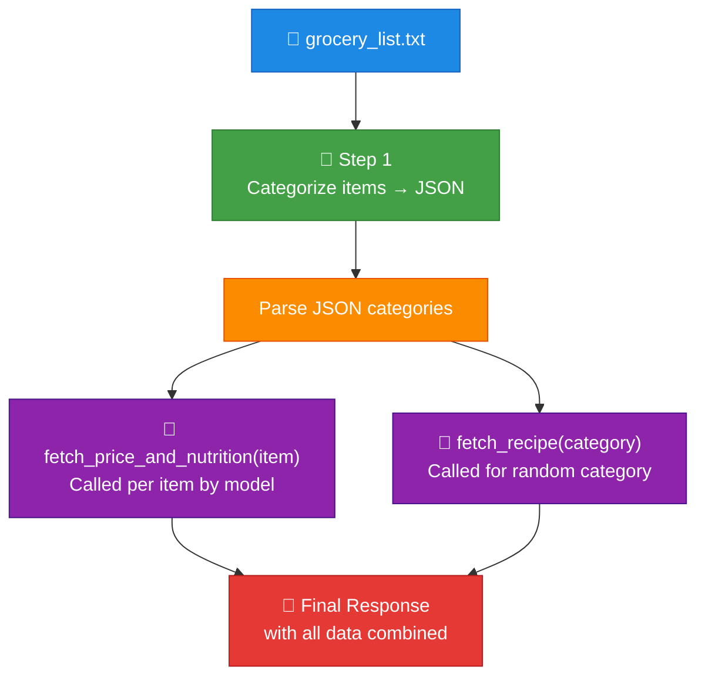

**How it works:**

| Concept | Explanation |
|---------|-------------|
| `tools` list | JSON schema definitions — tells the LLM what functions exist and their signatures |
| `tool_calls` in response | LLM decided to call a function — extract `name` + `arguments` |
| `{"role": "tool", ...}` | Send the function result back so the model can use it |
| `AsyncClient` | Used because functions are `async` (simulating real network calls) |

<details>
<summary><b>View code — function-calling.py</b></summary>

```python
import os
import json
import asyncio
import random
from ollama import AsyncClient


def load_grocery_list(file_path):
    if not os.path.exists(file_path):
        return []
    with open(file_path, "r") as file:
        return [line.strip() for line in file if line.strip()]


async def fetch_price_and_nutrition(item):
    await asyncio.sleep(0.1)
    return {
        "item":     item,
        "price":    f"${random.uniform(1, 10):.2f}",
        "calories": f"{random.randint(50, 500)} kcal",
        "fat":      f"{random.randint(1, 20)} g",
        "protein":  f"{random.randint(1, 30)} g",
    }


async def fetch_recipe(category):
    await asyncio.sleep(0.1)
    return {
        "category":     category,
        "recipe":       f"Delicious {category} dish",
        "ingredients":  ["Ingredient 1", "Ingredient 2", "Ingredient 3"],
        "instructions": "Mix ingredients and cook.",
    }


async def main():
    grocery_items = load_grocery_list("./data/grocery_list.txt")
    if not grocery_items:
        print("Grocery list is empty or file not found.")
        return

    client = AsyncClient()

    tools = [
        {
            "type": "function",
            "function": {
                "name": "fetch_price_and_nutrition",
                "description": "Fetch price and nutrition data for a grocery item",
                "parameters": {
                    "type": "object",
                    "properties": {
                        "item": {"type": "string", "description": "The name of the grocery item"},
                    },
                    "required": ["item"],
                },
            },
        },
        {
            "type": "function",
            "function": {
                "name": "fetch_recipe",
                "description": "Fetch a recipe based on a category",
                "parameters": {
                    "type": "object",
                    "properties": {
                        "category": {"type": "string", "description": "The category of food (e.g., Produce, Dairy)"},
                    },
                    "required": ["category"],
                },
            },
        },
    ]

    categorize_prompt = f"""
You are an assistant that categorizes grocery items.
Return the result ONLY as a valid JSON object with categories as keys and lists of items as values.
Grocery Items: {', '.join(grocery_items)}
"""
    messages = [{"role": "user", "content": categorize_prompt}]
    response = await client.chat(model="llama3.2", messages=messages, tools=tools)
    messages.append(response["message"])

    try:
        categorized_items = json.loads(response["message"]["content"])
        print("Categorized items:", categorized_items)
    except json.JSONDecodeError:
        print("Failed to parse JSON response.")
        return

    messages.append({"role": "user", "content": "For each item, use fetch_price_and_nutrition."})
    response = await client.chat(model="llama3.2", messages=messages, tools=tools)
    messages.append(response["message"])

    if response["message"].get("tool_calls"):
        available_functions = {"fetch_price_and_nutrition": fetch_price_and_nutrition}
        item_details = []
        for tool_call in response["message"]["tool_calls"]:
            fn   = available_functions.get(tool_call["function"]["name"])
            args = tool_call["function"]["arguments"]
            if fn:
                result = await fn(**args)
                messages.append({"role": "tool", "content": json.dumps(result)})
                item_details.append(result)
        print(item_details)

    random_category = random.choice(list(categorized_items.keys()))
    messages.append({"role": "user", "content": f"Fetch a recipe for '{random_category}' using fetch_recipe."})
    response = await client.chat(model="llama3.2", messages=messages, tools=tools)
    messages.append(response["message"])

    if response["message"].get("tool_calls"):
        for tool_call in response["message"]["tool_calls"]:
            args   = tool_call["function"]["arguments"]
            result = await fetch_recipe(**args)
            messages.append({"role": "tool", "content": json.dumps(result)})

    final_response = await client.chat(model="llama3.2", messages=messages, tools=tools)
    print("\nAssistant's Final Response:")
    print(final_response["message"]["content"])


asyncio.run(main())
```

</details>

---

## Voice RAG

Full RAG pipeline where the model's answer is spoken aloud via ElevenLabs TTS.

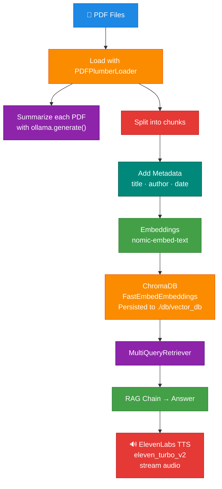

**Setup:**
```bash
# 1. Get a free API key at elevenlabs.io
# 2. Add to .env
echo "ELEVENLABS_API_KEY=your_key_here" > .env

# 3. Install extras
pip install elevenlabs python-dotenv pdfplumber

# 4. Run
python final-rag-voice.py
```

**What's different from basic RAG:**

| Feature | Detail |
|---------|--------|
| `add_metadata()` | Adds title, author, date to each chunk |
| `FastEmbedEmbeddings` | Higher quality embeddings than OllamaEmbeddings |
| Persisted DB | Saved to `./db/vector_db` |
| `stream(audio_stream)` | ElevenLabs speaks the answer aloud |

---

## DeepSeek R1

> [!NOTE]
> DeepSeek R1 is an open-source reasoning model from DeepSeek with capabilities comparable to OpenAI o1 — and it's completely free. Run it locally through Ollama.

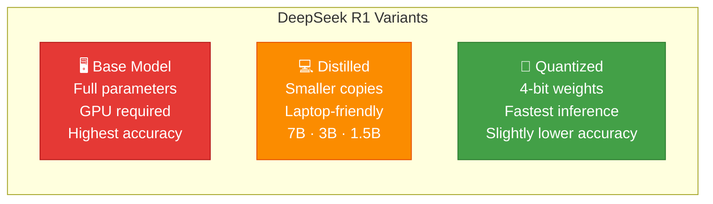

**Open vs Closed source:**

| | Open Source (DeepSeek) | Closed Source (GPT-4) |
|-|----------------------|----------------------|
| Cost | Free | Pay per token |
| Privacy | Data stays local | Sent to cloud |
| Customization | Full control | Limited |
| Setup | Requires local install | Just an API key |

```bash
ollama run deepseek-r1:1.5b
```

---

### deepseek.py — OpenAI-compatible Client

Ollama exposes an OpenAI-compatible endpoint — use the `openai` Python SDK and just point it at localhost.

<details>
<summary><b>View code</b></summary>

```python
from openai import OpenAI

client = OpenAI(api_key="ollama", base_url="http://localhost:11434/v1/")

response = client.chat.completions.create(
    model="deepseek-r1:1.5b",
    messages=[
        {"role": "system", "content": "You are a helpful assistant."},
        {"role": "user",   "content": "solve the problem of world hunger"},
    ],
    stream=True,
)

for chunk in response:
    print(chunk.choices[0].delta.content, end="", flush=True)
```

</details>

> [!NOTE]
> `api_key="ollama"` is a placeholder — Ollama doesn't need a real key but the OpenAI client requires the field to be set.

---

### research_assis.py — Document Analyzer

Upload PDFs, DOCX, or TXT files and analyze them with DeepSeek R1. Three views: Main Analysis, Key Points, Summary.

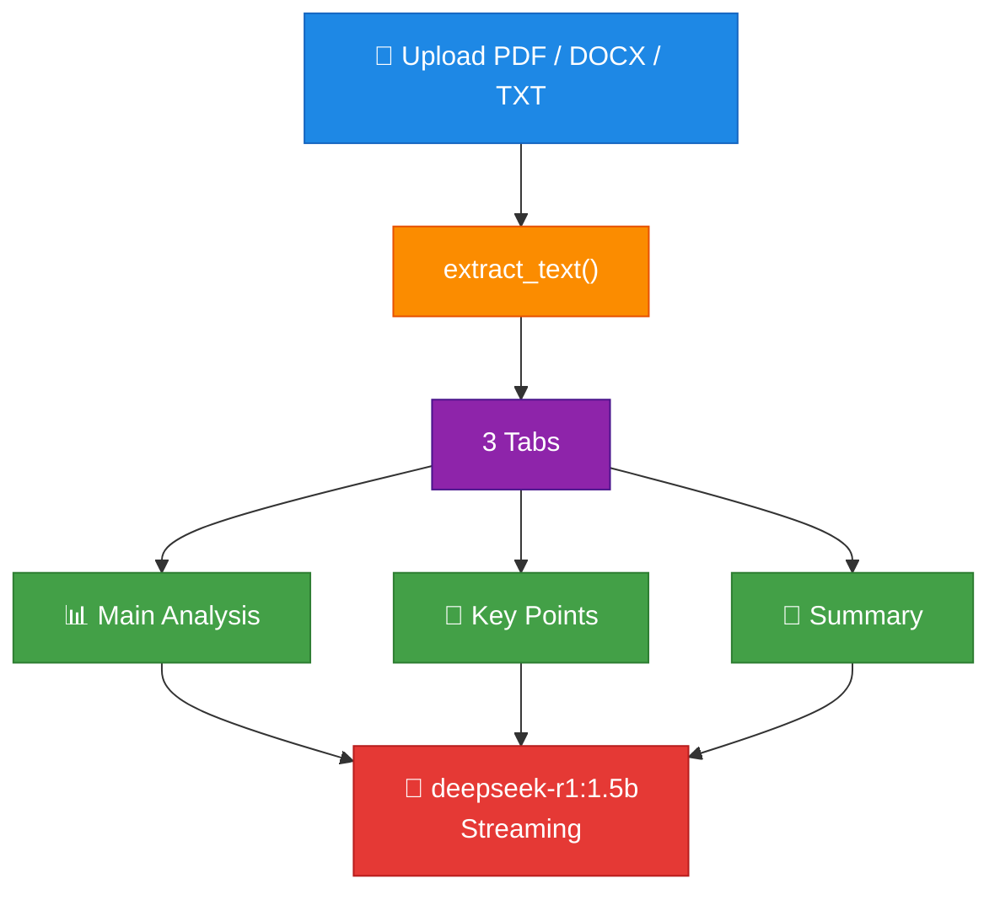

```bash
streamlit run research_assis.py
```

<details>
<summary><b>View code</b></summary>

```python
import streamlit as st
from openai import OpenAI
import PyPDF2
import docx


class ResearchAssistant:
    def __init__(self):
        self.client = OpenAI(api_key="ollama", base_url="http://localhost:11434/v1/")
        self.model  = "deepseek-r1:1.5b"

    def extract_text(self, uploaded_file):
        text = ""
        if uploaded_file.type == "application/pdf":
            pdf_reader = PyPDF2.PdfReader(uploaded_file)
            for page in pdf_reader.pages:
                text += page.extract_text()
        elif "wordprocessingml" in uploaded_file.type:
            doc = docx.Document(uploaded_file)
            for para in doc.paragraphs:
                text += para.text + "\n"
        else:
            text = str(uploaded_file.read(), "utf-8")
        return text

    def analyze_content(self, text, query):
        prompt = f"""Analyze this text and answer the following query:
Text: {text[:2000]}...
Query: {query}

Provide:
1. Direct answer to the query
2. Supporting evidence
3. Key findings
4. Limitations of the analysis
"""
        response = self.client.chat.completions.create(
            model=self.model,
            messages=[
                {"role": "system", "content": "You are a research assistant skilled in analyzing academic and technical documents."},
                {"role": "user",   "content": prompt},
            ],
            stream=True,
        )
        result = st.empty()
        collected_chunks = []
        for chunk in response:
            if chunk.choices[0].delta.content is not None:
                collected_chunks.append(chunk.choices[0].delta.content)
                result.markdown("".join(collected_chunks))
        return "".join(collected_chunks)


def main():
    st.set_page_config(page_title="Research Assistant", layout="wide")
    st.title("📚 Research Document Analyzer")

    assistant = ResearchAssistant()

    with st.sidebar:
        st.header("Upload Documents")
        uploaded_files = st.file_uploader(
            "Upload research documents",
            type=["pdf", "docx", "txt"],
            accept_multiple_files=True,
        )

    if uploaded_files:
        st.write(f"📎 {len(uploaded_files)} documents uploaded")
        query = st.text_area("What would you like to know about these documents?", height=100)

        if st.button("Analyze", type="primary"):
            with st.spinner("Analyzing documents..."):
                for file in uploaded_files:
                    st.write(f"### Analysis of {file.name}")
                    text = assistant.extract_text(file)
                    tab1, tab2, tab3 = st.tabs(["Main Analysis", "Key Points", "Summary"])
                    with tab1:
                        assistant.analyze_content(text, query)
                    with tab2:
                        assistant.analyze_content(text, "Extract key points and findings")
                    with tab3:
                        assistant.analyze_content(text, "Provide a brief summary")


if __name__ == "__main__":
    main()
```

</details>

---

### code_assis.py — Code Assistant

Three modes: Code Generation, Code Explanation, Code Review — all powered by DeepSeek R1.

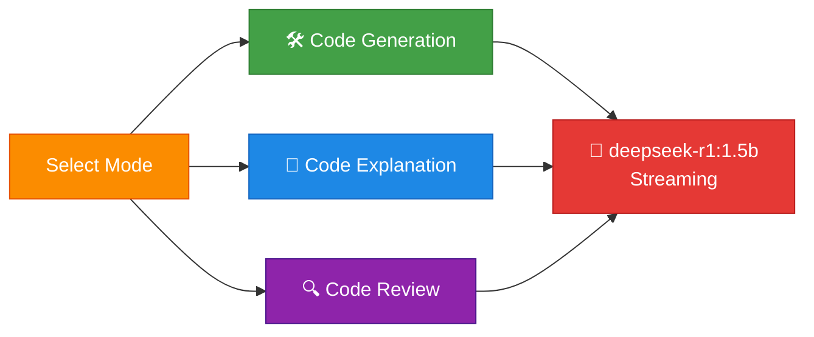

```bash
streamlit run code_assis.py
```

<details>
<summary><b>View code</b></summary>

```python
import streamlit as st
from openai import OpenAI


class LocalCodeAssistant:
    def __init__(self):
        self.client = OpenAI(api_key="ollama", base_url="http://localhost:11434/v1/")
        self.model  = "deepseek-r1:1.5b"

    def process_request(self, system_prompt: str, user_prompt: str) -> str:
        response = self.client.chat.completions.create(
            model=self.model,
            messages=[
                {"role": "system", "content": system_prompt},
                {"role": "user",   "content": user_prompt},
            ],
            stream=True,
        )
        result = st.empty()
        collected_chunks = []
        for chunk in response:
            if chunk.choices[0].delta.content is not None:
                collected_chunks.append(chunk.choices[0].delta.content)
                result.markdown("".join(collected_chunks))
        return "".join(collected_chunks)


def get_system_prompts():
    return {
        "Code Generation": """You are an expert Python programmer who writes clean, efficient, and well-documented code.
Follow these guidelines:
1. Start with a brief comment explaining the code's purpose
2. Include docstrings for functions
3. Use clear variable names
4. Add inline comments for complex logic
5. Follow PEP 8 style guidelines
6. Include example usage
7. Handle common edge cases""",

        "Code Explanation": """You are a patient and knowledgeable coding tutor.
Analyze the code and explain:
1. Overall purpose and functionality
2. Break down of each major component
3. Key programming concepts used
4. Flow of execution
5. Important variables and functions
6. Any clever techniques or patterns
7. Potential learning points for students""",

        "Code Review": """You are a senior code reviewer with expertise in Python best practices.
Review the code for:
1. Logical errors or bugs
2. Performance optimization opportunities
3. Security vulnerabilities
4. Code style and PEP 8 compliance
5. Error handling improvements
6. Documentation completeness
7. Code modularity and reusability
8. Memory efficiency""",
    }


def main():
    st.set_page_config(page_title="DeepSeek R1 Code Assistant", page_icon="🤖", layout="wide")
    st.title("🤖 Local DeepSeek R1 Code Assistant")

    system_prompts = get_system_prompts()
    st.sidebar.title("Settings")
    mode = st.sidebar.selectbox("Choose Mode", list(system_prompts.keys()))

    col1, col2 = st.columns([2, 3])
    with col1:
        st.markdown(f"### Input for {mode}")
        user_prompt    = st.text_area("Enter your prompt or code:", height=300)
        process_button = st.button("🚀 Process", type="primary", use_container_width=True)

    with col2:
        st.markdown("### Output")
        output_container = st.container()

    if process_button:
        if user_prompt:
            with st.spinner("Processing..."):
                with output_container:
                    assistant = LocalCodeAssistant()
                    assistant.process_request(system_prompts[mode], user_prompt)
        else:
            st.warning("⚠️ Please enter some input!")


if __name__ == "__main__":
    main()
```

</details>

---

### ai_multi_assis.py — Multi-Assistant

All tools in one app — Code Assistant, Language Tutor, Document Generator.

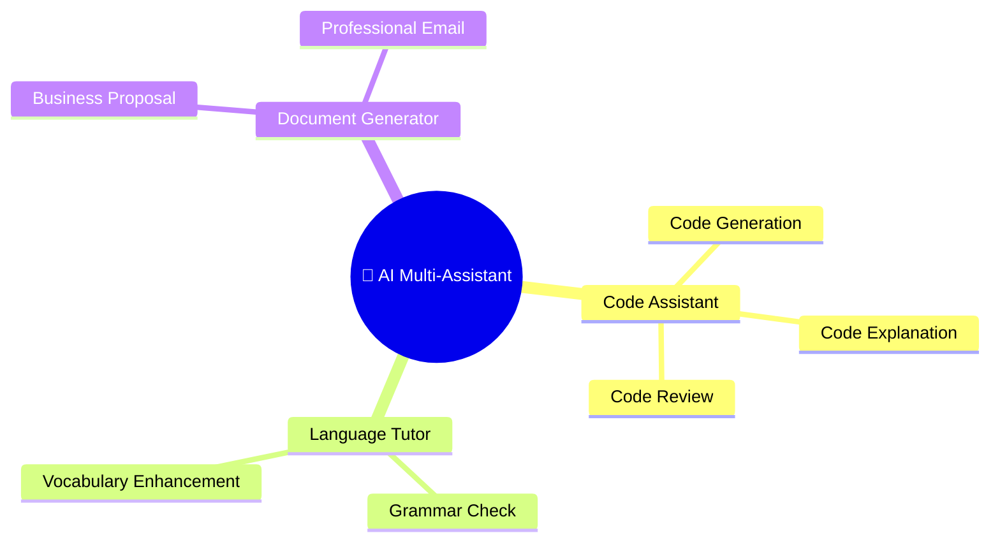

```bash
streamlit run ai_multi_assis.py
```

<details>
<summary><b>View code</b></summary>

```python
import streamlit as st
from openai import OpenAI


class MultiAssistant:
    def __init__(self):
        self.client = OpenAI(api_key="ollama", base_url="http://localhost:11434/v1/")
        self.model  = "deepseek-r1:1.5b"

    def process_request(self, system_prompt: str, user_prompt: str) -> str:
        response = self.client.chat.completions.create(
            model=self.model,
            messages=[
                {"role": "system", "content": system_prompt},
                {"role": "user",   "content": user_prompt},
            ],
            stream=True,
        )
        result = st.empty()
        collected_chunks = []
        for chunk in response:
            if chunk.choices[0].delta.content is not None:
                collected_chunks.append(chunk.choices[0].delta.content)
                result.markdown("".join(collected_chunks))
        return "".join(collected_chunks)


def get_system_prompts():
    return {
        "Code Generation":        "You are an expert Python programmer. Write clean, PEP 8-compliant code with docstrings and comments.",
        "Code Explanation":       "You are a coding tutor. Explain the code's purpose, components, concepts, and flow clearly.",
        "Code Review":            "You are a senior code reviewer. Check for bugs, security issues, performance, style, and documentation.",
        "Grammar Check":          "You are an English teacher. Identify grammar errors, punctuation mistakes, and style issues with corrections.",
        "Vocabulary Enhancement": "You are a vocabulary expert. Suggest sophisticated alternatives, explain idioms, and provide synonyms.",
        "Business Proposal":      "You are a professional business writer. Generate a proposal with executive summary, problem, solution, timeline, budget, and risks.",
        "Professional Email":     "You are a business communication expert. Write a clear, concise, professional email with a call to action.",
    }


def main():
    st.set_page_config(page_title="AI Multi-Assistant", page_icon="🤖", layout="wide")
    st.title("🤖 AI Multi-Assistant")

    system_prompts = get_system_prompts()

    tool_categories = {
        "Code Assistant":     ["Code Generation", "Code Explanation", "Code Review"],
        "Language Tutor":     ["Grammar Check", "Vocabulary Enhancement"],
        "Document Generator": ["Business Proposal", "Professional Email"],
    }

    st.sidebar.title("Tool Selection")
    category = st.sidebar.selectbox("Select Category", list(tool_categories.keys()))
    mode     = st.sidebar.selectbox("Select Tool", tool_categories[category])

    col1, col2 = st.columns([2, 3])
    with col1:
        st.markdown(f"### Input for {mode}")
        user_prompt    = st.text_area("Enter your prompt:", height=300)
        process_button = st.button("🚀 Process", type="primary", use_container_width=True)

    with col2:
        st.markdown("### Output")
        output_container = st.container()

    if process_button:
        if user_prompt:
            with st.spinner("Processing..."):
                with output_container:
                    assistant = MultiAssistant()
                    assistant.process_request(system_prompts[mode], user_prompt)
        else:
            st.warning("⚠️ Please enter some input!")


if __name__ == "__main__":
    main()
```

</details>

---

## Quick Reference

| Script | Run command | Description |
|--------|-------------|-------------|
| `start-1.py` | `python start-1.py` | REST API with streaming via `requests` |
| `start-2.py` | `python start-2.py` | Ollama Python library demo |
| `categorizer.py` | `python categorizer.py` | Grocery list categorizer |
| `pdf-rag.py` | `python pdf-rag.py` | Basic PDF RAG |
| `pdf-rag-clean.py` | `python pdf-rag-clean.py` | RAG with organized functions |
| `pdf-rag-streamlit.py` | `streamlit run pdf-rag-streamlit.py` | RAG with browser UI |
| `function-calling.py` | `python function-calling.py` | LLM tool/function calling demo |
| `final-rag-voice.py` | `python final-rag-voice.py` | RAG + ElevenLabs voice output |
| `deepseek.py` | `python deepseek.py` | DeepSeek R1 via OpenAI-compatible client |
| `research_assis.py` | `streamlit run research_assis.py` | Multi-format document analyzer |
| `code_assis.py` | `streamlit run code_assis.py` | Code generation / explanation / review |
| `ai_multi_assis.py` | `streamlit run ai_multi_assis.py` | All-in-one multi-tool assistant |

---

<div align="center">
  <sub>Built with 🦙 Ollama · LangChain · Streamlit · DeepSeek R1</sub>
</div>
