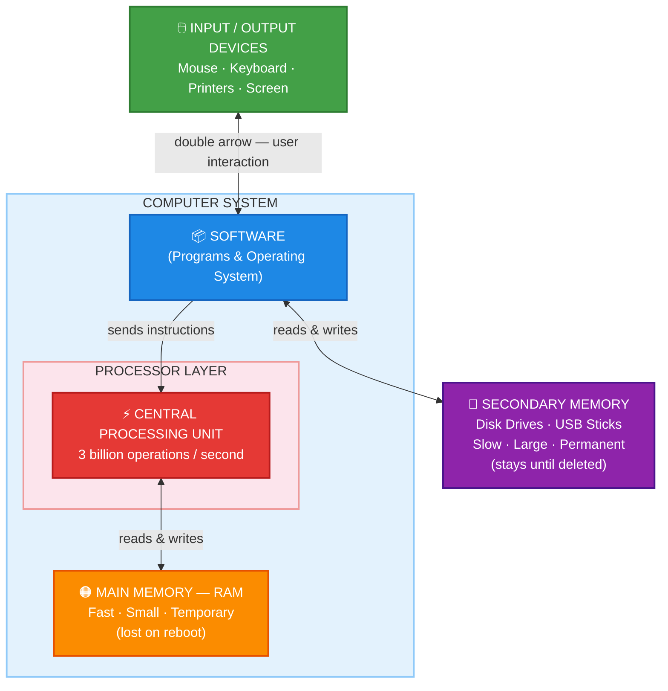
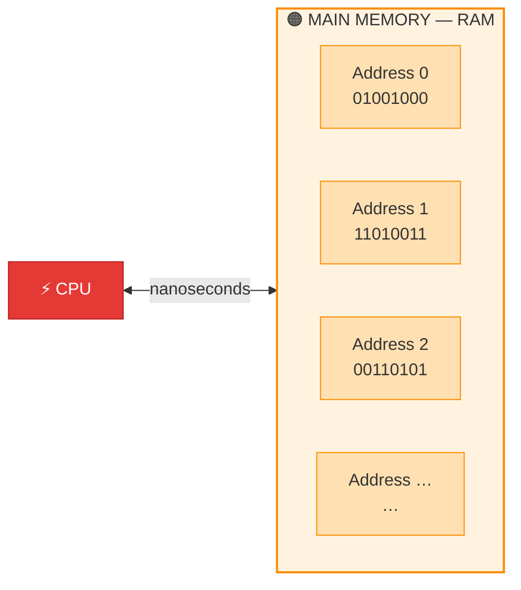
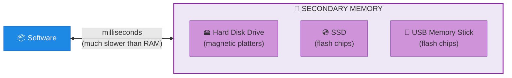
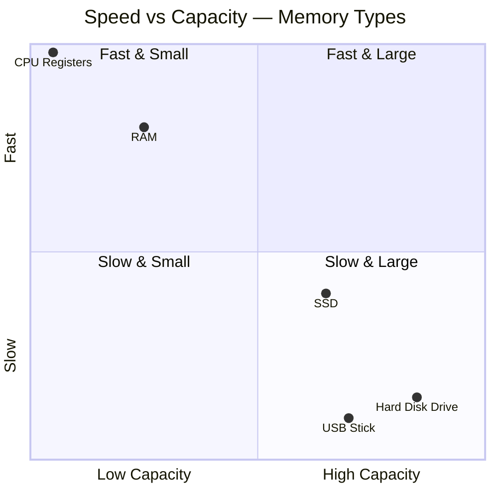
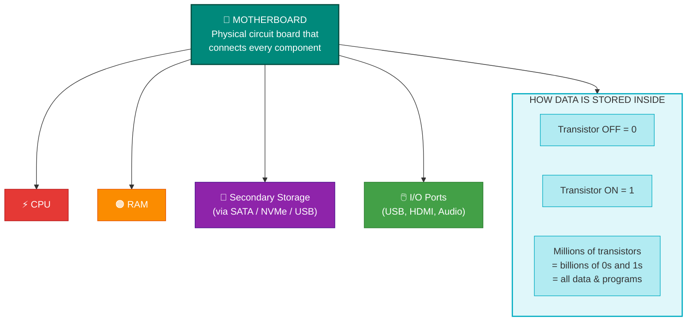

# Programming for Everybody

> **Core Idea:** Computers are remarkably good at text analysis and repetitive tasks — but they only do exactly what they are told.

---

## How a Computer Works — Architecture Overview



---

## The 4 Core Hardware Components

### 1. Input / Output Devices
> The interface between the human and the machine.

| Device Type | Examples |
|-------------|---------|
| Input | Mouse, Keyboard, Microphone, Scanner |
| Output | Monitor, Printer, Speakers |
| Both | Touchscreen, USB Drive |

---

### 2. Central Processing Unit (CPU)


**Key facts:**
- Contains **millions of transistors** — tiny switches that store 0s and 1s
- Runs at **~3 billion cycles per second** (3 GHz)
- The CPU is **not the "brain"** — it is incredibly fast but completely dumb
- It only ever asks one question: **"What do I do next?"**
- The *software* provides all the intelligence — the CPU just executes blindly

---

### 3. Main Memory (RAM)



| Property | Value |
|----------|-------|
| Speed | Very fast (nanoseconds) |
| Capacity | Small (GB range) |
| Persistence | **Temporary** — wiped on reboot |
| Purpose | Holds the currently running program & data |

> **RAM = working desk.** Everything you're actively working on sits here. Turn off the power → desk is cleared.

---

### 4. Secondary Memory



| Property | Value |
|----------|-------|
| Speed | Slower (milliseconds) |
| Capacity | Large (TB range) |
| Persistence | **Permanent** — survives reboots |
| Purpose | Long-term storage of files, programs, databases |

> **Secondary memory = filing cabinet.** Data stays here until you deliberately delete it.

---

## Memory Comparison at a Glance



| | RAM | Secondary Memory |
|--|-----|-----------------|
| **Speed** | ⚡ Very Fast | 🐢 Much Slower |
| **Size** | Small (GBs) | Large (TBs) |
| **Cost / GB** | Expensive | Cheap |
| **Survives reboot?** | ❌ No | ✅ Yes |
| **Connected to** | CPU directly | Motherboard |

---

## What Holds It All Together



---

## The Golden Rule of Computing

```
  ┌───────────────────────────────────────────────────────────────┐
  │                                                               │
  │   Software  =  Intelligence        (written by humans)       │
  │   CPU       =  Raw Speed           (dumb but blazing fast)   │
  │   RAM       =  Working Space       (fast, temporary)         │
  │   Disk      =  Long-term Storage   (slow, permanent)         │
  │                                                               │
  │   The CPU is NOT the brain. It blindly runs whatever         │
  │   instruction software gives it — 3 billion times/sec.       │
  │                                                               │
  └───────────────────────────────────────────────────────────────┘
```

---

## Key Vocabulary

| Term | Definition |
|------|-----------|
| **Transistor** | Tiny electronic switch (ON=1, OFF=0); millions packed into CPU & memory chips |
| **RAM** | Random Access Memory — fast, temporary workspace for running programs |
| **Motherboard** | Circuit board that physically connects CPU, RAM, storage, and I/O |
| **Magnetic Storage** | HDDs store data using magnetized particles on spinning platters |
| **Secondary Storage** | Any persistent storage: HDD, SSD, USB — connects via motherboard |
| **GHz** | Gigahertz — billions of cycles per second; measures CPU clock speed |
